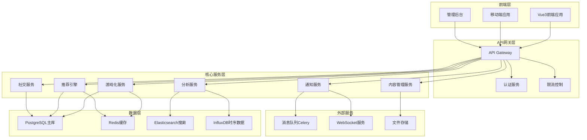

# Design Document

## Overview

本设计文档描述了Natural English学习平台的综合API增强方案。该方案旨在构建一个完整的游戏化学习生态系统，包括个性化推荐引擎、实时通知系统、高级数据分析平台和社交学习功能。系统采用微服务架构，支持高并发、实时交互和智能化学习体验。

## Architecture

### 系统架构概览



### 技术栈选择

- **后端框架**: Django REST Framework + FastAPI (高性能API)
- **数据库**: PostgreSQL (主数据) + Redis (缓存) + InfluxDB (时序数据)
- **消息队列**: Celery + Redis
- **实时通信**: WebSocket + Django Channels
- **搜索引擎**: Elasticsearch
- **监控**: Prometheus + Grafana
- **部署**: Docker + Kubernetes

## Components and Interfaces

### 1. 游戏化服务 (Gamification Service)

#### 核心组件
- **积分系统**: 管理用户积分的获得、消费和历史记录
- **等级系统**: 处理用户等级提升和权益解锁
- **成就系统**: 管理成就定义、触发条件和解锁逻辑
- **连击系统**: 计算学习连击和奖励机制

#### API接口设计
```python
# 积分管理
POST /api/v1/gamification/points/award
GET /api/v1/gamification/points/history
GET /api/v1/gamification/points/balance

# 等级系统
GET /api/v1/gamification/level/current
POST /api/v1/gamification/level/check-upgrade
GET /api/v1/gamification/level/benefits

# 成就系统
GET /api/v1/gamification/achievements/available
POST /api/v1/gamification/achievements/unlock
GET /api/v1/gamification/achievements/progress

# 连击系统
GET /api/v1/gamification/streak/current
POST /api/v1/gamification/streak/update
GET /api/v1/gamification/streak/rewards
```

### 2. 个性化推荐引擎 (Recommendation Engine)

#### 核心组件
- **用户画像构建**: 基于学习行为构建多维度用户画像
- **内容特征提取**: 分析学习内容的难度、类型、知识点等特征
- **推荐算法**: 协同过滤 + 内容推荐 + 深度学习模型
- **实时调整**: 基于用户反馈实时调整推荐策略

#### API接口设计
```python
# 个性化推荐
GET /api/v1/recommendation/words
GET /api/v1/recommendation/exercises
GET /api/v1/recommendation/learning-path
POST /api/v1/recommendation/feedback

# 用户画像
GET /api/v1/recommendation/profile
POST /api/v1/recommendation/profile/update
GET /api/v1/recommendation/preferences

# 推荐解释
GET /api/v1/recommendation/explanation/{item_id}
```

### 3. 实时通知系统 (Notification Service)

#### 核心组件
- **通知分发器**: 支持多渠道通知分发（WebSocket、邮件、推送）
- **模板引擎**: 动态生成个性化通知内容
- **订阅管理**: 用户通知偏好和订阅管理
- **消息队列**: 异步处理大量通知任务

#### API接口设计
```python
# 通知管理
GET /api/v1/notifications/
POST /api/v1/notifications/mark-read
DELETE /api/v1/notifications/{id}

# 通知设置
GET /api/v1/notifications/settings
PUT /api/v1/notifications/settings
POST /api/v1/notifications/subscribe

# 实时通知
WebSocket: /ws/notifications/{user_id}
```

### 4. 高级数据分析服务 (Analytics Service)

#### 核心组件
- **学习行为分析**: 分析用户学习模式和效果
- **预测模型**: 预测学习困难和流失风险
- **A/B测试框架**: 支持功能实验和效果评估
- **报表生成**: 自动生成多维度分析报表

#### API接口设计
```python
# 学习分析
GET /api/v1/analytics/learning-progress
GET /api/v1/analytics/performance-trends
GET /api/v1/analytics/difficulty-analysis

# 预测分析
GET /api/v1/analytics/risk-prediction
GET /api/v1/analytics/learning-forecast
GET /api/v1/analytics/intervention-suggestions

# A/B测试
POST /api/v1/analytics/experiments
GET /api/v1/analytics/experiments/{id}/results
PUT /api/v1/analytics/experiments/{id}/status

# 报表系统
GET /api/v1/analytics/reports/generate
GET /api/v1/analytics/reports/download/{id}
```

### 5. 社交学习服务 (Social Learning Service)

#### 核心组件
- **排行榜系统**: 多维度排名和竞赛管理
- **学习伙伴匹配**: 基于算法的学习伙伴推荐
- **协作学习**: 支持多人学习会话和讨论
- **学习动态**: 学习成果分享和互动

#### API接口设计
```python
# 排行榜
GET /api/v1/social/leaderboard/{category}
GET /api/v1/social/competitions/active
POST /api/v1/social/competitions/join

# 学习伙伴
GET /api/v1/social/partners/recommendations
POST /api/v1/social/partners/request
PUT /api/v1/social/partners/accept

# 协作学习
POST /api/v1/social/sessions/create
GET /api/v1/social/sessions/{id}/participants
WebSocket: /ws/collaboration/{session_id}

# 学习动态
GET /api/v1/social/feed
POST /api/v1/social/posts
POST /api/v1/social/posts/{id}/like
```

### 6. 教师管理服务 (Teacher Management Service)

#### 核心组件
- **学生关系管理**: 管理教师和学生的关联关系
- **学习任务分配**: 教师向学生分配学习任务
- **学习进度监控**: 监控学生的学习进度和表现
- **教学分析报告**: 生成教学效果分析报告

#### API接口设计
```python
# 学生管理
GET /api/v1/teacher/students
POST /api/v1/teacher/students/add
DELETE /api/v1/teacher/students/{student_id}/remove
GET /api/v1/teacher/students/{student_id}/progress

# 任务分配
POST /api/v1/teacher/assignments/create
GET /api/v1/teacher/assignments
PUT /api/v1/teacher/assignments/{id}/update
GET /api/v1/teacher/assignments/{id}/submissions

# 教学分析
GET /api/v1/teacher/analytics/overview
GET /api/v1/teacher/analytics/student-performance
GET /api/v1/teacher/analytics/learning-trends
POST /api/v1/teacher/analytics/reports/generate
```

## Data Models

### 游戏化数据模型

```python
class UserGameProfile(models.Model):
    user = models.OneToOneField(User, on_delete=models.CASCADE)
    total_points = models.IntegerField(default=0)
    current_level = models.IntegerField(default=1)
    current_streak = models.IntegerField(default=0)
    longest_streak = models.IntegerField(default=0)
    last_activity_date = models.DateField(auto_now=True)
    
class Achievement(models.Model):
    name = models.CharField(max_length=100)
    description = models.TextField()
    icon = models.CharField(max_length=50)
    condition_type = models.CharField(max_length=50)
    condition_value = models.JSONField()
    points_reward = models.IntegerField()
    
class UserAchievement(models.Model):
    user = models.ForeignKey(User, on_delete=models.CASCADE)
    achievement = models.ForeignKey(Achievement, on_delete=models.CASCADE)
    unlocked_at = models.DateTimeField(auto_now_add=True)
    progress = models.FloatField(default=0.0)
```

### 推荐系统数据模型

```python
class UserProfile(models.Model):
    user = models.OneToOneField(User, on_delete=models.CASCADE)
    learning_style = models.CharField(max_length=50)
    difficulty_preference = models.CharField(max_length=20)
    learning_goals = models.JSONField()
    preferred_topics = models.JSONField()
    
class LearningBehavior(models.Model):
    user = models.ForeignKey(User, on_delete=models.CASCADE)
    content_type = models.CharField(max_length=50)
    content_id = models.IntegerField()
    action_type = models.CharField(max_length=50)
    duration = models.IntegerField()
    success_rate = models.FloatField()
    timestamp = models.DateTimeField(auto_now_add=True)
    
class RecommendationLog(models.Model):
    user = models.ForeignKey(User, on_delete=models.CASCADE)
    recommended_items = models.JSONField()
    algorithm_version = models.CharField(max_length=20)
    context = models.JSONField()
    created_at = models.DateTimeField(auto_now_add=True)
```

### 通知系统数据模型

```python
class NotificationTemplate(models.Model):
    name = models.CharField(max_length=100)
    title_template = models.CharField(max_length=200)
    content_template = models.TextField()
    notification_type = models.CharField(max_length=50)
    channels = models.JSONField()  # ['websocket', 'email', 'push']
    
class UserNotification(models.Model):
    user = models.ForeignKey(User, on_delete=models.CASCADE)
    title = models.CharField(max_length=200)
    content = models.TextField()
    notification_type = models.CharField(max_length=50)
    is_read = models.BooleanField(default=False)
    created_at = models.DateTimeField(auto_now_add=True)
    
class NotificationSettings(models.Model):
    user = models.OneToOneField(User, on_delete=models.CASCADE)
    email_enabled = models.BooleanField(default=True)
    push_enabled = models.BooleanField(default=True)
    learning_reminders = models.BooleanField(default=True)
    achievement_notifications = models.BooleanField(default=True)
```

### 教师-学生关系数据模型

```python
class TeacherStudentRelation(models.Model):
    teacher = models.ForeignKey(User, on_delete=models.CASCADE, related_name='teaching_relations')
    student = models.ForeignKey(User, on_delete=models.CASCADE, related_name='learning_relations')
    created_at = models.DateTimeField(auto_now_add=True)
    is_active = models.BooleanField(default=True)
    
    class Meta:
        unique_together = ('teacher', 'student')
        
class TeachingAssignment(models.Model):
    teacher = models.ForeignKey(User, on_delete=models.CASCADE)
    student = models.ForeignKey(User, on_delete=models.CASCADE)
    assignment_type = models.CharField(max_length=50)  # 'vocabulary', 'grammar', 'reading', etc.
    content = models.JSONField()
    due_date = models.DateTimeField()
    created_at = models.DateTimeField(auto_now_add=True)
    is_completed = models.BooleanField(default=False)
```

## Error Handling

### 统一错误处理机制

```python
class APIException(Exception):
    def __init__(self, message, code=None, status_code=400):
        self.message = message
        self.code = code
        self.status_code = status_code

class ErrorHandler:
    ERROR_CODES = {
        'GAMIFICATION_001': '积分计算错误',
        'RECOMMENDATION_001': '推荐算法异常',
        'NOTIFICATION_001': '通知发送失败',
        'ANALYTICS_001': '数据分析错误',
        'SOCIAL_001': '社交功能异常'
    }
    
    @staticmethod
    def handle_error(error):
        return {
            'success': False,
            'error_code': error.code,
            'message': error.message,
            'timestamp': timezone.now().isoformat()
        }
```

### 错误监控和告警

- **Sentry集成**: 自动收集和分析错误信息
- **日志分级**: DEBUG/INFO/WARNING/ERROR/CRITICAL
- **告警机制**: 关键错误实时通知开发团队
- **错误恢复**: 自动重试和降级策略

## Testing Strategy

### 测试层次结构

1. **单元测试**
   - 每个API端点的功能测试
   - 业务逻辑组件测试
   - 数据模型验证测试

2. **集成测试**
   - 服务间接口测试
   - 数据库集成测试
   - 第三方服务集成测试

3. **性能测试**
   - API响应时间测试
   - 并发负载测试
   - 数据库查询优化测试

4. **端到端测试**
   - 完整用户流程测试
   - 跨平台兼容性测试
   - 实时功能测试

### 测试工具和框架

```python
# 测试配置
TESTING_TOOLS = {
    'unit_testing': 'pytest + Django TestCase',
    'api_testing': 'pytest-django + DRF test client',
    'load_testing': 'locust',
    'mocking': 'pytest-mock + factory_boy',
    'coverage': 'pytest-cov',
    'e2e_testing': 'Selenium + pytest'
}

# 测试数据工厂
class UserFactory(factory.django.DjangoModelFactory):
    class Meta:
        model = User
    
    username = factory.Sequence(lambda n: f"user{n}")
    email = factory.LazyAttribute(lambda obj: f"{obj.username}@example.com")

class GameProfileFactory(factory.django.DjangoModelFactory):
    class Meta:
        model = UserGameProfile
    
    user = factory.SubFactory(UserFactory)
    total_points = factory.Faker('random_int', min=0, max=10000)
    current_level = factory.Faker('random_int', min=1, max=50)
```

### 持续集成测试流程

1. **代码提交触发**
   - 自动运行单元测试
   - 代码质量检查
   - 安全漏洞扫描

2. **集成测试阶段**
   - 数据库迁移测试
   - API接口测试
   - 服务依赖测试

3. **部署前验证**
   - 性能基准测试
   - 兼容性测试
   - 用户验收测试

4. **生产环境监控**
   - 实时性能监控
   - 错误率监控
   - 用户体验监控