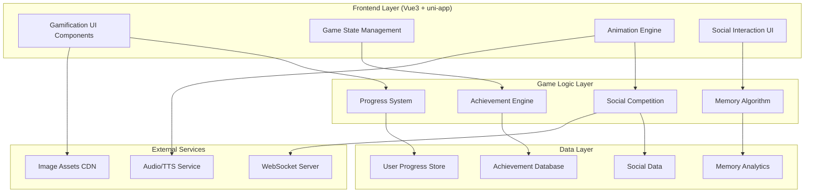

# 设计文档

## 概述

本设计文档概述了Natural English词汇学习应用的综合游戏化系统。该系统通过多个相互关联的子系统（包括进度机制、社交功能、收集元素和科学记忆优化）将传统的单词记忆转变为引人入胜的游戏化体验。

该设计利用现有的Vue3 + uni-app架构，同时引入与当前单词学习基础设施无缝集成的新游戏化组件。系统设计为模块化、可扩展和可维护的，同时在所有支持的平台上提供丰富的交互体验。

## 架构

### 系统架构概述



### 核心游戏化架构

游戏化系统围绕五个核心子系统构建：

1. **进度与成就系统**：管理用户等级、经验值和里程碑跟踪
2. **互动学习引擎**：处理多样化题型和即时反馈
3. **收集与定制系统**：管理角色进度和物品收集
4. **社交竞争平台**：启用实时PvP和协作功能
5. **记忆优化引擎**：实施间隔重复和自适应学习

## 组件和接口

### 1. 游戏状态管理 (Vue3 Composition API)

```javascript
// composables/useGameState.js
export function useGameState() {
  const gameState = reactive({
    user: {
      level: 1,
      experience: 0,
      coins: 0,
      character: 'default',
      title: 'Beginner'
    },
    progress: {
      wordsLearned: 0,
      currentStreak: 0,
      totalSessions: 0,
      averageAccuracy: 0
    },
    achievements: [],
    collections: {
      characters: [],
      pets: [],
      themes: []
    }
  })
  
  const updateExperience = (points) => { /* implementation */ }
  const levelUp = () => { /* implementation */ }
  const unlockAchievement = (achievementId) => { /* implementation */ }
  
  return {
    gameState: readonly(gameState),
    updateExperience,
    levelUp,
    unlockAchievement
  }
}
```

### 2. 互动学习组件

#### 多模式题型
- **DragDropSpelling.vue**：带物理动画的字母拖拽
- **WordMatchingGame.vue**：消除式单词-词义匹配
- **AudioRecognition.vue**：语音转文本发音练习
- **VisualAssociation.vue**：带情境场景的图像-单词关联

#### 反馈系统组件
- **ParticleEffect.vue**：正确答案的可配置粒子动画
- **ComboIndicator.vue**：带缩放动画的视觉连击计数器
- **ProgressRing.vue**：带平滑过渡的圆形进度指示器
- **HapticFeedback.js**：跨平台震动和触觉响应

### 3. 角色与收集系统

#### 角色进度
```javascript
// models/Character.js
export class Character {
  constructor(type = 'default') {
    this.type = type
    this.level = 1
    this.experience = 0
    this.abilities = []
    this.customizations = {
      skin: 'default',
      accessories: [],
      environment: 'classroom'
    }
  }
  
  levelUp() {
    this.level++
    this.unlockNewAbilities()
    this.triggerLevelUpAnimation()
  }
  
  addCustomization(item) {
    // Implementation for adding skins, pets, etc.
  }
}
```

#### 收集管理
- **CollectionGallery.vue**：带稀有度指示器的网格式收集展示
- **ItemShop.vue**：购买定制物品的应用内商店
- **PetCare.vue**：互动宠物喂养和照料机制
- **CharacterCustomizer.vue**：实时角色外观编辑器

### 4. 社交竞争系统

#### 实时PvP组件
```javascript
// services/PvPService.js
export class PvPService {
  constructor() {
    this.socket = null
    this.currentMatch = null
  }
  
  async findMatch() {
    // WebSocket matchmaking implementation
  }
  
  sendAnswer(answer) {
    // Real-time answer submission
  }
  
  handleOpponentAnswer(data) {
    // Process opponent's answer and update UI
  }
}
```

#### 社交功能
- **Leaderboard.vue**：带动画过渡的分段排名
- **TeamChallenge.vue**：3人协作学习挑战
- **FriendVisit.vue**：互动"单词王国"拜访系统
- **SocialShare.vue**：向外部平台分享成就

### 5. 记忆优化引擎

#### 间隔重复算法
```javascript
// algorithms/SpacedRepetition.js
export class SpacedRepetitionEngine {
  calculateNextReview(wordId, accuracy, responseTime) {
    const difficulty = this.calculateDifficulty(accuracy, responseTime)
    const interval = this.getOptimalInterval(difficulty)
    return new Date(Date.now() + interval)
  }
  
  adaptDifficulty(userPerformance) {
    // Dynamic difficulty adjustment based on user performance
  }
  
  generateReviewQueue() {
    // Prioritize words based on forgetting curve
  }
}
```

## 数据模型

### 用户游戏化档案
```javascript
{
  userId: String,
  gameProfile: {
    level: Number,
    experience: Number,
    coins: Number,
    character: {
      type: String,
      customizations: Object
    },
    achievements: [
      {
        id: String,
        unlockedAt: Date,
        progress: Number
      }
    ],
    collections: {
      characters: [String],
      pets: [Object],
      themes: [String]
    },
    statistics: {
      totalWordsLearned: Number,
      currentStreak: Number,
      longestStreak: Number,
      averageAccuracy: Number,
      totalPlayTime: Number,
      sessionsCompleted: Number
    }
  }
}
```

### 学习会话数据
```javascript
{
  sessionId: String,
  userId: String,
  startTime: Date,
  endTime: Date,
  wordsStudied: [
    {
      wordId: String,
      attempts: Number,
      correctAnswers: Number,
      responseTime: Number,
      difficultyLevel: Number
    }
  ],
  gameMetrics: {
    experienceGained: Number,
    coinsEarned: Number,
    achievementsUnlocked: [String],
    comboCount: Number,
    accuracyRate: Number
  }
}
```

### 社交竞争数据
```javascript
{
  matchId: String,
  type: 'pvp' | 'team_challenge',
  participants: [
    {
      userId: String,
      score: Number,
      accuracy: Number,
      responseTime: Number
    }
  ],
  startTime: Date,
  endTime: Date,
  winner: String,
  rewards: {
    experience: Number,
    coins: Number,
    items: [String]
  }
}
```

## 错误处理

### 优雅降级策略
1. **网络连接问题**：本地缓存游戏状态，连接恢复时同步
2. **动画性能**：在低端设备上自动降低动画复杂度
3. **音频故障**：为基于音频的功能提供视觉替代方案
4. **WebSocket断开**：实施指数退避的重连逻辑

### 错误恢复机制
```javascript
// utils/ErrorHandler.js
export class GameErrorHandler {
  handleNetworkError(error) {
    // Switch to offline mode, cache actions for later sync
  }
  
  handleAnimationError(error) {
    // Fallback to CSS-only animations
  }
  
  handleAudioError(error) {
    // Show visual pronunciation guide instead
  }
}
```

## 测试策略

### 单元测试
- **游戏逻辑测试**：测试进度算法、成就触发器和记忆计算
- **组件测试**：验证UI组件在不同游戏状态下正确渲染
- **API集成测试**：模拟后端响应以进行一致性测试

### 集成测试
- **跨平台测试**：确保在iOS、Android和网页上的一致行为
- **性能测试**：验证流畅的动画和响应式交互
- **社交功能测试**：测试实时多人游戏功能

### 用户体验测试
- **可访问性测试**：屏幕阅读器兼容性和替代输入方法
- **可用性测试**：验证学习流程和游戏化效果
- **A/B测试**：比较不同的奖励结构和进度率

## 性能考虑

### 动画优化
```javascript
// utils/AnimationOptimizer.js
export class AnimationOptimizer {
  constructor() {
    this.deviceCapability = this.detectDeviceCapability()
  }
  
  getOptimalAnimationLevel() {
    return this.deviceCapability.canHandleComplexAnimations ? 'high' : 'low'
  }
  
  optimizeParticleCount(baseCount) {
    return this.deviceCapability.gpu ? baseCount : Math.floor(baseCount / 2)
  }
}
```

### 内存管理
- **懒加载**：按需加载游戏资源以减少初始包大小
- **资源缓存**：为常用动画和声音实施智能缓存
- **状态清理**：在功能切换时正确释放游戏对象

### 网络优化
- **数据压缩**：压缩游戏状态同步数据
- **批量更新**：将多个游戏操作组合成单个API调用
- **离线支持**：为离线学习会话缓存必要的游戏数据

## 安全考虑

### 客户端安全
- **输入验证**：在处理前清理所有用户输入
- **状态篡改防护**：在服务器端验证游戏状态变更
- **API速率限制**：防止游戏化端点的滥用

### 数据隐私
- **用户同意**：社交功能和数据共享的明确选择加入
- **数据最小化**：仅收集必要的游戏化指标
- **安全存储**：在本地存储中加密敏感用户数据

## 部署策略

### 渐进式发布
1. **阶段1**：核心进度系统和基础成就
2. **阶段2**：互动学习组件和反馈系统
3. **阶段3**：社交竞争功能和实时PvP
4. **阶段4**：高级收集系统和角色定制

### 功能标志
```javascript
// config/FeatureFlags.js
export const FEATURE_FLAGS = {
  SOCIAL_COMPETITION: process.env.NODE_ENV === 'production',
  ADVANCED_ANIMATIONS: true,
  REAL_TIME_PVP: false, // Gradual rollout
  CHARACTER_CUSTOMIZATION: true
}
```

### 监控和分析
- **性能指标**：跟踪动画帧率和加载时间
- **参与度指标**：监控用户留存和功能采用
- **错误跟踪**：全面的错误日志记录以快速解决问题
- **A/B测试基础设施**：支持测试不同的游戏化方法