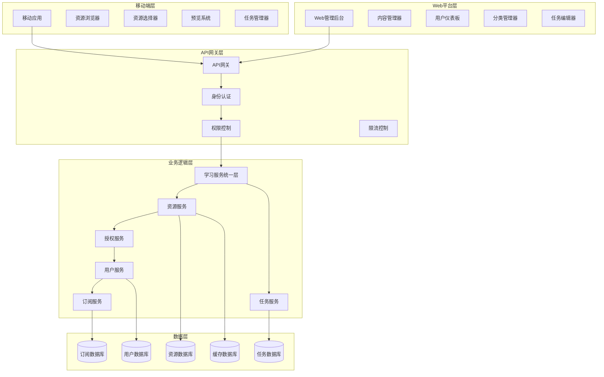
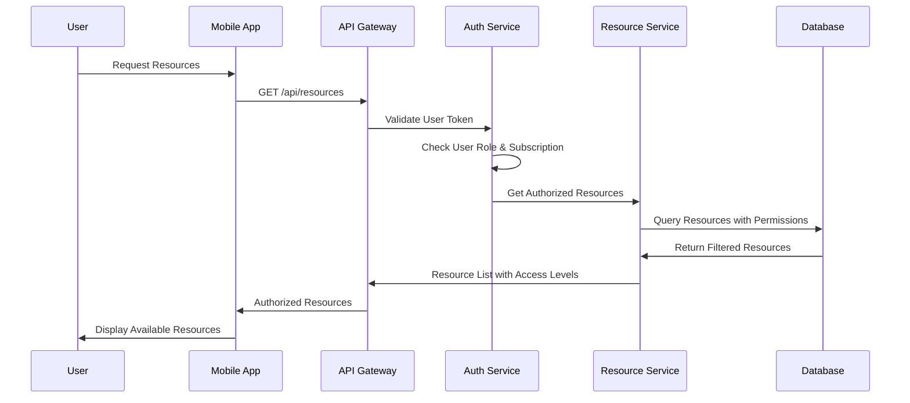

# 设计文档

## 概述

资源授权系统是一个全面的内容管理和访问控制平台，管理跨移动端和Web端的教育单词资源。系统实现了三层资源模型（免费、高级、用户生成），具有基于角色的访问控制、平台特定功能，以及与现有学习目标系统的无缝集成。

架构支持三种主要资源添加方法：手动逐一添加单词、单词集关联和词库列表关联，同时为不同用户类型和订阅级别提供细粒度的授权控制。

## 功能整合分析

### Teaching vs Vocabulary_Manager 功能重叠分析

经过分析，发现两个应用存在显著功能重叠：

**重叠功能：**
1. **学习目标管理** - 两个应用都有LearningGoal模型
2. **学习会话跟踪** - 都有学习会话和进度记录
3. **单词学习进度** - 都跟踪单词掌握情况
4. **学习计划制定** - 都有计划管理功能

**设计差异：**
- Teaching应用：面向教学场景，强调师生互动
- Vocabulary_Manager应用：面向个人学习，强调自主管理

**整合方案：**
1. 保留Teaching应用作为主要学习管理系统
2. 将Vocabulary_Manager的个人学习功能整合到Teaching中
3. 统一学习目标和进度管理模型
4. 保持多端易用性设计

## Architecture

### 系统架构



### Resource Authorization Flow



## 组件和接口

### 1. 统一学习服务层

#### UnifiedLearningService 类
```python
class UnifiedLearningService:
    def create_learning_goal(user, goal_data)
    def manage_learning_progress(user, goal_id, progress_data)
    def get_learning_analytics(user, goal_id=None)
    def sync_cross_platform_data(user, platform, data)
    def get_authorized_resources(user, resource_type=None)
```

### 2. 资源管理组件

#### ResourceManager 类
```python
class ResourceManager:
    def get_authorized_resources(user, resource_type=None)
    def check_resource_access(user, resource_id)
    def create_user_resource(user, resource_data)
    def update_resource_permissions(resource_id, permissions)
    def get_resource_analytics(resource_id)
```

#### 资源类型
- **WordResource**: 带有多媒体内容的单个单词资源
- **WordSet**: 为特定学习目标策划的单词集合
- **VocabularyList**: 按课程组织的综合词汇数据库

### 3. 授权组件

#### AuthorizationService 类
```python
class AuthorizationService:
    def validate_resource_access(user, resource)
    def get_user_subscription_level(user)
    def check_premium_access(user, resource)
    def validate_teacher_shared_content(user, resource)
    def apply_resource_filters(user, queryset)
```

#### 访问级别
- **FREE**: 所有用户可用的基础资源
- **PREMIUM**: 需要有效订阅的付费内容
- **USER_GENERATED**: 教师/用户创建的自定义内容
- **SHARED**: 教师分享给特定学生的内容

### 4. 内容管理组件

#### ContentManager 类
```python
class ContentManager:
    def create_content(user, content_data)
    def update_content(user, content_id, updates)
    def delete_content(user, content_id)
    def share_content(user, content_id, recipients)
    def organize_content(user, content_id, categories)
```

### 5. 任务管理组件

#### TaskManager 类
```python
class TaskManager:
    def create_learning_task(user, task_data, platform)
    def update_task_progress(user, task_id, progress)
    def get_platform_optimized_tasks(user, platform)
    def sync_task_across_platforms(user, task_id)
    def get_task_analytics(user, task_id)
```

### 6. 移动端接口组件

#### MobileAPI 类
```python
class MobileAPI:
    def list_resources(user, filters)
    def preview_resource(user, resource_id)
    def select_resource(user, resource_id)
    def get_simple_tasks(user)
    def update_task_progress_mobile(user, task_id, progress)
```

### 7. Web端接口组件

#### WebAPI 类
```python
class WebAPI:
    def manage_content(user, action, content_data)
    def bulk_operations(user, operation, content_ids)
    def detailed_task_management(user, task_data)
    def analytics_dashboard(user, date_range)
    def export_import_content(user, operation, data)
```

## Data Models

### Enhanced Resource Models

```python
class ResourceAuthorization(models.Model):
    """Resource authorization and access control"""
    resource_type = models.CharField(choices=RESOURCE_TYPE_CHOICES)
    resource_id = models.PositiveIntegerField()
    access_level = models.CharField(choices=ACCESS_LEVEL_CHOICES)
    created_by = models.ForeignKey(User)
    shared_with = models.ManyToManyField(User, through='ResourceShare')
    subscription_required = models.CharField(choices=SUBSCRIPTION_CHOICES)
    is_active = models.BooleanField(default=True)
    created_at = models.DateTimeField(auto_now_add=True)
    expires_at = models.DateTimeField(null=True, blank=True)

class ResourceShare(models.Model):
    """Resource sharing relationships"""
    authorization = models.ForeignKey(ResourceAuthorization)
    shared_by = models.ForeignKey(User, related_name='shared_resources')
    shared_with = models.ForeignKey(User, related_name='received_resources')
    permission_level = models.CharField(choices=PERMISSION_CHOICES)
    shared_at = models.DateTimeField(auto_now_add=True)
    expires_at = models.DateTimeField(null=True, blank=True)
    is_active = models.BooleanField(default=True)

class ResourceCategory(models.Model):
    """Hierarchical resource categorization"""
    name = models.CharField(max_length=100)
    parent = models.ForeignKey('self', null=True, blank=True)
    created_by = models.ForeignKey(User)
    description = models.TextField(blank=True)
    is_public = models.BooleanField(default=False)
    sort_order = models.IntegerField(default=0)

class ResourceUsageAnalytics(models.Model):
    """Resource usage tracking and analytics"""
    resource_type = models.CharField(choices=RESOURCE_TYPE_CHOICES)
    resource_id = models.PositiveIntegerField()
    user = models.ForeignKey(User)
    action = models.CharField(choices=ACTION_CHOICES)
    session_id = models.CharField(max_length=100)
    platform = models.CharField(choices=PLATFORM_CHOICES)
    timestamp = models.DateTimeField(auto_now_add=True)
    metadata = models.JSONField(default=dict)
```

### User Subscription Models

```python
class UserSubscription(models.Model):
    """User subscription management"""
    user = models.OneToOneField(User)
    subscription_type = models.CharField(choices=SUBSCRIPTION_TYPE_CHOICES)
    status = models.CharField(choices=SUBSCRIPTION_STATUS_CHOICES)
    start_date = models.DateTimeField()
    end_date = models.DateTimeField()
    auto_renew = models.BooleanField(default=True)
    payment_method = models.CharField(max_length=50)
    created_at = models.DateTimeField(auto_now_add=True)
    updated_at = models.DateTimeField(auto_now=True)

class SubscriptionFeature(models.Model):
    """Subscription feature definitions"""
    name = models.CharField(max_length=100)
    description = models.TextField()
    subscription_types = models.JSONField()  # List of subscription types that include this feature
    is_active = models.BooleanField(default=True)
```

## Error Handling

### Error Categories

1. **Authentication Errors**
   - Invalid or expired tokens
   - Insufficient permissions
   - Account suspension/deactivation

2. **Authorization Errors**
   - Resource access denied
   - Subscription required
   - Content not shared with user

3. **Resource Errors**
   - Resource not found
   - Invalid resource format
   - Upload size/type restrictions

4. **Business Logic Errors**
   - Subscription expired
   - Usage limits exceeded
   - Content sharing restrictions

### Error Response Format

```json
{
  "error": {
    "code": "RESOURCE_ACCESS_DENIED",
    "message": "You don't have permission to access this premium resource",
    "details": {
      "resource_id": 12345,
      "required_subscription": "premium",
      "current_subscription": "free",
      "upgrade_url": "/subscription/upgrade"
    },
    "timestamp": "2025-01-09T10:30:00Z"
  }
}
```

### Error Handling Strategy

1. **Graceful Degradation**: Show available alternatives when access is denied
2. **Clear Messaging**: Provide actionable error messages with upgrade paths
3. **Logging**: Comprehensive error logging for debugging and analytics
4. **Retry Logic**: Automatic retry for transient failures
5. **Fallback Content**: Default content when premium resources are unavailable

## Testing Strategy

### Unit Testing

1. **Authorization Logic Tests**
   - User permission validation
   - Subscription level checking
   - Resource access control

2. **Resource Management Tests**
   - CRUD operations
   - Content sharing functionality
   - Category management

3. **API Endpoint Tests**
   - Request/response validation
   - Error handling
   - Rate limiting

### Integration Testing

1. **Mobile App Integration**
   - Resource browsing and selection
   - Preview functionality
   - Offline content access

2. **Web Platform Integration**
   - Content management workflows
   - Bulk operations
   - Import/export functionality

3. **Payment Integration**
   - Subscription activation
   - Access level updates
   - Billing cycle management

### Performance Testing

1. **Load Testing**
   - Concurrent user access
   - Resource query performance
   - Database optimization

2. **Scalability Testing**
   - Large dataset handling
   - Multi-tenant performance
   - Cache effectiveness

### Security Testing

1. **Access Control Testing**
   - Permission bypass attempts
   - Privilege escalation
   - Data leakage prevention

2. **Input Validation Testing**
   - SQL injection prevention
   - File upload security
   - XSS protection

### User Acceptance Testing

1. **Mobile User Experience**
   - Resource discovery flow
   - Selection and usage workflow
   - Offline functionality

2. **Web Content Management**
   - Content creation workflow
   - Sharing and collaboration
   - Analytics and reporting

3. **Subscription Management**
   - Upgrade/downgrade flows
   - Payment processing
   - Access level changes