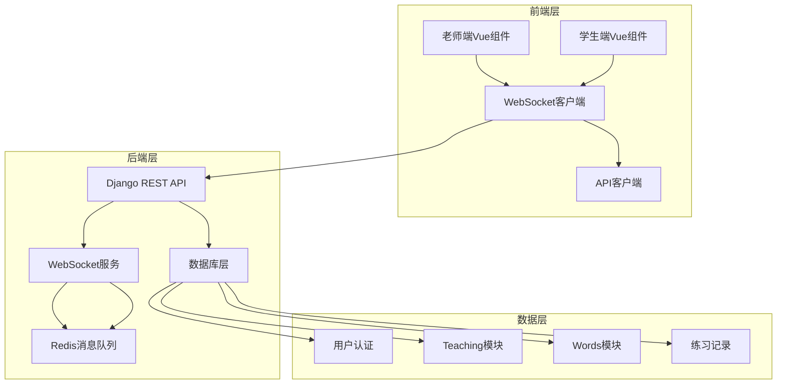

# 老师指导单词选择练习系统设计文档

## 实施状态总结

**总体完成度：10% (项目处于设计阶段)**

**设计状态：80%完成**
- ✅ 系统架构设计
- ✅ 组件设计
- ✅ API接口设计
- ✅ 数据模型设计
- ❌ 详细实施计划

**开发状态：0%完成**
- ❌ 前端组件开发
- ❌ 后端API实现
- ❌ WebSocket服务
- ❌ 数据库模型

**集成状态：0%完成**
- ❌ 与现有系统集成
- ❌ 测试和验证
- ❌ 部署配置

## 概述

基于现有的Vue3 + uni-app前端和Django后端架构，设计一个老师指导学生练习的实时互动教学平台。系统通过WebSocket实现双端同步，允许老师实时控制学生的单词练习过程，查看学习数据，并提供个性化指导。

### 核心特性
- 实时双端同步的练习控制
- 基于GoalWord的练习内容管理
- 多学生并发指导支持
- 详细的练习数据记录和分析
- 智能教学辅助功能

## 架构设计

### 系统架构图



### 技术栈
- **前端**: Vue3 + uni-app + WebSocket客户端
- **后端**: Django + Django Channels + Redis
- **数据库**: SQLite/PostgreSQL
- **实时通信**: WebSocket + Redis Channel Layer
- **认证**: Django Token Authentication

## 组件和接口设计

### 前端组件架构

#### 老师端组件
```
TeacherGuidedPractice/
├── TeacherDashboard.vue          # 老师主控制台
├── StudentSelector.vue           # 学生选择器
├── PracticeController.vue        # 练习控制面板
├── StudentDataViewer.vue         # 学生数据查看器
├── RealTimeMonitor.vue          # 实时监控面板
└── PracticeReports.vue          # 练习报告
```

#### 学生端组件
```
StudentGuidedPractice/
├── GuidedPracticeView.vue        # 学生练习界面
├── WaitingRoom.vue              # 等待室
├── PracticeQuestion.vue         # 题目显示组件
└── PracticeResult.vue           # 结果显示组件
```

### 后端API设计

#### WebSocket消息协议
```python
# 消息类型定义
MESSAGE_TYPES = {
    'session_start': '开始练习会话',
    'question_push': '推送题目',
    'student_answer': '学生答题',
    'answer_reveal': '公布答案',
    'session_end': '结束会话',
    'student_join': '学生加入',
    'student_leave': '学生离开',
    'heartbeat': '心跳检测'
}

# 消息格式
{
    "type": "question_push",
    "session_id": "session_123",
    "data": {
        "question_id": 1,
        "word": "apple",
        "options": ["苹果", "香蕉", "橙子", "葡萄"],
        "correct_answer": 0,
        "time_limit": 30
    },
    "timestamp": "2025-01-09T10:30:00Z"
}
```

#### REST API端点
```python
# 练习会话管理
POST /api/teaching/guided-sessions/          # 创建指导会话
GET  /api/teaching/guided-sessions/{id}/     # 获取会话详情
PUT  /api/teaching/guided-sessions/{id}/     # 更新会话状态
DELETE /api/teaching/guided-sessions/{id}/   # 删除会话

# 学生管理
GET  /api/teaching/my-students/              # 获取我的学生列表
GET  /api/teaching/student-data/{id}/        # 获取学生详细数据
GET  /api/teaching/student-progress/{id}/    # 获取学生进度统计

# 练习内容管理
GET  /api/teaching/goal-words/               # 获取目标单词
POST /api/teaching/practice-content/         # 创建练习内容
GET  /api/teaching/practice-history/         # 获取练习历史

# 实时控制
POST /api/teaching/sessions/{id}/start/      # 开始练习
POST /api/teaching/sessions/{id}/pause/      # 暂停练习
POST /api/teaching/sessions/{id}/resume/     # 继续练习
POST /api/teaching/sessions/{id}/next/       # 下一题
POST /api/teaching/sessions/{id}/end/        # 结束练习
```

## 数据模型设计

### 新增数据模型

#### GuidedPracticeSession (指导练习会话)
```python
class GuidedPracticeSession(models.Model):
    """老师指导练习会话模型"""
    teacher = models.ForeignKey(User, on_delete=models.CASCADE, related_name='guided_sessions')
    students = models.ManyToManyField(User, related_name='participated_sessions')
    learning_goal = models.ForeignKey(LearningGoal, on_delete=models.CASCADE)
    session_name = models.CharField(max_length=200)
    practice_mode = models.CharField(max_length=20, choices=PRACTICE_MODE_CHOICES)
    
    # 会话状态
    status = models.CharField(max_length=20, choices=SESSION_STATUS_CHOICES)
    current_question_index = models.IntegerField(default=0)
    total_questions = models.IntegerField(default=0)
    
    # 时间记录
    start_time = models.DateTimeField(null=True, blank=True)
    end_time = models.DateTimeField(null=True, blank=True)
    created_at = models.DateTimeField(auto_now_add=True)
    
    # WebSocket房间标识
    room_name = models.CharField(max_length=100, unique=True)
```

#### GuidedPracticeQuestion (指导练习题目)
```python
class GuidedPracticeQuestion(models.Model):
    """指导练习题目模型"""
    session = models.ForeignKey(GuidedPracticeSession, on_delete=models.CASCADE)
    word = models.ForeignKey(Word, on_delete=models.CASCADE)
    question_order = models.IntegerField()
    question_type = models.CharField(max_length=20, default='multiple_choice')
    
    # 题目内容
    options = models.JSONField()  # 选项列表
    correct_answer = models.IntegerField()  # 正确答案索引
    time_limit = models.IntegerField(default=30)  # 答题时限(秒)
    
    # 状态跟踪
    is_active = models.BooleanField(default=False)
    started_at = models.DateTimeField(null=True, blank=True)
    ended_at = models.DateTimeField(null=True, blank=True)
```

#### GuidedPracticeAnswer (指导练习答案)
```python
class GuidedPracticeAnswer(models.Model):
    """学生在指导练习中的答案记录"""
    question = models.ForeignKey(GuidedPracticeQuestion, on_delete=models.CASCADE)
    student = models.ForeignKey(User, on_delete=models.CASCADE)
    selected_answer = models.IntegerField()
    is_correct = models.BooleanField()
    response_time = models.FloatField()  # 响应时间(秒)
    answered_at = models.DateTimeField(auto_now_add=True)
```

### 扩展现有模型

#### LearningSession 扩展
```python
# 在现有LearningSession模型中添加字段
class LearningSession(models.Model):
    # ... 现有字段 ...
    
    # 新增字段
    is_guided = models.BooleanField(default=False)  # 是否为指导模式
    guided_session = models.ForeignKey(
        'GuidedPracticeSession', 
        on_delete=models.SET_NULL, 
        null=True, 
        blank=True
    )
    teacher = models.ForeignKey(
        User, 
        on_delete=models.SET_NULL, 
        null=True, 
        blank=True,
        related_name='guided_learning_sessions'
    )
```

#### WordLearningRecord 扩展
```python
# 在现有WordLearningRecord模型中添加字段
class WordLearningRecord(models.Model):
    # ... 现有字段 ...
    
    # 新增字段
    is_guided = models.BooleanField(default=False)  # 是否为指导模式
    guided_question = models.ForeignKey(
        'GuidedPracticeQuestion',
        on_delete=models.SET_NULL,
        null=True,
        blank=True
    )
```

## WebSocket服务设计

### Consumer类设计
```python
class GuidedPracticeConsumer(AsyncWebsocketConsumer):
    """指导练习WebSocket消费者"""
    
    async def connect(self):
        """建立连接"""
        # 验证用户身份和权限
        # 加入对应的房间组
        
    async def disconnect(self, close_code):
        """断开连接"""
        # 清理连接状态
        # 通知其他用户
        
    async def receive(self, text_data):
        """接收消息"""
        # 解析消息类型
        # 根据消息类型处理业务逻辑
        
    # 消息处理方法
    async def handle_teacher_control(self, event):
        """处理老师控制消息"""
        
    async def handle_student_answer(self, event):
        """处理学生答题消息"""
        
    async def broadcast_to_room(self, message):
        """向房间广播消息"""
```

### 房间管理策略
```python
# 房间命名规则
ROOM_NAME_FORMAT = "guided_practice_{session_id}"

# 用户角色管理
class RoomManager:
    def __init__(self):
        self.rooms = {}  # 房间状态缓存
        
    def join_room(self, room_name, user_id, role):
        """用户加入房间"""
        
    def leave_room(self, room_name, user_id):
        """用户离开房间"""
        
    def get_room_users(self, room_name):
        """获取房间用户列表"""
        
    def broadcast_to_room(self, room_name, message, exclude_user=None):
        """向房间广播消息"""
```

## 错误处理和异常管理

### 错误类型定义
```python
class GuidedPracticeError(Exception):
    """指导练习基础异常"""
    pass

class SessionNotFoundError(GuidedPracticeError):
    """会话不存在异常"""
    pass

class PermissionDeniedError(GuidedPracticeError):
    """权限不足异常"""
    pass

class WebSocketConnectionError(GuidedPracticeError):
    """WebSocket连接异常"""
    pass
```

### 异常处理策略
1. **连接异常**: 自动重连机制，最多重试3次
2. **权限异常**: 立即断开连接，返回错误信息
3. **数据异常**: 记录错误日志，返回友好提示
4. **网络异常**: 显示网络状态，提供手动重连选项

## 测试策略

### 单元测试
- 模型层测试：数据模型的CRUD操作
- 视图层测试：API端点的功能测试
- WebSocket测试：消息收发和房间管理

### 集成测试
- 端到端练习流程测试
- 多用户并发测试
- 网络异常恢复测试

### 性能测试
- WebSocket连接数压力测试
- 数据库查询性能测试
- 前端渲染性能测试

## 安全考虑

### 认证和授权
- 基于Token的API认证
- WebSocket连接时的身份验证
- 老师-学生关系验证

### 数据安全
- 敏感数据加密传输
- 练习记录数据保护
- 用户隐私信息脱敏

### 防护措施
- CSRF攻击防护
- XSS攻击防护
- WebSocket消息频率限制
- 恶意连接检测和阻断

## 部署和运维

### 部署架构
```
Load Balancer
    ↓
Django Application Servers (多实例)
    ↓
Redis Cluster (WebSocket消息队列)
    ↓
Database (主从复制)
```

### 监控指标
- WebSocket连接数
- 消息处理延迟
- 数据库查询性能
- 用户活跃度统计

### 日志管理
- 用户操作日志
- 系统错误日志
- 性能监控日志
- 安全审计日志