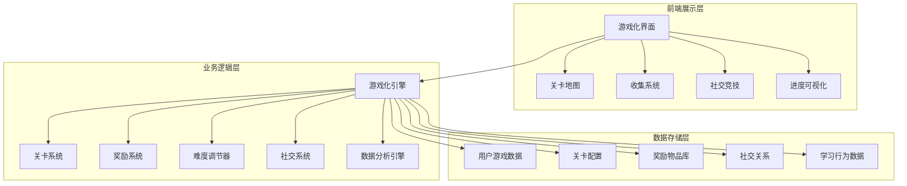

# 用户粘性游戏化系统设计文档

## 概述

用户粘性游戏化系统是一个基于心理学和行为激励理论的综合性学习激励平台。系统通过"挑战-反馈-成长"闭环机制，结合多元化游戏元素、社交竞争和科学记忆法，构建可持续的用户粘性引擎，显著提升用户留存率和学习效果。

## 架构设计

### 系统架构图



### 核心模块架构

1. **游戏化核心引擎**：负责统一管理所有游戏化元素
2. **关卡进度系统**：管理用户学习进度和关卡解锁
3. **收集培养系统**：处理卡牌收集和虚拟宠物培养
4. **社交竞技系统**：实现实时对战和排行榜功能
5. **智能反馈系统**：提供动态视听反馈和难度调节
6. **数据分析系统**：监控用户行为并优化游戏化元素

## 组件和接口

### 1. 游戏化核心引擎 (GamificationEngine)

**职责**：统一管理游戏化元素，协调各子系统交互

**核心接口**：
```python
class GamificationEngine:
    def calculate_user_level(user_id: int) -> dict
    def award_experience(user_id: int, exp_points: int) -> bool
    def trigger_achievement(user_id: int, achievement_type: str) -> dict
    def update_difficulty(user_id: int, performance_data: dict) -> int
    def process_learning_session(session_data: dict) -> dict
```

### 2. 关卡进度系统 (LevelProgressSystem)

**职责**：管理关卡解锁、星级评分和进度追踪

**核心组件**：
- `LevelManager`: 关卡配置和解锁逻辑
- `StarRatingCalculator`: 星级评分算法
- `ProgressTracker`: 进度追踪和可视化

**数据模型**：
```python
class GameLevel:
    level_id: int
    difficulty: int
    unlock_requirements: dict
    star_thresholds: dict
    rewards: dict

class UserLevelProgress:
    user_id: int
    level_id: int
    stars_earned: int
    completion_time: datetime
    attempts: int
    is_unlocked: bool
```

### 3. 收集培养系统 (CollectionSystem)

**职责**：管理卡牌收集、虚拟宠物培养和物品系统

**核心组件**：
- `CardManager`: 卡牌生成、收集和展示
- `PetSystem`: 虚拟宠物培养和互动
- `ItemShop`: 虚拟商店和物品兑换

**数据模型**：
```python
class MonsterCard:
    card_id: int
    word_id: int
    rarity: str  # common, rare, epic, legendary
    attributes: dict
    unlock_condition: str

class VirtualPet:
    pet_id: int
    user_id: int
    pet_type: str
    level: int
    experience: int
    decorations: list
    last_interaction: datetime
```

### 4. 社交竞技系统 (SocialCompetitionSystem)

**职责**：实现实时对战、排行榜和团队协作功能

**核心组件**：
- `BattleMatchmaker`: 对战匹配算法
- `RealtimeBattle`: 实时对战逻辑
- `LeaderboardManager`: 排行榜管理
- `TeamManager`: 团队协作功能

**数据模型**：
```python
class BattleSession:
    battle_id: int
    player1_id: int
    player2_id: int
    battle_type: str
    start_time: datetime
    end_time: datetime
    winner_id: int
    scores: dict

class StudyGroup:
    group_id: int
    group_name: str
    members: list
    weekly_goals: dict
    achievements: list
    created_at: datetime
```

### 5. 智能反馈系统 (FeedbackSystem)

**职责**：提供动态视听反馈和自适应难度调节

**核心组件**：
- `VisualEffectManager`: 视觉特效管理
- `AudioFeedbackManager`: 音效反馈管理
- `DifficultyAdjuster`: 智能难度调节
- `FlowStateMonitor`: 心流状态监控

**算法设计**：
```python
class DifficultyAdjuster:
    def calculate_optimal_difficulty(self, user_performance: dict) -> float:
        # 基于用户表现计算最优难度
        accuracy_rate = user_performance['accuracy']
        response_time = user_performance['avg_response_time']
        recent_trend = user_performance['recent_trend']
        
        # 心流理论：挑战略高于能力
        optimal_difficulty = user_ability * 1.1
        return optimal_difficulty
```

### 6. 智能复习系统 (SpacedRepetitionSystem)

**职责**：基于艾宾浩斯遗忘曲线的智能复习调度

**核心组件**：
- `ForgettingCurveCalculator`: 遗忘曲线计算
- `ReviewScheduler`: 复习时间调度
- `WeaknessAnalyzer`: 薄弱点分析

**算法实现**：
```python
class SpacedRepetitionAlgorithm:
    def calculate_next_review(self, word_id: int, performance: dict) -> datetime:
        # SM-2算法的改进版本
        easiness_factor = self.update_easiness_factor(performance)
        interval = self.calculate_interval(easiness_factor, repetition_count)
        return datetime.now() + timedelta(days=interval)
```

## 数据模型

### 核心数据模型设计

```python
# 用户游戏化档案
class UserGamificationProfile:
    user_id: int
    current_level: int
    total_experience: int
    coins: int
    gems: int
    current_streak: int
    longest_streak: int
    total_study_time: int
    achievements: list
    character_type: str  # 平民->皇帝进化链
    
# 游戏关卡配置
class GameLevelConfig:
    level_id: int
    level_name: str
    difficulty_tier: int
    word_count_requirement: int
    accuracy_threshold: float
    time_limit: int
    unlock_requirements: dict
    rewards: dict
    
# 用户收集物品
class UserCollection:
    user_id: int
    monster_cards: list
    pet_collection: list
    decorations: list
    achievements: list
    special_items: list
    
# 学习会话游戏化数据
class GamifiedStudySession:
    session_id: int
    user_id: int
    level_id: int
    start_time: datetime
    end_time: datetime
    words_studied: int
    accuracy_rate: float
    combo_count: int
    max_combo: int
    experience_gained: int
    coins_earned: int
    cards_unlocked: list
```

## 错误处理

### 错误分类和处理策略

1. **系统级错误**
   - 数据库连接失败：降级到本地缓存
   - 服务不可用：显示友好提示，保存用户进度

2. **业务逻辑错误**
   - 关卡解锁条件不满足：提示用户完成前置条件
   - 奖励发放失败：记录日志，异步重试

3. **用户交互错误**
   - 网络中断：本地保存进度，恢复后同步
   - 操作超时：自动保存当前状态

### 错误恢复机制

```python
class GamificationErrorHandler:
    def handle_session_interruption(self, session_data: dict):
        # 保存会话状态到本地存储
        self.save_session_locally(session_data)
        # 显示恢复提示
        self.show_recovery_prompt()
    
    def recover_interrupted_session(self, user_id: int):
        # 从本地存储恢复会话
        session_data = self.load_local_session(user_id)
        # 同步到服务器
        self.sync_to_server(session_data)
```

## 测试策略

### 测试层级

1. **单元测试**
   - 游戏化算法测试
   - 数据模型验证
   - 业务逻辑测试

2. **集成测试**
   - 系统间接口测试
   - 数据流测试
   - 性能测试

3. **用户体验测试**
   - A/B测试框架
   - 用户行为分析
   - 游戏化元素效果评估

### 关键测试场景

```python
class GamificationTestSuite:
    def test_level_progression(self):
        # 测试关卡解锁逻辑
        pass
    
    def test_difficulty_adjustment(self):
        # 测试难度自适应算法
        pass
    
    def test_reward_distribution(self):
        # 测试奖励发放机制
        pass
    
    def test_social_features(self):
        # 测试社交功能
        pass
```

## 性能优化

### 缓存策略

1. **用户数据缓存**：Redis缓存用户游戏化档案
2. **关卡配置缓存**：内存缓存关卡配置数据
3. **排行榜缓存**：定时更新排行榜缓存

### 数据库优化

1. **索引优化**：为查询频繁的字段建立索引
2. **分表策略**：按时间分表存储学习记录
3. **读写分离**：读操作使用从库，写操作使用主库

### 前端性能优化

1. **资源预加载**：预加载游戏资源和动画
2. **懒加载**：按需加载非关键组件
3. **动画优化**：使用CSS3硬件加速

## 安全考虑

### 数据安全

1. **用户隐私保护**：敏感数据加密存储
2. **防作弊机制**：客户端验证+服务端校验
3. **数据备份**：定期备份用户游戏化数据

### 业务安全

1. **积分防刷**：限制积分获取频率
2. **排行榜防作弊**：异常行为检测
3. **虚拟物品安全**：防止物品复制和丢失

## 监控和分析

### 关键指标监控

1. **用户粘性指标**
   - 日活跃用户数 (DAU)
   - 用户留存率
   - 平均会话时长
   - 连续学习天数

2. **游戏化效果指标**
   - 关卡完成率
   - 收集完成度
   - 社交参与度
   - 奖励兑换率

3. **学习效果指标**
   - 学习效率提升
   - 知识掌握度
   - 复习完成率
   - 错误率下降

### 数据分析框架

```python
class GamificationAnalytics:
    def track_user_engagement(self, user_id: int, event: str, properties: dict):
        # 追踪用户参与度事件
        pass
    
    def analyze_feature_effectiveness(self, feature_name: str) -> dict:
        # 分析功能有效性
        pass
    
    def generate_optimization_suggestions(self) -> list:
        # 生成优化建议
        pass
```

## 扩展性设计

### 模块化架构

系统采用模块化设计，各功能模块相对独立，便于后续扩展：

1. **插件化游戏模式**：支持新增游戏类型
2. **可配置奖励系统**：支持动态调整奖励规则
3. **多语言支持**：国际化框架支持
4. **主题系统**：支持节日主题和个性化定制

### API设计

```python
# RESTful API设计
class GamificationAPI:
    # 用户游戏化数据
    GET /api/gamification/profile/{user_id}
    PUT /api/gamification/profile/{user_id}
    
    # 关卡系统
    GET /api/gamification/levels
    POST /api/gamification/levels/{level_id}/complete
    
    # 收集系统
    GET /api/gamification/collection/{user_id}
    POST /api/gamification/collection/cards/unlock
    
    # 社交系统
    POST /api/gamification/battle/start
    GET /api/gamification/leaderboard
    
    # 奖励系统
    POST /api/gamification/rewards/claim
    GET /api/gamification/shop/items
```

这个设计文档全面覆盖了用户粘性游戏化系统的各个方面，从架构设计到具体实现，从数据模型到性能优化，为后续的开发工作提供了详细的技术指导。