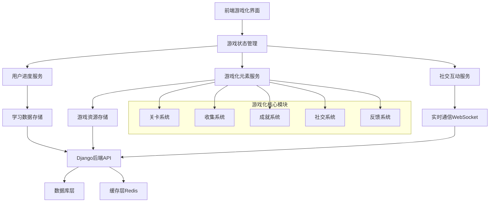
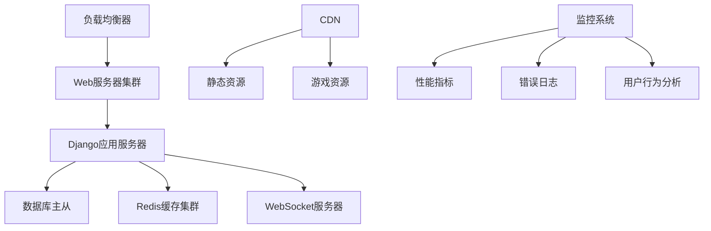

# 背单词软件游戏化元素设计文档

## 概述

本设计文档基于需求文档，为背单词软件构建全面的游戏化元素系统。系统将传统的单词学习转化为沉浸式游戏体验，通过关卡解锁、收集养成、社交竞技、个性化装扮等多元化游戏机制，显著提升学习趣味性和用户黏性。

## 架构设计

### 系统架构图



### 技术栈选择

- **前端**: Vue3 + uni-app (跨端支持)
- **状态管理**: Pinia (Vue3响应式状态管理)
- **实时通信**: WebSocket (对战功能)
- **后端**: Django + Django REST Framework
- **数据库**: SQLite/PostgreSQL
- **缓存**: Redis (排行榜、实时数据)
- **动画**: CSS3 + Canvas (粒子效果)

## 组件和接口设计

### 核心组件架构

#### 1. 关卡系统组件 (LevelSystem)

```javascript
// 关卡地图组件
LevelMapComponent {
  - 横屏闯关界面
  - 关卡解锁状态
  - 怪兽形象展示
  - 星级评分显示
}

// 关卡挑战组件
LevelChallengeComponent {
  - 单词转怪兽机制
  - 实时答题界面
  - 进度条显示
  - 结果评分
}
```

#### 2. 收集系统组件 (CollectionSystem)

```javascript
// 卡牌收集组件
CardCollectionComponent {
  - 400+怪兽卡展示
  - 收集进度统计
  - 卡牌详情查看
  - 稀有度分类
}

// 宠物养成组件
PetSystemComponent {
  - 仓鼠宠物展示
  - 经验值系统
  - 技能树解锁
  - 装扮系统
}
```

#### 3. 社交竞技组件 (SocialSystem)

```javascript
// 实时对战组件
PvPBattleComponent {
  - WebSocket连接管理
  - 双人答题界面
  - 实时进度同步
  - 结果结算
}

// 排行榜组件
LeaderboardComponent {
  - 分组排名显示
  - 荣誉称号展示
  - 历史记录查看
}
```

#### 4. 个性化系统组件 (CustomizationSystem)

```javascript
// 装扮系统组件
CustomizationComponent {
  - 角色装扮界面
  - 场景皮肤选择
  - 房间建造功能
  - 道具管理
}
```

#### 5. 反馈特效组件 (FeedbackSystem)

```javascript
// 视听反馈组件
FeedbackEffectsComponent {
  - 粒子动画系统
  - 音效管理
  - 震动反馈
  - 动态特效
}
```

### API接口设计

#### 关卡系统API

```python
# 关卡管理
GET /api/levels/                    # 获取关卡列表
GET /api/levels/{id}/               # 获取关卡详情
POST /api/levels/{id}/complete/     # 完成关卡
GET /api/levels/{id}/monsters/      # 获取关卡怪兽

# 进度管理
GET /api/user/progress/             # 获取用户进度
POST /api/user/progress/update/     # 更新学习进度
GET /api/user/stars/                # 获取星级统计
```

#### 收集系统API

```python
# 卡牌系统
GET /api/cards/                     # 获取卡牌列表
POST /api/cards/collect/            # 收集卡牌
GET /api/user/collection/           # 获取用户收集

# 宠物系统
GET /api/pets/                      # 获取宠物信息
POST /api/pets/feed/                # 喂养宠物
POST /api/pets/customize/           # 宠物装扮
GET /api/pets/skills/               # 获取技能树
```

#### 社交系统API

```python
# 对战系统
POST /api/battle/create/            # 创建对战房间
POST /api/battle/join/              # 加入对战
WebSocket /ws/battle/{room_id}/     # 实时对战通信

# 排行榜系统
GET /api/leaderboard/               # 获取排行榜
GET /api/leaderboard/friends/       # 好友排行
GET /api/achievements/              # 获取成就列表
```

#### 游戏化元素API

```python
# 成就系统
GET /api/achievements/              # 获取成就列表
POST /api/achievements/unlock/      # 解锁成就
GET /api/user/badges/               # 获取用户勋章

# 复习系统
GET /api/review/schedule/           # 获取复习计划
POST /api/review/complete/          # 完成复习
GET /api/review/mistakes/           # 获取错题集
```

## 数据模型设计

### 核心数据模型

#### 1. 关卡系统模型

```python
class Level(models.Model):
    """关卡模型"""
    name = models.CharField(max_length=100)
    difficulty = models.CharField(max_length=20)  # 四六级、雅思等
    order = models.IntegerField()
    unlock_condition = models.JSONField()  # 解锁条件
    words = models.ManyToManyField('Word')
    created_at = models.DateTimeField(auto_now_add=True)

class UserLevelProgress(models.Model):
    """用户关卡进度"""
    user = models.ForeignKey(User, on_delete=models.CASCADE)
    level = models.ForeignKey(Level, on_delete=models.CASCADE)
    stars = models.IntegerField(default=0)  # 1-3星
    completed = models.BooleanField(default=False)
    completion_time = models.DateTimeField(null=True)
    accuracy_rate = models.FloatField(default=0.0)
```

#### 2. 收集系统模型

```python
class MonsterCard(models.Model):
    """怪兽卡牌模型"""
    name = models.CharField(max_length=100)
    word = models.OneToOneField('Word', on_delete=models.CASCADE)
    rarity = models.CharField(max_length=20)  # 普通、稀有、史诗、传说
    image_url = models.URLField()
    description = models.TextField()

class UserCollection(models.Model):
    """用户收集"""
    user = models.ForeignKey(User, on_delete=models.CASCADE)
    card = models.ForeignKey(MonsterCard, on_delete=models.CASCADE)
    collected_at = models.DateTimeField(auto_now_add=True)
    
class Pet(models.Model):
    """宠物模型"""
    user = models.OneToOneField(User, on_delete=models.CASCADE)
    name = models.CharField(max_length=50, default="仓鼠")
    level = models.IntegerField(default=1)
    experience = models.IntegerField(default=0)
    customization = models.JSONField(default=dict)  # 装扮配置
```

#### 3. 社交系统模型

```python
class BattleRoom(models.Model):
    """对战房间"""
    room_id = models.CharField(max_length=50, unique=True)
    player1 = models.ForeignKey(User, on_delete=models.CASCADE, related_name='battles_as_p1')
    player2 = models.ForeignKey(User, on_delete=models.CASCADE, related_name='battles_as_p2', null=True)
    status = models.CharField(max_length=20)  # waiting, playing, finished
    words = models.JSONField()  # 对战单词列表
    created_at = models.DateTimeField(auto_now_add=True)

class Leaderboard(models.Model):
    """排行榜"""
    user = models.ForeignKey(User, on_delete=models.CASCADE)
    category = models.CharField(max_length=50)  # class, friends, global
    score = models.IntegerField()
    rank = models.IntegerField()
    updated_at = models.DateTimeField(auto_now=True)
```

#### 4. 成就系统模型

```python
class Achievement(models.Model):
    """成就模型"""
    name = models.CharField(max_length=100)
    description = models.TextField()
    icon_url = models.URLField()
    condition = models.JSONField()  # 达成条件
    reward = models.JSONField()  # 奖励内容

class UserAchievement(models.Model):
    """用户成就"""
    user = models.ForeignKey(User, on_delete=models.CASCADE)
    achievement = models.ForeignKey(Achievement, on_delete=models.CASCADE)
    unlocked_at = models.DateTimeField(auto_now_add=True)
    progress = models.JSONField(default=dict)  # 进度追踪
```

## 错误处理

### 错误分类和处理策略

#### 1. 网络连接错误
```javascript
// 网络重试机制
const networkRetry = {
  maxRetries: 3,
  retryDelay: 1000,
  exponentialBackoff: true
}

// WebSocket断线重连
const websocketReconnect = {
  autoReconnect: true,
  reconnectInterval: 5000,
  maxReconnectAttempts: 10
}
```

#### 2. 游戏状态同步错误
```javascript
// 状态同步错误处理
const stateSyncError = {
  localStateBackup: true,
  conflictResolution: 'server-wins',
  rollbackSupport: true
}
```

#### 3. 资源加载错误
```javascript
// 资源加载失败处理
const resourceLoadError = {
  fallbackImages: true,
  progressiveLoading: true,
  cacheStrategy: 'cache-first'
}
```

### 错误恢复机制

```python
# Django后端错误处理
class GameErrorHandler:
    @staticmethod
    def handle_battle_disconnect(room_id, user_id):
        """处理对战断线"""
        # 保存对战状态
        # 通知对手
        # 设置重连超时
        
    @staticmethod
    def handle_progress_sync_error(user_id, local_data):
        """处理进度同步错误"""
        # 数据校验
        # 冲突解决
        # 状态恢复
```

## 测试策略

### 单元测试

#### 1. 游戏逻辑测试
```python
class LevelSystemTest(TestCase):
    def test_level_unlock_logic(self):
        """测试关卡解锁逻辑"""
        
    def test_star_rating_calculation(self):
        """测试星级评分计算"""
        
    def test_monster_defeat_mechanism(self):
        """测试怪兽击败机制"""
```

#### 2. 收集系统测试
```python
class CollectionSystemTest(TestCase):
    def test_card_collection_logic(self):
        """测试卡牌收集逻辑"""
        
    def test_pet_experience_system(self):
        """测试宠物经验系统"""
        
    def test_customization_save_load(self):
        """测试装扮保存加载"""
```

### 集成测试

#### 1. 实时对战测试
```python
class BattleSystemIntegrationTest(TestCase):
    def test_websocket_battle_flow(self):
        """测试WebSocket对战流程"""
        
    def test_concurrent_battles(self):
        """测试并发对战处理"""
        
    def test_battle_reconnection(self):
        """测试对战重连机制"""
```

#### 2. 跨端兼容性测试
```javascript
// uni-app跨端测试
const crossPlatformTest = {
  platforms: ['H5', 'App', 'WeChat'],
  testCases: [
    'gesture_interaction',
    'animation_performance',
    'audio_playback',
    'vibration_feedback'
  ]
}
```

### 性能测试

#### 1. 动画性能测试
```javascript
// 60fps性能监控
const performanceMonitor = {
  targetFPS: 60,
  animationBudget: 16.67, // ms per frame
  memoryThreshold: 100, // MB
  batteryOptimization: true
}
```

#### 2. 并发用户测试
```python
# 压力测试配置
LOAD_TEST_CONFIG = {
    'concurrent_users': 1000,
    'battle_rooms': 100,
    'websocket_connections': 500,
    'api_requests_per_second': 2000
}
```

## 部署和运维

### 部署架构



### 监控指标

#### 1. 游戏性能指标
- 平均响应时间 < 100ms
- 动画帧率 > 55fps
- 内存使用 < 150MB
- 电池消耗优化

#### 2. 用户体验指标
- 关卡完成率
- 用户留存率
- 社交互动频率
- 成就解锁率

#### 3. 系统稳定性指标
- API可用性 > 99.9%
- WebSocket连接稳定性
- 数据同步准确性
- 错误恢复成功率

### 扩展性设计

#### 1. 水平扩展支持
```python
# 微服务架构准备
MICROSERVICES = {
    'level_service': '关卡管理服务',
    'collection_service': '收集系统服务',
    'battle_service': '对战服务',
    'achievement_service': '成就服务'
}
```

#### 2. 数据分片策略
```python
# 用户数据分片
USER_SHARDING = {
    'strategy': 'user_id_hash',
    'shards': 4,
    'replication': 2
}
```

这个设计文档为背单词软件的游戏化元素系统提供了全面的技术架构和实现方案，确保系统能够支持大规模用户的沉浸式学习体验。