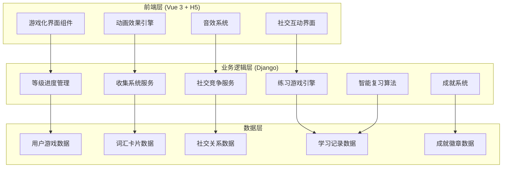

# 词汇游戏化系统设计文档

## 概述

词汇游戏化系统旨在通过全面的游戏化元素，将传统的词汇学习转变为互动的游戏化体验。系统包含进度系统、收集机制、社交功能、多样化练习模式、智能反馈和成就系统，显著提升用户参与度、学习动机和留存率。

## 架构设计

### 系统架构图



## 组件和接口设计

### 1. 等级进度系统

#### 数据模型
```python
class UserLevel(models.Model):
    user = models.OneToOneField(User, on_delete=models.CASCADE)
    current_level = models.IntegerField(default=1)
    current_stars = models.IntegerField(default=0)
    rank = models.CharField(max_length=20, default='青铜')  # 青铜、白银、黄金、钻石、大师
    total_experience = models.IntegerField(default=0)
    
class LevelProgress(models.Model):
    user = models.ForeignKey(User, on_delete=models.CASCADE)
    level = models.IntegerField()
    stars_earned = models.IntegerField(default=0)  # 1-3星
    accuracy_rate = models.FloatField()
    completion_time = models.DateTimeField()
    is_unlocked = models.BooleanField(default=False)
```

#### 核心接口
- `POST /api/gamification/levels/complete/` - 完成等级
- `GET /api/gamification/levels/progress/` - 获取进度
- `POST /api/gamification/levels/unlock/` - 解锁等级

### 2. 收集系统

#### 数据模型
```python
class WordCard(models.Model):
    word = models.OneToOneField(Word, on_delete=models.CASCADE)
    rarity = models.CharField(max_length=20)  # 普通、稀有、史诗、传说
    card_image = models.ImageField(upload_to='word_cards/')
    unlock_condition = models.TextField()
    
class UserCollection(models.Model):
    user = models.ForeignKey(User, on_delete=models.CASCADE)
    word_card = models.ForeignKey(WordCard, on_delete=models.CASCADE)
    collected_at = models.DateTimeField(auto_now_add=True)
    
class VirtualPet(models.Model):
    user = models.OneToOneField(User, on_delete=models.CASCADE)
    pet_type = models.CharField(max_length=50)
    level = models.IntegerField(default=1)
    experience = models.IntegerField(default=0)
    accessories = models.JSONField(default=list)  # 装饰物品列表
```

#### 核心接口
- `POST /api/gamification/collection/add-card/` - 添加卡片到收藏
- `GET /api/gamification/collection/cards/` - 获取用户收藏
- `POST /api/gamification/pet/upgrade/` - 升级宠物
- `POST /api/gamification/pet/buy-accessory/` - 购买装饰

### 3. 社交竞争系统

#### 数据模型
```python
class Battle(models.Model):
    player1 = models.ForeignKey(User, on_delete=models.CASCADE, related_name='battles_as_player1')
    player2 = models.ForeignKey(User, on_delete=models.CASCADE, related_name='battles_as_player2')
    status = models.CharField(max_length=20)  # waiting, active, completed
    winner = models.ForeignKey(User, on_delete=models.SET_NULL, null=True)
    created_at = models.DateTimeField(auto_now_add=True)
    
class Leaderboard(models.Model):
    user = models.ForeignKey(User, on_delete=models.CASCADE)
    category = models.CharField(max_length=50)  # weekly, monthly, class, friends
    score = models.IntegerField()
    rank = models.IntegerField()
    period = models.CharField(max_length=20)
    
class StudyGroup(models.Model):
    name = models.CharField(max_length=100)
    members = models.ManyToManyField(User, through='GroupMembership')
    group_challenge = models.ForeignKey('GroupChallenge', on_delete=models.SET_NULL, null=True)
```

#### 核心接口
- `POST /api/gamification/battle/create/` - 创建对战
- `POST /api/gamification/battle/join/` - 加入对战
- `GET /api/gamification/leaderboard/` - 获取排行榜
- `POST /api/gamification/group/create/` - 创建学习小组

### 4. 多样化练习系统

#### 游戏模式设计
```python
class GameMode(models.Model):
    name = models.CharField(max_length=50)
    description = models.TextField()
    difficulty_level = models.IntegerField()
    game_type = models.CharField(max_length=30)  # matching, spelling, listening
    
class GameSession(models.Model):
    user = models.ForeignKey(User, on_delete=models.CASCADE)
    game_mode = models.ForeignKey(GameMode, on_delete=models.CASCADE)
    score = models.IntegerField(default=0)
    accuracy = models.FloatField()
    duration = models.DurationField()
    combo_count = models.IntegerField(default=0)
```

#### 游戏类型实现
1. **单词匹配游戏** - 拖拽式词义配对
2. **字母拼写游戏** - 拖拽字母瓦片组词
3. **听力理解游戏** - 音频识别与语音反馈
4. **单词消消乐** - 消除式词汇练习

### 5. 智能反馈系统

#### 反馈引擎设计
```python
class FeedbackEngine:
    def generate_instant_feedback(self, is_correct, response_time):
        """生成即时反馈"""
        if is_correct:
            return {
                'type': 'success',
                'animation': 'particle_burst',
                'sound': 'success_chime',
                'message': self.get_positive_message()
            }
        else:
            return {
                'type': 'error',
                'animation': 'gentle_shake',
                'sound': 'soft_error',
                'hint': self.get_helpful_hint()
            }
    
    def update_combo_streak(self, user, is_correct):
        """更新连击状态"""
        if is_correct:
            user.current_combo += 1
            if user.current_combo % 5 == 0:
                return self.generate_combo_celebration()
        else:
            user.current_combo = 0
```

### 6. 智能复习系统

#### 艾宾浩斯遗忘曲线实现
```python
class SpacedRepetitionAlgorithm:
    def calculate_next_review(self, word_progress):
        """基于艾宾浩斯曲线计算下次复习时间"""
        difficulty_factor = word_progress.difficulty_level
        success_rate = word_progress.success_rate
        
        # 基础间隔（小时）
        base_intervals = [1, 4, 24, 72, 168, 336, 720]
        
        interval_index = min(word_progress.review_count, len(base_intervals) - 1)
        base_interval = base_intervals[interval_index]
        
        # 根据成功率调整间隔
        if success_rate > 0.8:
            adjusted_interval = base_interval * 1.3
        elif success_rate < 0.6:
            adjusted_interval = base_interval * 0.6
        else:
            adjusted_interval = base_interval
            
        return timezone.now() + timedelta(hours=adjusted_interval)
```

### 7. 成就系统

#### 成就类型设计
```python
class Achievement(models.Model):
    name = models.CharField(max_length=100)
    description = models.TextField()
    category = models.CharField(max_length=50)  # streak, milestone, social, seasonal
    condition = models.JSONField()  # 解锁条件
    reward = models.JSONField()  # 奖励内容
    badge_image = models.ImageField(upload_to='badges/')
    is_seasonal = models.BooleanField(default=False)
    
class UserAchievement(models.Model):
    user = models.ForeignKey(User, on_delete=models.CASCADE)
    achievement = models.ForeignKey(Achievement, on_delete=models.CASCADE)
    unlocked_at = models.DateTimeField(auto_now_add=True)
    is_shared = models.BooleanField(default=False)
```

## 数据模型

### 核心数据表结构

#### 用户游戏化数据
- `UserLevel` - 用户等级信息
- `LevelProgress` - 等级进度记录
- `UserCollection` - 用户收藏
- `VirtualPet` - 虚拟宠物

#### 游戏内容数据
- `WordCard` - 词汇卡片
- `GameMode` - 游戏模式
- `Achievement` - 成就定义

#### 社交数据
- `Battle` - 对战记录
- `Leaderboard` - 排行榜
- `StudyGroup` - 学习小组

#### 学习数据
- `GameSession` - 游戏会话
- `ReviewSchedule` - 复习计划
- `WordProgress` - 单词学习进度

## 错误处理

### 错误类型定义
```python
class GamificationError(Exception):
    """游戏化系统基础异常"""
    pass

class LevelLockError(GamificationError):
    """等级锁定异常"""
    pass

class BattleMatchingError(GamificationError):
    """对战匹配异常"""
    pass

class CollectionError(GamificationError):
    """收集系统异常"""
    pass
```

### 错误处理策略
1. **网络错误** - 自动重试机制，离线缓存
2. **数据同步错误** - 增量同步，冲突解决
3. **游戏状态错误** - 状态回滚，用户提示
4. **性能问题** - 懒加载，分页处理

## 测试策略

### 单元测试
- 等级计算逻辑测试
- 复习算法准确性测试
- 成就解锁条件测试
- 社交功能逻辑测试

### 集成测试
- 前后端数据同步测试
- 实时对战功能测试
- 动画效果性能测试
- 多用户并发测试

### 用户体验测试
- A/B测试不同游戏化元素
- 用户留存率分析
- 学习效果评估
- 界面交互流畅度测试

## 性能优化

### 前端优化
- 动画效果GPU加速
- 图片资源懒加载
- 音效文件预加载
- 组件按需加载

### 后端优化
- 数据库查询优化
- 缓存策略（Redis）
- 异步任务处理
- API响应时间监控

### 移动端优化
- 触觉反馈适配
- 电池消耗优化
- 网络状况适应
- 存储空间管理

## 安全考虑

### 数据安全
- 用户学习数据加密
- 社交信息隐私保护
- 防作弊机制
- 敏感操作验证

### 系统安全
- API访问频率限制
- 输入数据验证
- SQL注入防护
- XSS攻击防护