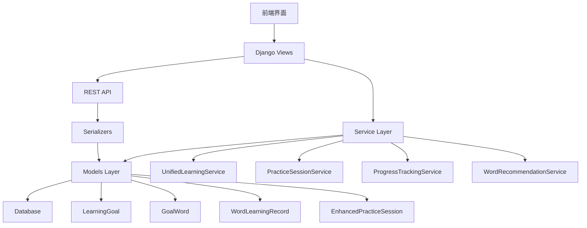

# Design Document

## 概述

增强版单词选择练习系统（word-selection-practice-enhanced）是一个基于Django的Web应用，与现有的学习目标管理系统深度集成，根据用户的个性化学习目标提供智能化的单词练习体验。系统提供两种不同的学习子模式，支持完整的学习流程管理和进度跟踪，采用列表样式布局，提供灵活的练习配置选项，并支持学习状态的持久化和恢复功能。

## Architecture

### 系统架构



### 核心集成组件

- **LearningGoal集成**: 直接使用现有的学习目标模型
- **GoalWord关联**: 利用目标单词关联获取练习内容
- **WordLearningRecord**: 记录练习结果到学习目标
- **UnifiedLearningService**: 统一的学习服务接口

### Technology Stack

- **Backend**: Django + Django REST Framework
- **Frontend**: HTML/CSS/JavaScript (响应式设计)
- **Database**: 现有数据库（PostgreSQL/MySQL）
- **Audio**: Web Audio API for pronunciation playback
- **State Management**: LocalStorage + Session Storage

## Components and Interfaces

### 1. 练习配置组件

**目的**: 基于用户学习目标处理练习配置

**核心功能**:
- 自动加载用户当前活跃学习目标
- 显示目标进度和剩余单词数量
- 智能推荐练习数量（基于目标进度）
- 词条数量配置（全部剩余、30个、50个、100个）
- 每页词条量设置（默认15个）
- 子模式选择

**接口**:
```python
class PracticeConfigurationView(View):
    def get(self, request):
        # 获取用户当前学习目标
        service = UnifiedLearningService(request.user)
        current_goal = service.get_current_goal()
        goals = service.get_learning_goals(active_only=True)
        
        context = {
            'current_goal': current_goal,
            'available_goals': goals,
            'goal_progress': service.get_goal_progress(current_goal.id) if current_goal else None
        }
        return render(request, 'practice_config.html', context)
    
    def post(self, request):
        # 处理配置提交，创建练习会话
        pass
```

### 2. Practice Mode Components

#### 2.1 Mode 1: Self-Assessment Mode (子模式1)

**Purpose**: 看单词，说词意，会的打钩，不会的打叉

**Key Features**:
- 列表样式单词显示
- 打钩/打叉按钮
- 实时状态更新
- 学习记录跟踪

**Interface**:
```python
class SelfAssessmentModeView(View):
    def get(self, request):
        # 显示单词列表
        pass
    
    def post(self, request):
        # 处理用户选择（打钩/打叉）
        pass
```

#### 2.2 Mode 2: Audio Learning Mode (子模式2)

**Purpose**: 看单词，听读音，点击3次后出现词意

**Key Features**:
- 列表样式单词显示
- 音频播放功能
- 点击计数跟踪
- 3次点击后显示词意

**Interface**:
```python
class AudioLearningModeView(View):
    def get(self, request):
        # 显示单词列表
        pass
    
    def post(self, request):
        # 处理单词点击和音频播放
        pass
```

### 3. Progress Tracking Component

**Purpose**: 学习进度跟踪和数据记录

**Key Features**:
- 学习行为记录
- 点击次数统计
- 学习时间跟踪
- 正确率计算

**Interface**:
```python
class ProgressTrackingService:
    def record_practice_action(self, session_id, word_id, action_type, response_time):
        # 记录学习行为
        pass
    
    def calculate_session_stats(self, session_id):
        # 计算会话统计
        pass
```

### 4. Session Management Component

**Purpose**: 学习会话管理和状态持久化

**Key Features**:
- 会话创建和管理
- 状态保存和恢复
- 中途退出处理
- 继续学习功能

**Interface**:
```python
class PracticeSessionService:
    def create_session(self, user, goal, mode, config):
        # 创建练习会话
        pass
    
    def save_session_state(self, session_id, state_data):
        # 保存会话状态
        pass
    
    def restore_session_state(self, session_id):
        # 恢复会话状态
        pass
```

### 5. 智能推荐组件

**目的**: 基于学习目标进度提供个性化单词推荐

**核心功能**:
- 分析目标的九宫格进度状态
- 智能分配不同掌握程度的单词比例
- 根据用户表现调整推荐策略
- 优先推荐需要复习的单词

**接口**:
```python
class WordRecommendationService:
    def __init__(self, user, goal):
        self.user = user
        self.goal = goal
    
    def get_recommended_words(self, count, mode='balanced'):
        # 获取推荐的单词列表
        progress_stats = self.goal.get_progress_stats()
        
        # 根据九宫格状态分配单词
        if mode == 'review_focused':
            # 复习模式：优先选择需要复习的单词
            pass
        elif mode == 'new_learning':
            # 新学习模式：优先选择未学习的单词
            pass
        else:
            # 平衡模式：智能分配比例
            pass
    
    def adjust_recommendation_strategy(self, session_performance):
        # 根据练习表现调整推荐策略
        pass
```

### 6. 报告生成组件

**目的**: 生成详细的学习报告并更新目标进度

**核心功能**:
- 总结报告生成
- 学习统计分析
- 复习建议提供
- 图表数据生成
- 更新学习目标进度

**接口**:
```python
class ReportGenerationService:
    def generate_session_report(self, session_id):
        # 生成会话报告并更新目标进度
        session = EnhancedPracticeSession.objects.get(id=session_id)
        session.goal.update_progress()
        
        # 生成报告数据
        pass
    
    def get_learning_recommendations(self, user_id, session_data):
        # 基于目标进度获取学习建议
        pass
```

## 数据模型

### 1. 增强版练习会话模型

```python
class EnhancedPracticeSession(models.Model):
    """增强版练习会话模型 - 与学习目标深度集成"""
    user = models.ForeignKey(User, on_delete=models.CASCADE, verbose_name='用户')
    goal = models.ForeignKey('teaching.LearningGoal', on_delete=models.CASCADE, verbose_name='学习目标')
    
    # 会话配置
    mode = models.CharField(max_length=20, choices=[
        ('self_assessment', '自我评估模式'),
        ('audio_learning', '音频学习模式')
    ], verbose_name='练习模式')
    
    word_count_config = models.CharField(max_length=20, choices=[
        ('all_remaining', '全部剩余'),
        ('30', '30个'),
        ('50', '50个'),
        ('100', '100个')
    ], verbose_name='单词数量配置')
    
    words_per_page = models.IntegerField(default=15, verbose_name='每页单词数')
    
    # 智能推荐配置
    recommendation_strategy = models.CharField(max_length=20, choices=[
        ('balanced', '平衡模式'),
        ('review_focused', '复习优先'),
        ('new_learning', '新学习优先')
    ], default='balanced', verbose_name='推荐策略')
    
    # 会话状态
    status = models.CharField(max_length=20, choices=[
        ('active', '进行中'),
        ('paused', '暂停'),
        ('completed', '完成')
    ], verbose_name='会话状态')
    
    # 目标进度快照（会话开始时的进度）
    initial_progress_snapshot = models.JSONField(default=dict, verbose_name='初始进度快照')
    
    # 会话数据
    session_data = models.JSONField(default=dict, verbose_name='会话状态数据')
    current_page = models.IntegerField(default=1, verbose_name='当前页码')
    total_pages = models.IntegerField(default=1, verbose_name='总页数')
    
    # 时间跟踪
    start_time = models.DateTimeField(auto_now_add=True, verbose_name='开始时间')
    end_time = models.DateTimeField(null=True, blank=True, verbose_name='结束时间')
    last_activity = models.DateTimeField(auto_now=True, verbose_name='最后活动时间')
    
    created_at = models.DateTimeField(auto_now_add=True, verbose_name='创建时间')
    updated_at = models.DateTimeField(auto_now=True, verbose_name='更新时间')
    
    class Meta:
        verbose_name = '增强版练习会话'
        verbose_name_plural = '增强版练习会话'
    
    def save(self, *args, **kwargs):
        # 保存初始进度快照
        if not self.pk and self.goal:
            self.initial_progress_snapshot = self.goal.get_progress_stats()
        super().save(*args, **kwargs)
    
    def get_recommended_words(self):
        """获取推荐的单词列表"""
        service = WordRecommendationService(self.user, self.goal)
        word_count = self.get_target_word_count()
        return service.get_recommended_words(word_count, self.recommendation_strategy)
    
    def get_target_word_count(self):
        """获取目标单词数量"""
        if self.word_count_config == 'all_remaining':
            return self.goal.remaining_words
        return int(self.word_count_config)
```

### 2. 单词练习记录模型

```python
class WordPracticeRecord(models.Model):
    """单词练习记录模型 - 继承现有的WordLearningRecord"""
    session = models.ForeignKey(EnhancedPracticeSession, on_delete=models.CASCADE, verbose_name='练习会话')
    word = models.ForeignKey('words.Word', on_delete=models.CASCADE, verbose_name='单词')
    goal = models.ForeignKey('teaching.LearningGoal', on_delete=models.CASCADE, verbose_name='学习目标')
    
    # 练习数据
    action_type = models.CharField(max_length=20, choices=[
        ('check', '打钩'),
        ('cross', '打叉'),
        ('click', '点击'),
        ('audio_play', '播放音频')
    ], verbose_name='操作类型')
    
    click_count = models.IntegerField(default=0, verbose_name='点击次数')
    response_time = models.FloatField(verbose_name='响应时间（秒）')
    is_correct = models.BooleanField(null=True, blank=True, verbose_name='是否正确')
    
    # 模式特定数据
    mode_data = models.JSONField(default=dict, verbose_name='模式特定数据')
    
    # 推荐相关数据
    was_recommended = models.BooleanField(default=False, verbose_name='是否为推荐单词')
    recommendation_reason = models.CharField(max_length=50, blank=True, verbose_name='推荐原因')
    
    created_at = models.DateTimeField(auto_now_add=True, verbose_name='创建时间')
    
    class Meta:
        verbose_name = '单词练习记录'
        verbose_name_plural = '单词练习记录'
    
    def save(self, *args, **kwargs):
        super().save(*args, **kwargs)
        
        # 同步到现有的WordLearningRecord系统
        from apps.teaching.models import WordLearningRecord, LearningSession
        
        # 获取或创建对应的LearningSession
        learning_session, created = LearningSession.objects.get_or_create(
            user=self.session.user,
            goal=self.goal,
            start_time=self.session.start_time,
            defaults={'end_time': self.session.end_time}
        )
        
        # 创建WordLearningRecord
        WordLearningRecord.objects.create(
            session=learning_session,
            goal=self.goal,
            word=self.word,
            user_answer=self.action_type,
            is_correct=self.is_correct or False,
            response_time=self.response_time
        )
```

### 3. Session State Model

```python
class SessionState(models.Model):
    """会话状态模型"""
    session = models.OneToOneField(EnhancedPracticeSession, on_delete=models.CASCADE)
    
    # 状态数据
    current_word_index = models.IntegerField(default=0)
    completed_words = models.JSONField(default=list)  # 已完成单词ID列表
    word_states = models.JSONField(default=dict)  # 单词状态字典
    
    # 分页状态
    current_page = models.IntegerField(default=1)
    page_states = models.JSONField(default=dict)  # 页面状态
    
    updated_at = models.DateTimeField(auto_now=True)
```

## Error Handling

### 1. Session Management Errors

- **会话过期**: 自动保存状态，提示用户恢复
- **网络中断**: 本地状态缓存，重连后同步
- **数据冲突**: 版本控制，冲突解决策略

### 2. Audio Playback Errors

- **音频文件缺失**: 显示提示信息，跳过音频功能
- **浏览器不支持**: 降级到文本模式
- **加载失败**: 重试机制，错误提示

### 3. Data Validation Errors

- **配置参数错误**: 前端验证 + 后端验证
- **会话状态异常**: 状态修复机制
- **用户权限错误**: 权限检查，错误页面

## Testing Strategy

### 1. Unit Tests

- **Models**: 数据模型验证测试
- **Services**: 业务逻辑单元测试
- **Views**: 视图函数测试
- **APIs**: REST API端点测试

### 2. Integration Tests

- **Session Flow**: 完整会话流程测试
- **Mode Switching**: 模式切换测试
- **State Persistence**: 状态持久化测试
- **Report Generation**: 报告生成测试

### 3. Frontend Tests

- **UI Components**: 组件功能测试
- **User Interactions**: 用户交互测试
- **Responsive Design**: 响应式设计测试
- **Audio Functionality**: 音频功能测试

### 4. Performance Tests

- **Page Load**: 页面加载性能测试
- **Audio Loading**: 音频加载性能测试
- **Database Queries**: 数据库查询优化测试
- **Memory Usage**: 内存使用测试

## Security Considerations

### 1. User Authentication

- **Session Management**: Django会话管理
- **CSRF Protection**: CSRF令牌验证
- **Permission Checks**: 用户权限验证

### 2. Data Protection

- **Input Validation**: 输入数据验证
- **SQL Injection**: ORM防护
- **XSS Protection**: 输出转义

### 3. API Security

- **Rate Limiting**: API调用频率限制
- **Authentication**: API认证机制
- **Data Sanitization**: 数据清理

## Performance Optimization

### 1. Database Optimization

- **Query Optimization**: 查询优化
- **Indexing**: 数据库索引
- **Connection Pooling**: 连接池管理

### 2. Frontend Optimization

- **Asset Compression**: 资源压缩
- **Lazy Loading**: 懒加载
- **Caching**: 浏览器缓存

### 3. Audio Optimization

- **Audio Compression**: 音频压缩
- **Preloading**: 音频预加载
- **CDN**: 内容分发网络

## Mobile Responsiveness

### 1. Responsive Design

- **Flexible Layout**: 弹性布局
- **Media Queries**: 媒体查询
- **Touch Optimization**: 触摸优化

### 2. Performance on Mobile

- **Network Optimization**: 网络优化
- **Battery Efficiency**: 电池效率
- **Memory Management**: 内存管理

### 3. User Experience

- **Touch Targets**: 触摸目标大小
- **Gesture Support**: 手势支持
- **Offline Capability**: 离线功能