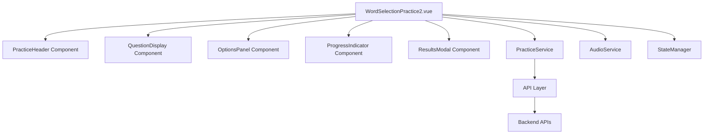
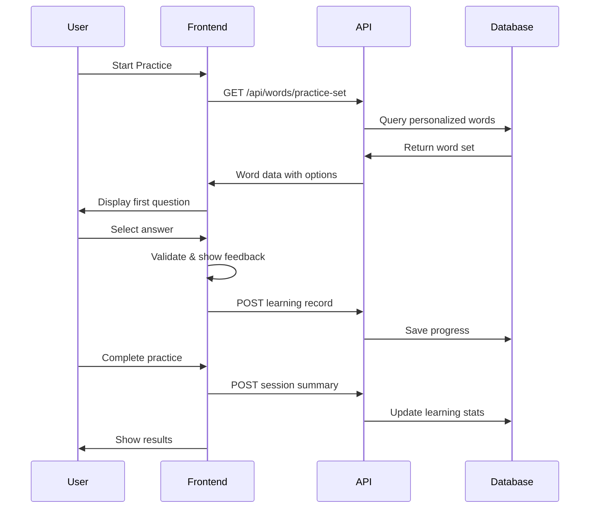

# Design Document

## Overview

The word-selection-practice2 (简洁模式) is designed as a streamlined, focused vocabulary practice interface that prioritizes clarity, efficiency, and task-oriented learning. Unlike the gamified mode, this design emphasizes clean visual hierarchy, immediate feedback, and minimal distractions to create an optimal learning environment for users who prefer simplicity or have limited time.

The system will be built as a Vue.js single-page component that integrates seamlessly with the existing backend API infrastructure, ensuring data consistency and reusability of existing learning models.

## Architecture

### Frontend Architecture



### Backend Integration

The frontend will integrate with existing backend services:
- **Word API**: `/api/words/` for fetching vocabulary data
- **Learning Session API**: `/api/teaching/learning-sessions/` for session management
- **Learning Records API**: `/api/teaching/learning-records/` for progress tracking
- **Audio API**: Text-to-speech or audio file serving for pronunciation

### Data Flow



## Components and Interfaces

### 1. Main Container (WordSelectionPractice2.vue)

**Purpose**: Root component managing overall state and orchestrating child components

**Props**: None (route-based)

**State**:
```javascript
{
  currentQuestion: Object,
  questionIndex: Number,
  totalQuestions: Number,
  userAnswers: Array,
  sessionData: Object,
  isLoading: Boolean,
  showResults: Boolean
}
```

**Key Methods**:
- `initializePractice()`: Load word set and start session
- `handleAnswerSelection(answer)`: Process user answer and update state
- `nextQuestion()`: Advance to next question
- `completePractice()`: Finalize session and show results

### 2. PracticeHeader Component

**Purpose**: Display session info and navigation

**Props**:
```javascript
{
  currentIndex: Number,
  totalQuestions: Number,
  correctCount: Number
}
```

**Template Structure**:
- Session title
- Question counter (e.g., "5 / 20")
- Current accuracy percentage
- Exit button (with confirmation)

### 3. QuestionDisplay Component

**Purpose**: Present the current word and context

**Props**:
```javascript
{
  word: Object, // { text, phonetic, definition, audio_url }
  showAnswer: Boolean,
  userAnswer: String,
  correctAnswer: String
}
```

**Features**:
- Large, clear word display
- Phonetic notation
- Audio play button with visual feedback
- Answer feedback (correct/incorrect highlighting)

### 4. OptionsPanel Component

**Purpose**: Display answer choices and handle selection

**Props**:
```javascript
{
  options: Array,
  selectedAnswer: String,
  correctAnswer: String,
  showFeedback: Boolean,
  disabled: Boolean
}
```

**Behavior**:
- 4 option buttons in clean grid layout
- Visual feedback for selection
- Disabled state during feedback display
- Correct answer highlighting when wrong

### 5. ProgressIndicator Component

**Purpose**: Show learning progress and status

**Props**:
```javascript
{
  currentIndex: Number,
  totalQuestions: Number,
  correctCount: Number
}
```

**Elements**:
- Linear progress bar
- Percentage completion
- Correct/total ratio
- Visual milestone markers

### 6. ResultsModal Component

**Purpose**: Display session summary and next actions

**Props**:
```javascript
{
  sessionResults: Object,
  incorrectAnswers: Array,
  totalTime: Number
}
```

**Content**:
- Overall accuracy score
- Time taken
- Incorrect questions review
- Action buttons (Restart, Review Mistakes, Exit)

## Data Models

### Frontend Data Structures

```javascript
// Question Object
{
  id: Number,
  word: String,
  phonetic: String,
  definition: String,
  options: Array[String],
  correctAnswer: String,
  audioUrl: String
}

// Session State
{
  sessionId: String,
  startTime: Date,
  endTime: Date,
  totalQuestions: Number,
  correctAnswers: Number,
  userAnswers: Array[{
    questionId: Number,
    userAnswer: String,
    isCorrect: Boolean,
    timeSpent: Number
  }]
}

// Practice Configuration
{
  wordCount: Number,
  difficulty: String,
  categories: Array[String],
  userId: Number
}
```

### API Response Formats

```javascript
// GET /api/words/practice-set
{
  session_id: String,
  questions: Array[{
    id: Number,
    word: String,
    phonetic: String,
    definition: String,
    options: Array[String],
    correct_answer: String,
    audio_url: String
  }]
}

// POST /api/teaching/learning-records/
{
  session_id: String,
  word_id: Number,
  user_answer: String,
  is_correct: Boolean,
  time_spent: Number,
  timestamp: String
}
```

## Error Handling

### Network Error Handling

1. **API Failure Recovery**:
   - Retry mechanism for failed requests
   - Offline mode with cached content
   - User-friendly error messages
   - Graceful degradation

2. **Audio Loading Errors**:
   - Fallback to text-only mode
   - Error indicator on audio button
   - Alternative pronunciation guide

3. **Session Recovery**:
   - Local storage backup of progress
   - Resume capability after interruption
   - Data validation before submission

### User Input Validation

1. **Answer Selection**:
   - Prevent double-submission
   - Validate option existence
   - Handle rapid clicking

2. **Session Management**:
   - Timeout handling for inactive sessions
   - Confirmation for early exit
   - Progress preservation

## Testing Strategy

### Unit Testing

**Components to Test**:
- Each Vue component in isolation
- State management functions
- API service methods
- Audio handling utilities

**Test Cases**:
```javascript
// Example test structure
describe('QuestionDisplay Component', () => {
  test('displays word and phonetic correctly', () => {})
  test('handles audio play button click', () => {})
  test('shows correct answer feedback', () => {})
  test('handles missing audio gracefully', () => {})
})
```

### Integration Testing

**Scenarios**:
- Complete practice session flow
- API integration with backend
- Error handling and recovery
- Cross-component communication

### User Experience Testing

**Focus Areas**:
- Loading performance (< 2 seconds)
- Response time (< 500ms for feedback)
- Mobile responsiveness
- Accessibility compliance

### Performance Testing

**Metrics**:
- Initial load time
- Memory usage during session
- API response times
- Audio loading performance

## Implementation Considerations

### Performance Optimization

1. **Lazy Loading**:
   - Load questions in batches
   - Preload next question audio
   - Optimize image and asset loading

2. **Caching Strategy**:
   - Cache frequently used words
   - Store user preferences locally
   - Implement service worker for offline support

3. **Bundle Optimization**:
   - Code splitting for practice module
   - Tree shaking for unused dependencies
   - Minimize CSS and JavaScript

### Accessibility

1. **Keyboard Navigation**:
   - Tab order for all interactive elements
   - Enter/Space for button activation
   - Arrow keys for option selection

2. **Screen Reader Support**:
   - ARIA labels for all components
   - Live regions for dynamic content
   - Semantic HTML structure

3. **Visual Accessibility**:
   - High contrast color scheme
   - Scalable font sizes
   - Clear focus indicators

### Mobile Optimization

1. **Touch Interface**:
   - Minimum 44px touch targets
   - Swipe gestures for navigation
   - Haptic feedback for interactions

2. **Responsive Design**:
   - Flexible grid system
   - Adaptive typography
   - Orientation change handling

3. **Performance**:
   - Minimize network requests
   - Optimize for slower connections
   - Reduce battery usage

### Security Considerations

1. **Data Protection**:
   - Secure API communication (HTTPS)
   - Input sanitization
   - Session token management

2. **Privacy**:
   - Minimal data collection
   - Clear data usage policies
   - User consent management

This design provides a comprehensive foundation for implementing the word-selection-practice2 feature while maintaining simplicity, performance, and user experience quality.