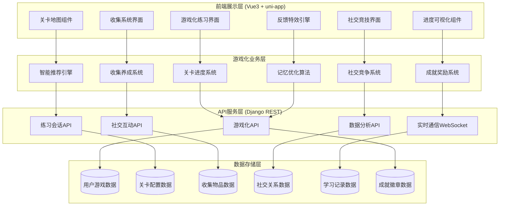

# 综合游戏化单词选择练习系统设计文档

## 概述

基于现有的单词选择练习页面原型，设计一个全面的游戏化智能单词学习平台。该系统整合了关卡进度、收集养成、社交竞技、智能复习、成就系统和视听反馈等多个游戏化元素，将传统的单词记忆转变为沉浸式游戏化学习体验。

系统采用Vue3 + uni-app前端架构和Django后端，通过科学的记忆算法、即时反馈循环和社交互动机制，显著提升用户参与度、学习效果和长期留存率。设计为模块化、可扩展和可维护的架构，同时在所有支持的平台上提供丰富的交互体验。

## Architecture

### 系统架构概述



### 核心游戏化架构

游戏化系统围绕六个核心子系统构建：

1. **关卡进度系统**：管理用户等级、星级评分和关卡解锁
2. **智能推荐引擎**：处理难度调节和个性化单词推荐
3. **收集养成系统**：管理角色进度、宠物培养和物品收集
4. **社交竞争系统**：启用实时PvP、排行榜和团队协作
5. **成就奖励系统**：处理成就解锁、奖励分发和激励机制
6. **记忆优化算法**：实施间隔重复和科学记忆强化

### 技术栈

**前端技术栈:**
- Vue3 + Composition API - 响应式状态管理
- uni-app - 跨平台开发框架
- Pinia - 状态管理库
- CSS3 + Canvas - 动画和粒子效果
- WebSocket - 实时通信
- 响应式设计 - 多设备适配

**后端技术栈:**
- Django 4.x + DRF - Web框架和API
- WebSocket (Django Channels) - 实时通信
- PostgreSQL - 主数据库
- Redis - 缓存和实时数据
- Celery - 异步任务处理
- 机器学习库 - 智能推荐算法

## 组件和接口设计

### 1. 游戏化状态管理 (Vue3 Composition API)

```javascript
// composables/useGameState.js
export function useGameState() {
  const gameState = reactive({
    user: {
      level: 1,
      experience: 0,
      coins: 0,
      character: 'default',
      title: 'Beginner',
      currentStreak: 0
    },
    progress: {
      wordsLearned: 0,
      totalSessions: 0,
      averageAccuracy: 0,
      currentLevel: 1,
      starsEarned: 0
    },
    achievements: [],
    collections: {
      characters: [],
      pets: [],
      themes: [],
      cards: []
    },
    socialData: {
      friends: [],
      leaderboardRank: 0,
      battleStats: {}
    }
  })
  
  const updateExperience = (points) => { /* implementation */ }
  const levelUp = () => { /* implementation */ }
  const unlockAchievement = (achievementId) => { /* implementation */ }
  
  return {
    gameState: readonly(gameState),
    updateExperience,
    levelUp,
    unlockAchievement
  }
}
```

### 2. 核心游戏化组件

#### 关卡地图组件 (LevelMap.vue)
```vue
<template>
  <div class="level-map">
    <div class="map-container">
      <LevelNode 
        v-for="level in levels" 
        :key="level.id"
        :level="level"
        :isUnlocked="level.isUnlocked"
        :stars="level.stars"
        @level-selected="startLevel"
      />
    </div>
    <CharacterDisplay :character="userCharacter" />
  </div>
</template>
```

#### 游戏化练习界面 (GameifiedPractice.vue)
```vue
<template>
  <div class="gamified-practice">
    <GameHeader 
      :level="currentLevel"
      :experience="userExperience"
      :combo="currentCombo"
    />
    <WordBattleCard 
      :word="currentWord"
      :options="options"
      :gameMode="practiceMode"
      @answer-selected="handleAnswer"
    />
    <ParticleEffect 
      v-if="showEffect"
      :type="effectType"
    />
    <ProgressRing 
      :current="currentIndex"
      :total="totalWords"
      :accuracy="currentAccuracy"
    />
  </div>
</template>
```

#### 收集系统组件 (CollectionGallery.vue)
```vue
<template>
  <div class="collection-gallery">
    <div class="tabs">
      <tab-button 
        v-for="category in categories"
        :key="category"
        :active="activeTab === category"
        @click="activeTab = category"
      >
        {{ category }}
      </tab-button>
    </div>
    <div class="collection-grid">
      <CollectionItem
        v-for="item in filteredItems"
        :key="item.id"
        :item="item"
        :rarity="item.rarity"
        @item-clicked="showItemDetails"
      />
    </div>
  </div>
</template>
```

#### 社交竞技组件 (SocialBattle.vue)
```vue
<template>
  <div class="social-battle">
    <BattleArena
      :player1="currentUser"
      :player2="opponent"
      :battleState="battleState"
    />
    <RealtimeProgress
      :player1Score="player1Score"
      :player2Score="player2Score"
      :timeRemaining="timeLeft"
    />
    <WordChallenge
      :word="battleWord"
      :options="battleOptions"
      @answer="submitBattleAnswer"
    />
  </div>
</template>
```

### 3. 互动学习组件

#### 多模式题型组件
- **DragDropSpelling.vue**：带物理动画的字母拖拽
- **WordMatchingGame.vue**：消除式单词-词义匹配
- **AudioRecognition.vue**：语音转文本发音练习
- **VisualAssociation.vue**：带情境场景的图像-单词关联

#### 反馈系统组件
- **ParticleEffect.vue**：正确答案的可配置粒子动画
- **ComboIndicator.vue**：带缩放动画的视觉连击计数器
- **ProgressRing.vue**：带平滑过渡的圆形进度指示器
- **HapticFeedback.js**：跨平台震动和触觉响应

### 4. 智能复习系统组件

#### 复习调度组件 (ReviewScheduler.vue)
```vue
<template>
  <div class="review-scheduler">
    <ReviewTimeline :schedule="reviewSchedule" />
    <WeaknessAnalysis :weakWords="difficultWords" />
    <ReviewSession
      :words="reviewWords"
      :algorithm="spacedRepetition"
      @session-complete="updateSchedule"
    />
  </div>
</template>
```

### 5. 后端API设计

#### 游戏化核心API

```python
# 关卡系统API
class LevelSystemViewSet(viewsets.ModelViewSet):
    @action(detail=False, methods=['get'])
    def get_level_map(self, request):
        """获取用户关卡地图"""
        
    @action(detail=True, methods=['post'])
    def complete_level(self, request, pk=None):
        """完成关卡并计算星级"""
        
    @action(detail=False, methods=['post'])
    def unlock_level(self, request):
        """解锁新关卡"""

# 收集系统API
class CollectionSystemViewSet(viewsets.ModelViewSet):
    @action(detail=False, methods=['get'])
    def get_user_collection(self, request):
        """获取用户收集"""
        
    @action(detail=True, methods=['post'])
    def collect_item(self, request, pk=None):
        """收集新物品"""
        
    @action(detail=False, methods=['get'])
    def get_shop_items(self, request):
        """获取商店物品"""

# 社交竞技API
class SocialBattleViewSet(viewsets.ModelViewSet):
    @action(detail=False, methods=['post'])
    def create_battle(self, request):
        """创建对战房间"""
        
    @action(detail=True, methods=['post'])
    def join_battle(self, request, pk=None):
        """加入对战"""
        
    @action(detail=False, methods=['get'])
    def get_leaderboard(self, request):
        """获取排行榜"""

# 成就系统API
class AchievementSystemViewSet(viewsets.ModelViewSet):
    @action(detail=False, methods=['get'])
    def get_user_achievements(self, request):
        """获取用户成就"""
        
    @action(detail=True, methods=['post'])
    def unlock_achievement(self, request, pk=None):
        """解锁成就"""
        
    @action(detail=False, methods=['get'])
    def get_progress(self, request):
        """获取成就进度"""
```

#### 智能推荐引擎API

```python
class IntelligentRecommendationAPI:
    def get_personalized_words(self, user_id, difficulty_level):
        """基于用户表现推荐单词"""
        
    def adjust_difficulty(self, user_performance):
        """动态调整难度"""
        
    def generate_distractors(self, target_word):
        """生成干扰选项"""
        
    def schedule_review(self, user_id, word_id, performance):
        """安排复习时间"""
```

#### 实时通信WebSocket

```python
# WebSocket消费者
class BattleConsumer(AsyncWebsocketConsumer):
    async def connect(self):
        """建立WebSocket连接"""
        
    async def receive(self, text_data):
        """处理实时对战消息"""
        
    async def battle_update(self, event):
        """广播对战更新"""
        
    async def disconnect(self, close_code):
        """断开连接处理"""
```

## 数据模型

### 用户游戏化档案
```python
class UserGamificationProfile(models.Model):
    """用户游戏化档案"""
    user = models.OneToOneField(CustomUser, on_delete=models.CASCADE)
    current_level = models.IntegerField(default=1)
    total_experience = models.IntegerField(default=0)
    coins = models.IntegerField(default=0)
    gems = models.IntegerField(default=0)
    current_streak = models.IntegerField(default=0)
    longest_streak = models.IntegerField(default=0)
    total_study_time = models.IntegerField(default=0)  # 分钟
    character_type = models.CharField(max_length=50, default='平民')
    rank = models.CharField(max_length=20, default='青铜')
    created_at = models.DateTimeField(auto_now_add=True)
    updated_at = models.DateTimeField(auto_now=True)
```

### 关卡系统模型
```python
class GameLevel(models.Model):
    """游戏关卡模型"""
    level_id = models.IntegerField(unique=True)
    name = models.CharField(max_length=100)
    difficulty = models.CharField(max_length=20)  # 四六级、雅思等
    unlock_requirements = models.JSONField()
    star_thresholds = models.JSONField()  # 1-3星的要求
    rewards = models.JSONField()
    words = models.ManyToManyField('Word')
    is_active = models.BooleanField(default=True)

class UserLevelProgress(models.Model):
    """用户关卡进度"""
    user = models.ForeignKey(CustomUser, on_delete=models.CASCADE)
    level = models.ForeignKey(GameLevel, on_delete=models.CASCADE)
    stars_earned = models.IntegerField(default=0)  # 0-3星
    completion_time = models.DateTimeField(null=True)
    attempts = models.IntegerField(default=0)
    best_accuracy = models.FloatField(default=0.0)
    is_unlocked = models.BooleanField(default=False)
    
    class Meta:
        unique_together = ['user', 'level']
```

### 收集系统模型
```python
class CollectibleItem(models.Model):
    """收集物品模型"""
    ITEM_TYPES = [
        ('character', '角色'),
        ('pet', '宠物'),
        ('decoration', '装饰'),
        ('theme', '主题'),
        ('card', '卡牌')
    ]
    RARITY_LEVELS = [
        ('common', '普通'),
        ('rare', '稀有'),
        ('epic', '史诗'),
        ('legendary', '传说')
    ]
    
    name = models.CharField(max_length=100)
    item_type = models.CharField(max_length=20, choices=ITEM_TYPES)
    rarity = models.CharField(max_length=20, choices=RARITY_LEVELS)
    description = models.TextField()
    image_url = models.URLField()
    unlock_condition = models.JSONField()
    price = models.IntegerField(default=0)  # 金币价格

class UserCollection(models.Model):
    """用户收集记录"""
    user = models.ForeignKey(CustomUser, on_delete=models.CASCADE)
    item = models.ForeignKey(CollectibleItem, on_delete=models.CASCADE)
    collected_at = models.DateTimeField(auto_now_add=True)
    is_equipped = models.BooleanField(default=False)
    
    class Meta:
        unique_together = ['user', 'item']

class VirtualPet(models.Model):
    """虚拟宠物模型"""
    user = models.OneToOneField(CustomUser, on_delete=models.CASCADE)
    name = models.CharField(max_length=50, default="学习伙伴")
    pet_type = models.CharField(max_length=50, default="仓鼠")
    level = models.IntegerField(default=1)
    experience = models.IntegerField(default=0)
    happiness = models.IntegerField(default=100)
    last_interaction = models.DateTimeField(auto_now=True)
    customization = models.JSONField(default=dict)
```

### 社交系统模型
```python
class BattleRoom(models.Model):
    """对战房间模型"""
    room_id = models.CharField(max_length=50, unique=True)
    player1 = models.ForeignKey(CustomUser, on_delete=models.CASCADE, related_name='battles_as_p1')
    player2 = models.ForeignKey(CustomUser, on_delete=models.CASCADE, related_name='battles_as_p2', null=True)
    status = models.CharField(max_length=20, default='waiting')  # waiting, active, completed
    battle_type = models.CharField(max_length=20, default='quick_match')
    words = models.JSONField()  # 对战单词列表
    scores = models.JSONField(default=dict)
    winner = models.ForeignKey(CustomUser, on_delete=models.SET_NULL, null=True)
    created_at = models.DateTimeField(auto_now_add=True)
    completed_at = models.DateTimeField(null=True)

class Leaderboard(models.Model):
    """排行榜模型"""
    user = models.ForeignKey(CustomUser, on_delete=models.CASCADE)
    category = models.CharField(max_length=50)  # weekly, monthly, class, friends, global
    score = models.IntegerField()
    rank = models.IntegerField()
    period = models.CharField(max_length=20)  # 2024-W01, 2024-01等
    updated_at = models.DateTimeField(auto_now=True)
    
    class Meta:
        unique_together = ['user', 'category', 'period']

class StudyGroup(models.Model):
    """学习小组模型"""
    name = models.CharField(max_length=100)
    description = models.TextField(blank=True)
    creator = models.ForeignKey(CustomUser, on_delete=models.CASCADE)
    members = models.ManyToManyField(CustomUser, through='GroupMembership')
    weekly_goal = models.IntegerField(default=100)  # 每周目标单词数
    current_progress = models.IntegerField(default=0)
    created_at = models.DateTimeField(auto_now_add=True)
```

### 成就系统模型
```python
class Achievement(models.Model):
    """成就模型"""
    ACHIEVEMENT_TYPES = [
        ('streak', '连续学习'),
        ('milestone', '里程碑'),
        ('social', '社交'),
        ('seasonal', '季节性'),
        ('mastery', '掌握度')
    ]
    
    name = models.CharField(max_length=100)
    description = models.TextField()
    achievement_type = models.CharField(max_length=20, choices=ACHIEVEMENT_TYPES)
    condition = models.JSONField()  # 解锁条件
    reward = models.JSONField()  # 奖励内容
    badge_image = models.URLField()
    is_seasonal = models.BooleanField(default=False)
    is_active = models.BooleanField(default=True)

class UserAchievement(models.Model):
    """用户成就记录"""
    user = models.ForeignKey(CustomUser, on_delete=models.CASCADE)
    achievement = models.ForeignKey(Achievement, on_delete=models.CASCADE)
    unlocked_at = models.DateTimeField(auto_now_add=True)
    progress = models.JSONField(default=dict)  # 进度追踪
    is_shared = models.BooleanField(default=False)
    
    class Meta:
        unique_together = ['user', 'achievement']
```

### 智能复习系统模型
```python
class WordLearningRecord(models.Model):
    """单词学习记录模型"""
    user = models.ForeignKey(CustomUser, on_delete=models.CASCADE)
    word = models.ForeignKey('Word', on_delete=models.CASCADE)
    mastery_level = models.FloatField(default=0.0)  # 0.0-1.0
    difficulty_factor = models.FloatField(default=2.5)  # SM-2算法参数
    interval = models.IntegerField(default=1)  # 复习间隔（天）
    repetitions = models.IntegerField(default=0)  # 重复次数
    next_review = models.DateTimeField()
    last_reviewed = models.DateTimeField(auto_now=True)
    total_reviews = models.IntegerField(default=0)
    correct_reviews = models.IntegerField(default=0)
    
    class Meta:
        unique_together = ['user', 'word']

class PracticeSession(models.Model):
    """游戏化练习会话模型"""
    user = models.ForeignKey(CustomUser, on_delete=models.CASCADE)
    level = models.ForeignKey(GameLevel, on_delete=models.SET_NULL, null=True)
    session_type = models.CharField(max_length=20, choices=[
        ('level_challenge', '关卡挑战'),
        ('review_session', '复习会话'),
        ('battle_practice', '对战练习'),
        ('free_practice', '自由练习')
    ])
    difficulty_level = models.IntegerField(default=1)
    words_studied = models.IntegerField(default=0)
    correct_answers = models.IntegerField(default=0)
    total_answers = models.IntegerField(default=0)
    max_combo = models.IntegerField(default=0)
    experience_gained = models.IntegerField(default=0)
    coins_earned = models.IntegerField(default=0)
    start_time = models.DateTimeField(auto_now_add=True)
    end_time = models.DateTimeField(null=True)
    is_completed = models.BooleanField(default=False)
    session_data = models.JSONField(default=dict)  # 详细会话数据
```

## Error Handling

### 前端错误处理

**网络错误处理:**
```javascript
// API调用错误处理
const handleApiError = (error) => {
  if (error.response?.status === 401) {
    // 未授权，跳转登录
    router.push('/login')
  } else if (error.response?.status === 500) {
    // 服务器错误
    showErrorMessage('服务器暂时不可用，请稍后重试')
  } else {
    // 其他错误
    showErrorMessage(error.message || '操作失败，请重试')
  }
}
```

**练习状态错误处理:**
- 网络中断时保存本地状态
- 会话超时自动保存进度
- 数据同步失败重试机制

### 后端错误处理

**API异常处理:**
```python
from rest_framework.views import exception_handler
from rest_framework.response import Response

def custom_exception_handler(exc, context):
    response = exception_handler(exc, context)
    
    if response is not None:
        custom_response_data = {
            'error': True,
            'message': '操作失败',
            'details': response.data
        }
        response.data = custom_response_data
    
    return response
```

**业务逻辑错误处理:**
- 单词推荐失败降级策略
- 会话数据不一致修复
- 用户权限验证失败处理

## Testing Strategy

### 前端测试

**单元测试:**
- 组件渲染测试
- 用户交互测试
- 状态管理测试
- API调用测试

**集成测试:**
- 完整练习流程测试
- 多设备兼容性测试
- 网络异常场景测试

**测试工具:**
- Jest - 单元测试框架
- Vue Test Utils - Vue组件测试
- Cypress - 端到端测试

### 后端测试

**单元测试:**
- 模型方法测试
- API端点测试
- 业务逻辑测试
- 权限验证测试

**集成测试:**
- 数据库操作测试
- 第三方服务集成测试
- 缓存机制测试

**性能测试:**
- API响应时间测试
- 并发用户测试
- 数据库查询优化测试

## Security Considerations

### 用户认证和授权

**认证机制:**
- Token-based认证
- 会话超时管理
- 多设备登录控制

**权限控制:**
- 用户只能访问自己的练习数据
- 教师可以查看学生练习报告
- 管理员拥有全部数据访问权限

### 数据安全

**数据传输安全:**
- HTTPS加密传输
- API请求签名验证
- 敏感数据脱敏处理

**数据存储安全:**
- 用户密码加密存储
- 个人信息匿名化
- 定期数据备份

### 防护措施

**API安全:**
- 请求频率限制
- SQL注入防护
- XSS攻击防护
- CSRF令牌验证

## Performance Optimization

### 前端性能优化

**加载优化:**
- 组件懒加载
- 图片资源优化
- 静态资源CDN加速
- 浏览器缓存策略

**运行时优化:**
- 虚拟滚动
- 防抖和节流
- 内存泄漏防护
- 状态管理优化

### 后端性能优化

**数据库优化:**
- 查询索引优化
- 数据库连接池
- 查询结果缓存
- 分页查询优化

**API优化:**
- 响应数据压缩
- 批量操作接口
- 异步任务处理
- 缓存热点数据

## Deployment Architecture

### 开发环境

**前端开发环境:**
- Node.js + npm/yarn
- Vue CLI开发服务器
- 热重载和调试工具

**后端开发环境:**
- Python虚拟环境
- Django开发服务器
- 数据库迁移工具

### 生产环境

**前端部署:**
- 静态文件构建和压缩
- CDN分发
- 负载均衡

**后端部署:**
- Docker容器化部署
- 数据库集群
- Redis缓存集群
- 监控和日志系统

## Monitoring and Analytics

### 系统监控

**性能监控:**
- API响应时间监控
- 数据库性能监控
- 服务器资源监控
- 错误率监控

**用户行为分析:**
- 练习完成率统计
- 用户活跃度分析
- 学习效果评估
- 功能使用情况分析

### 日志管理

**日志分类:**
- 系统运行日志
- 用户操作日志
- 错误异常日志
- 性能指标日志

**日志分析:**
- 实时日志监控
- 异常告警机制
- 日志数据挖掘
- 趋势分析报告