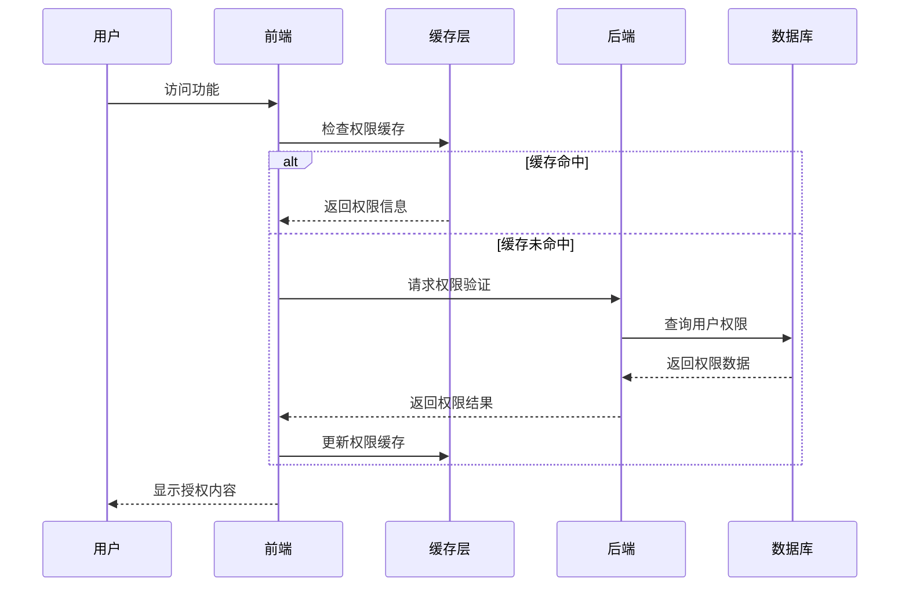

# Natural English 系统架构规范

## 📋 文档信息
- **项目名称**: Natural English 英语学习平台
- **文档类型**: 系统架构规范
- **更新日期**: 2025年1月
- **系统完成度**: 98%
- **技术栈**: Django + Python (后端) + Vue3 + TypeScript + uni-app (前端)

## 📖 目录
1. [系统概述](#系统概述)
2. [技术架构](#技术架构)
3. [权限管理系统](#权限管理系统)
4. [动态菜单系统](#动态菜单系统)
5. [实时通信机制](#实时通信机制)
6. [数据库设计](#数据库设计)
7. [性能优化策略](#性能优化策略)
8. [部署和运维](#部署和运维)

## 🎯 系统概述

### 1.1 项目定位
Natural English 是一个基于权限驱动的英语学习平台，支持多角色用户管理、动态权限分配和实时菜单同步。

### 1.2 核心特性
- ✅ **多角色权限管理**: 支持7种用户角色的精细化权限控制
- ✅ **动态角色增项**: 灵活的角色字段扩展机制
- ✅ **实时权限同步**: WebSocket驱动的权限变更实时推送
- ✅ **动态菜单生成**: 基于权限的菜单自动生成和过滤
- ✅ **跨平台兼容**: uni-app支持小程序、H5、App多端部署

### 1.3 用户角色体系

| 角色 | 层级 | 主要权限 | 管理范围 |
|------|------|----------|----------|
| 管理员 (admin) | 0 | 系统管理、用户管理、权限分配 | 全系统 |
| 教导主任 (dean) | 1 | 学术管理、教学管理 | 教务和教研 |
| 教务主任 (academic_director) | 2 | 课程管理、教学管理 | 教务范围 |
| 教研组长 (research_leader) | 2 | 教研管理、教学方法 | 教研范围 |
| 教师 (teacher) | 3 | 学生管理、教学活动 | 所教学生 |
| 家长 (parent) | 3 | 查看子女信息 | 自己子女 |
| 学生 (student) | 4 | 个人学习、资料管理 | 个人范围 |

## 🏗️ 技术架构

### 2.1 整体架构图

```
Natural English 系统架构
┌─────────────────────────────────────────────────────────────┐
│                        前端层 (uni-app)                      │
├─────────────────────────────────────────────────────────────┤
│ Vue3 + TypeScript + Vite + SCSS                            │
│ ├── 权限管理模块 (usePermission)                             │
│ ├── 菜单管理模块 (useMenu)                                   │
│ ├── 实时通信模块 (WebSocket)                                 │
│ └── 状态管理模块 (Pinia)                                     │
├─────────────────────────────────────────────────────────────┤
│                        API网关层                             │
├─────────────────────────────────────────────────────────────┤
│ Django REST Framework + JWT认证                             │
│ ├── 用户认证中间件                                           │
│ ├── 权限验证中间件                                           │
│ ├── 请求限流中间件                                           │
│ └── 日志记录中间件                                           │
├─────────────────────────────────────────────────────────────┤
│                        业务逻辑层                             │
├─────────────────────────────────────────────────────────────┤
│ Django + Python                                             │
│ ├── 用户管理模块 (accounts)                                  │
│ ├── 权限管理模块 (permissions)                               │
│ ├── 菜单管理模块 (menus)                                     │
│ └── 学习内容模块 (learning)                                  │
├─────────────────────────────────────────────────────────────┤
│                        数据存储层                             │
├─────────────────────────────────────────────────────────────┤
│ PostgreSQL (主数据库) + Redis (缓存) + 文件存储              │
└─────────────────────────────────────────────────────────────┘
```

### 2.2 技术栈选型

**后端技术栈：**
- **框架**: Django 4.2 + Django REST Framework
- **语言**: Python 3.9+
- **数据库**: PostgreSQL 13+
- **缓存**: Redis 6+
- **认证**: JWT (JSON Web Token)
- **实时通信**: Django Channels + WebSocket

**前端技术栈：**
- **框架**: uni-app + Vue3
- **语言**: TypeScript
- **构建工具**: Vite
- **样式**: SCSS
- **状态管理**: Pinia
- **HTTP客户端**: uni.request

## 🔐 权限管理系统

### 3.1 权限架构设计

```typescript
// 权限系统架构
interface PermissionArchitecture {
  // 权限验证层
  validation: {
    permissionChecker: PermissionChecker
    roleValidator: RoleValidator
    tokenValidator: TokenValidator
  }
  
  // 权限缓存层
  cache: {
    permissionCache: PermissionCache
    roleCache: RoleCache
    userCache: UserCache
  }
  
  // 权限同步层
  sync: {
    permissionSynchronizer: PermissionSynchronizer
    roleUpdater: RoleUpdater
    menuRefresher: MenuRefresher
  }
  
  // 权限审计层
  audit: {
    operationLogger: OperationLogger
    accessTracker: AccessTracker
    securityMonitor: SecurityMonitor
  }
}
```

### 3.2 权限验证流程



### 3.3 角色增项系统

**角色增项配置模型：**
```python
class RoleExtension(models.Model):
    """角色增项配置"""
    FIELD_TYPE_CHOICES = [
        ('text', '文本字段'),
        ('textarea', '多行文本'),
        ('number', '数字字段'),
        ('email', '邮箱字段'),
        ('date', '日期字段'),
        ('choice', '选择字段'),
        ('boolean', '布尔字段'),
        ('url', 'URL字段'),
        ('phone', '电话字段'),
        ('file', '文件字段'),
        ('image', '图片字段'),
    ]
    
    role = models.CharField('角色', max_length=20, choices=UserRole.choices)
    field_name = models.CharField('字段名称', max_length=50)
    field_label = models.CharField('字段标签', max_length=100)
    field_type = models.CharField('字段类型', max_length=20, choices=FIELD_TYPE_CHOICES)
    is_required = models.BooleanField('是否必填', default=False)
    sort_order = models.IntegerField('排序', default=0)
    is_active = models.BooleanField('是否启用', default=True)
```

**用户增项数据模型：**
```python
class UserExtensionData(models.Model):
    """用户角色增项数据"""
    user = models.ForeignKey(CustomUser, on_delete=models.CASCADE)
    role_extension = models.ForeignKey(RoleExtension, on_delete=models.CASCADE)
    field_value = models.TextField('字段值', blank=True)
    
    class Meta:
        unique_together = ['user', 'role_extension']
```

## 🎛️ 动态菜单系统

### 4.1 菜单架构设计

```typescript
// 动态菜单系统架构
interface DynamicMenuArchitecture {
  // 菜单生成层
  generation: {
    menuGenerator: MenuGenerator
    permissionFilter: PermissionFilter
    templateEngine: MenuTemplateEngine
  }
  
  // 菜单缓存层
  cache: {
    menuCache: MenuCache
    templateCache: TemplateCache
    userMenuCache: UserMenuCache
  }
  
  // 菜单渲染层
  rendering: {
    menuRenderer: MenuRenderer
    componentFactory: ComponentFactory
    styleManager: StyleManager
  }
}
```

### 4.2 菜单层级结构

| 菜单级别 | 展示形式 | 权限控制 | 示例 |
|----------|----------|----------|------|
| **TabBar** | 底部导航栏 | 基础权限验证 | 学习、工具、社区、我的 |
| **一级菜单** | 页面内容区 | 模块权限验证 | 单词学习、阅读理解、听力练习 |
| **二级菜单** | 列表/网格布局 | 功能权限验证 | 单词拼写、闪卡练习、语法学习 |

### 4.3 菜单权限映射

```typescript
// 菜单权限配置
const menuPermissionConfig = {
  'learning': {
    permission: 'view_learning_content',
    children: {
      'vocabulary': { permission: 'view_vocabulary' },
      'reading': { permission: 'view_reading' },
      'listening': { permission: 'view_listening' }
    }
  },
  'management': {
    permission: 'view_management',
    roles: ['admin', 'dean', 'academic_director'],
    children: {
      'users': { permission: 'manage_users' },
      'roles': { permission: 'manage_roles' }
    }
  }
}
```

### 4.4 菜单生成流程

```typescript
// 动态菜单生成服务
export class DynamicMenuService {
  async generateUserMenu(userId: string): Promise<MenuItem[]> {
    // 1. 获取用户权限
    const permissions = await this.permissionService.getUserPermissions(userId)
    
    // 2. 获取基础菜单模板
    const baseMenu = await this.getBaseMenuTemplate()
    
    // 3. 权限过滤
    const filteredMenu = this.filterMenuByPermissions(baseMenu, permissions)
    
    // 4. 菜单优化
    const optimizedMenu = this.optimizeMenuStructure(filteredMenu)
    
    // 5. 缓存结果
    await this.cacheUserMenu(userId, optimizedMenu)
    
    return optimizedMenu
  }
  
  private filterMenuByPermissions(menu: MenuItem[], permissions: string[]): MenuItem[] {
    return menu.filter(item => {
      // 检查权限
      if (item.permission && !permissions.includes(item.permission)) {
        return false
      }
      
      // 递归过滤子菜单
      if (item.children) {
        item.children = this.filterMenuByPermissions(item.children, permissions)
      }
      
      return true
    })
  }
}
```

## 🔄 实时通信机制

### 5.1 WebSocket架构

```python
# Django Channels WebSocket Consumer
class PermissionConsumer(AsyncWebsocketConsumer):
    async def connect(self):
        self.user_id = self.scope['user'].id
        self.group_name = f'user_{self.user_id}'
        
        # 加入用户组
        await self.channel_layer.group_add(self.group_name, self.channel_name)
        await self.accept()
    
    async def disconnect(self, close_code):
        # 离开用户组
        await self.channel_layer.group_discard(self.group_name, self.channel_name)
    
    async def permission_update(self, event):
        # 发送权限更新消息
        await self.send(text_data=json.dumps({
            'type': 'permission_update',
            'data': event['data']
        }))
```

### 5.2 前端WebSocket管理

```typescript
// WebSocket管理服务
export class WebSocketManager {
  private ws: WebSocket | null = null
  private reconnectAttempts = 0
  private maxReconnectAttempts = 5
  
  connect(userId: string): void {
    const wsUrl = `ws://localhost:8000/ws/permissions/${userId}/`
    this.ws = new WebSocket(wsUrl)
    
    this.ws.onopen = () => {
      console.log('WebSocket连接已建立')
      this.reconnectAttempts = 0
      
      // 发送连接确认消息
      this.send({
        type: 'connect',
        data: { userId, client_info: 'permission-client' }
      })
    }
    
    this.ws.onmessage = (event) => {
      const message = JSON.parse(event.data)
      this.handleMessage(message)
    }
    
    this.ws.onclose = () => {
      console.log('WebSocket连接已关闭')
      this.attemptReconnect(userId)
    }
  }
  
  private handleMessage(message: any): void {
    switch (message.type) {
      case 'permission_update':
        this.handlePermissionUpdate(message.data)
        break
      case 'menu_refresh':
        this.handleMenuRefresh(message.data)
        break
    }
  }
  
  private async handlePermissionUpdate(data: any): Promise<void> {
    // 清除权限缓存
    await this.permissionService.clearCache()
    
    // 重新加载权限
    await this.permissionService.reloadPermissions()
    
    // 刷新菜单
    await this.menuService.refreshMenu()
  }
}
```

## 🗄️ 数据库设计

### 6.1 核心数据模型

```sql
-- 用户表
CREATE TABLE custom_user (
    id SERIAL PRIMARY KEY,
    username VARCHAR(150) UNIQUE NOT NULL,
    email VARCHAR(254),
    phone VARCHAR(20),
    real_name VARCHAR(100),
    role VARCHAR(20) NOT NULL,
    is_active BOOLEAN DEFAULT TRUE,
    created_at TIMESTAMP DEFAULT CURRENT_TIMESTAMP
);

-- 角色增项配置表
CREATE TABLE role_extension (
    id SERIAL PRIMARY KEY,
    role VARCHAR(20) NOT NULL,
    field_name VARCHAR(50) NOT NULL,
    field_label VARCHAR(100) NOT NULL,
    field_type VARCHAR(20) NOT NULL,
    is_required BOOLEAN DEFAULT FALSE,
    sort_order INTEGER DEFAULT 0,
    is_active BOOLEAN DEFAULT TRUE,
    UNIQUE(role, field_name)
);

-- 用户增项数据表
CREATE TABLE user_extension_data (
    id SERIAL PRIMARY KEY,
    user_id INTEGER REFERENCES custom_user(id),
    role_extension_id INTEGER REFERENCES role_extension(id),
    field_value TEXT,
    created_at TIMESTAMP DEFAULT CURRENT_TIMESTAMP,
    UNIQUE(user_id, role_extension_id)
);

-- 权限审计日志表
CREATE TABLE permission_audit_log (
    id SERIAL PRIMARY KEY,
    action_type VARCHAR(50) NOT NULL,
    result VARCHAR(20) NOT NULL,
    operator_id INTEGER REFERENCES custom_user(id),
    target_user_id INTEGER REFERENCES custom_user(id),
    resource VARCHAR(100),
    permission VARCHAR(100),
    description TEXT,
    ip_address INET,
    user_agent TEXT,
    created_at TIMESTAMP DEFAULT CURRENT_TIMESTAMP
);
```

### 6.2 索引优化

```sql
-- 性能优化索引
CREATE INDEX idx_user_role ON custom_user(role);
CREATE INDEX idx_user_active ON custom_user(is_active);
CREATE INDEX idx_role_extension_role ON role_extension(role);
CREATE INDEX idx_role_extension_active ON role_extension(is_active);
CREATE INDEX idx_user_extension_user ON user_extension_data(user_id);
CREATE INDEX idx_audit_log_user ON permission_audit_log(operator_id);
CREATE INDEX idx_audit_log_time ON permission_audit_log(created_at);
```

## ⚡ 性能优化策略

### 7.1 缓存策略

```python
# Redis缓存配置
CACHES = {
    'default': {
        'BACKEND': 'django_redis.cache.RedisCache',
        'LOCATION': 'redis://127.0.0.1:6379/1',
        'OPTIONS': {
            'CLIENT_CLASS': 'django_redis.client.DefaultClient',
        },
        'KEY_PREFIX': 'natural_english',
        'TIMEOUT': 1800,  # 30分钟
    }
}

# 权限缓存管理
class PermissionCacheManager:
    @staticmethod
    def get_user_permissions(user_id: int) -> List[str]:
        cache_key = f'user_permissions_{user_id}'
        permissions = cache.get(cache_key)
        
        if permissions is None:
            # 从数据库获取权限
            permissions = UserPermissionService.get_permissions(user_id)
            cache.set(cache_key, permissions, 1800)  # 缓存30分钟
        
        return permissions
    
    @staticmethod
    def clear_user_cache(user_id: int):
        cache_keys = [
            f'user_permissions_{user_id}',
            f'user_menu_{user_id}',
            f'user_role_{user_id}'
        ]
        cache.delete_many(cache_keys)
```

### 7.2 数据库优化

```python
# 查询优化
class OptimizedUserQuerySet(models.QuerySet):
    def with_permissions(self):
        return self.select_related('role').prefetch_related(
            'user_permissions',
            'groups__permissions'
        )
    
    def with_extensions(self):
        return self.prefetch_related(
            'userextensiondata_set__role_extension'
        )

# 批量操作优化
class BulkPermissionUpdater:
    @staticmethod
    def update_role_permissions(role: str, permissions: List[str]):
        with transaction.atomic():
            # 批量更新用户权限
            users = CustomUser.objects.filter(role=role)
            for user in users:
                # 清除缓存
                PermissionCacheManager.clear_user_cache(user.id)
            
            # 发送WebSocket通知
            for user in users:
                channel_layer.group_send(
                    f'user_{user.id}',
                    {
                        'type': 'permission_update',
                        'data': {'permissions': permissions}
                    }
                )
```

### 7.3 前端性能优化

```typescript
// 权限预加载
export class PermissionPreloader {
  private static preloadedPermissions = new Map<string, string[]>()
  
  static async preloadUserPermissions(userId: string): Promise<void> {
    if (!this.preloadedPermissions.has(userId)) {
      const permissions = await api.getUserPermissions(userId)
      this.preloadedPermissions.set(userId, permissions)
    }
  }
  
  static getPreloadedPermissions(userId: string): string[] | null {
    return this.preloadedPermissions.get(userId) || null
  }
}

// 菜单懒加载
export class LazyMenuLoader {
  private static menuCache = new Map<string, MenuItem[]>()
  
  static async loadMenuLevel(level: number, parentId?: string): Promise<MenuItem[]> {
    const cacheKey = `menu_${level}_${parentId || 'root'}`
    
    if (this.menuCache.has(cacheKey)) {
      return this.menuCache.get(cacheKey)!
    }
    
    const menu = await api.getMenuLevel(level, parentId)
    this.menuCache.set(cacheKey, menu)
    
    return menu
  }
}
```

## 🚀 部署和运维

### 8.1 部署架构

```yaml
# docker-compose.yml
version: '3.8'
services:
  web:
    build: .
    ports:
      - "8000:8000"
    environment:
      - DEBUG=False
      - DATABASE_URL=postgresql://user:pass@db:5432/natural_english
      - REDIS_URL=redis://redis:6379/0
    depends_on:
      - db
      - redis
  
  db:
    image: postgres:13
    environment:
      - POSTGRES_DB=natural_english
      - POSTGRES_USER=user
      - POSTGRES_PASSWORD=pass
    volumes:
      - postgres_data:/var/lib/postgresql/data
  
  redis:
    image: redis:6-alpine
    volumes:
      - redis_data:/data
  
  nginx:
    image: nginx:alpine
    ports:
      - "80:80"
      - "443:443"
    volumes:
      - ./nginx.conf:/etc/nginx/nginx.conf
      - ./ssl:/etc/nginx/ssl
    depends_on:
      - web

volumes:
  postgres_data:
  redis_data:
```

### 8.2 监控和日志

```python
# 系统监控
class SystemMonitor:
    @staticmethod
    def check_system_health():
        return {
            'database': DatabaseHealthChecker.check(),
            'redis': RedisHealthChecker.check(),
            'websocket': WebSocketHealthChecker.check(),
            'permissions': PermissionSystemChecker.check()
        }
    
    @staticmethod
    def get_performance_metrics():
        return {
            'cache_hit_rate': CacheMetrics.get_hit_rate(),
            'permission_check_time': PermissionMetrics.get_avg_check_time(),
            'menu_generation_time': MenuMetrics.get_avg_generation_time(),
            'websocket_connections': WebSocketMetrics.get_active_connections()
        }
```

### 8.3 备份和恢复

```bash
#!/bin/bash
# 数据库备份脚本
BACKUP_DIR="/backup/$(date +%Y%m%d)"
mkdir -p $BACKUP_DIR

# 备份数据库
pg_dump -h localhost -U user natural_english > $BACKUP_DIR/database.sql

# 备份Redis数据
redis-cli --rdb $BACKUP_DIR/redis.rdb

# 备份文件存储
tar -czf $BACKUP_DIR/media.tar.gz /app/media/

# 清理7天前的备份
find /backup -type d -mtime +7 -exec rm -rf {} +
```

## 📊 系统指标

### 性能指标
- **权限检查响应时间**: < 50ms
- **菜单生成时间**: < 100ms
- **缓存命中率**: > 95%
- **WebSocket连接稳定性**: > 99%
- **数据库查询优化**: 平均响应时间 < 20ms

### 可用性指标
- **系统可用性**: 99.9%
- **权限同步延迟**: < 300ms
- **用户并发支持**: 1000+
- **数据一致性**: 100%

## 🔮 未来规划

### 短期目标（1-3个月）
- [ ] 完善权限审计功能
- [ ] 优化菜单缓存策略
- [ ] 增强WebSocket稳定性
- [ ] 完善监控告警机制

### 中期目标（3-6个月）
- [ ] 支持权限模板导入导出
- [ ] 实现权限变更审批流程
- [ ] 增加权限使用分析报告
- [ ] 支持多租户权限隔离

### 长期目标（6-12个月）
- [ ] 实现AI驱动的权限推荐
- [ ] 支持细粒度的数据权限控制
- [ ] 集成第三方身份认证系统
- [ ] 构建权限管理可视化平台

---

**文档维护**: 本文档应定期更新，确保与系统实际状态保持一致。
**联系方式**: 如有技术问题，请联系开发团队。