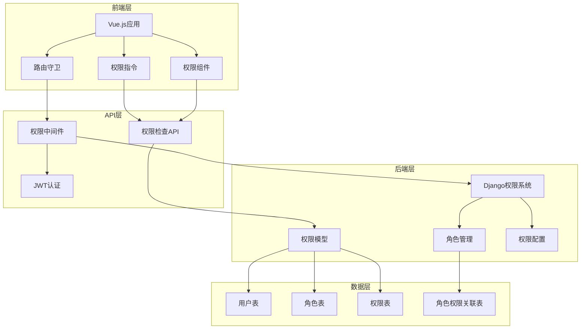

# 用户权限管理系统规范 - 总览

## 1. 系统概述

本文档为Natural English英语学习平台的用户权限管理系统总览，整合了前端和后端的权限管理规范，提供完整的权限控制解决方案。

### 1.1 系统目标

- **安全性**：确保用户只能访问其被授权的功能和数据
- **灵活性**：支持多角色、多权限的灵活配置
- **可维护性**：提供可视化的权限配置和管理界面
- **用户体验**：提供流畅的权限检查和友好的提示
- **扩展性**：支持新功能和新角色的快速接入

### 1.2 技术架构



## 2. 权限分类体系

### 2.1 统一权限分类

| 权限分类 | 权限代码前缀 | 权限数量 | 描述 |
|----------|--------------|----------|------|
| 基础权限 | `basic_` | 8 | 用户基本功能权限 |
| 学习功能权限 | `learning_` | 14 | 学习相关功能权限 |
| 社交功能权限 | `social_` | 6 | 社交互动功能权限 |
| 内容权限 | `content_` | 10 | 内容管理相关权限 |
| 管理功能权限 | `admin_` | 15 | 系统管理功能权限 |
| 家长专用权限 | `parent_` | 5 | 家长监控功能权限 |

### 2.2 角色权限体系

#### 2.2.1 用户角色定义

```javascript
const USER_ROLES = {
  GUEST: 'guest',           // 游客
  STUDENT: 'student',       // 学生
  PARENT: 'parent',         // 家长
  TEACHER: 'teacher',       // 教师
  ADMIN: 'admin',           // 管理员
  SUPER_ADMIN: 'super_admin' // 超级管理员
}
```

#### 2.2.2 角色权限映射

```javascript
const ROLE_PERMISSIONS = {
  [USER_ROLES.GUEST]: [
    'basic_view_dashboard',
    'basic_view_help',
    'content_discover_content'
  ],
  
  [USER_ROLES.STUDENT]: [
    // 基础权限
    'basic_view_dashboard',
    'basic_view_profile',
    'basic_edit_profile',
    'basic_view_notifications',
    
    // 学习功能权限
    'learning_view_word_learning',
    'learning_practice_spelling',
    'learning_use_flashcard',
    'learning_practice_reading',
    'learning_use_pattern_memory',
    'learning_view_progress',
    'learning_take_quiz',
    'learning_view_achievements',
    
    // 社交功能权限
    'social_view_social',
    'social_send_message',
    'social_join_group',
    
    // 内容权限
    'content_view_content',
    'content_discover_content'
  ],
  
  [USER_ROLES.PARENT]: [
    // 基础权限
    'basic_view_dashboard',
    'basic_view_profile',
    'basic_edit_profile',
    
    // 家长专用权限
    'parent_view_child_progress',
    'parent_set_child_limits',
    'parent_receive_reports',
    'parent_manage_child_account',
    'parent_view_child_activities'
  ],
  
  [USER_ROLES.TEACHER]: [
    // 学生权限 + 教师专用权限
    ...ROLE_PERMISSIONS[USER_ROLES.STUDENT],
    
    // 内容管理权限
    'content_create_content',
    'content_edit_content',
    'content_manage_assignments',
    
    // 管理功能权限
    'admin_view_student_progress',
    'admin_manage_class',
    'admin_create_assignments'
  ],
  
  [USER_ROLES.ADMIN]: [
    // 教师权限 + 管理员专用权限
    ...ROLE_PERMISSIONS[USER_ROLES.TEACHER],
    
    // 管理功能权限
    'admin_manage_users',
    'admin_manage_roles',
    'admin_view_analytics',
    'admin_system_config',
    'admin_manage_content',
    'admin_view_logs'
  ],
  
  [USER_ROLES.SUPER_ADMIN]: [
    // 所有权限
    '*'
  ]
}
```

## 3. 前端权限控制

### 3.1 路由权限守卫

```javascript
// router/guards/permission.js
import { useAuthStore } from '@/stores/auth'
import { hasPermission } from '@/utils/permission'

export function createPermissionGuard(router) {
  router.beforeEach(async (to, from, next) => {
    const authStore = useAuthStore()
    
    // 检查是否需要登录
    if (to.meta.requiresAuth && !authStore.isAuthenticated) {
      return next('/login')
    }
    
    // 检查页面权限
    if (to.meta.permission) {
      const userRole = authStore.user?.role
      if (!hasPermission(userRole, to.meta.permission)) {
        return next('/403')
      }
    }
    
    next()
  })
}
```

### 3.2 组件权限控制

```vue
<!-- 权限指令使用示例 -->
<template>
  <div>
    <!-- 基于权限显示/隐藏 -->
    <button v-permission="'content_create_content'">
      创建内容
    </button>
    
    <!-- 基于角色显示/隐藏 -->
    <div v-role="['admin', 'teacher']">
      管理面板
    </div>
    
    <!-- 权限组件 -->
    <PermissionWrapper permission="admin_view_analytics">
      <AnalyticsChart />
    </PermissionWrapper>
  </div>
</template>
```

### 3.3 权限工具函数

```javascript
// utils/permission.js
import { useAuthStore } from '@/stores/auth'

/**
 * 检查用户是否有指定权限
 * @param {string} userRole - 用户角色
 * @param {string} permission - 权限代码
 * @returns {boolean}
 */
export function hasPermission(userRole, permission) {
  if (!userRole || !permission) return false
  
  const rolePermissions = ROLE_PERMISSIONS[userRole] || []
  
  // 超级管理员拥有所有权限
  if (rolePermissions.includes('*')) return true
  
  // 检查具体权限
  return rolePermissions.includes(permission)
}

/**
 * 检查用户是否有指定角色
 * @param {string} userRole - 用户角色
 * @param {string|string[]} roles - 角色或角色数组
 * @returns {boolean}
 */
export function hasRole(userRole, roles) {
  if (!userRole) return false
  
  const targetRoles = Array.isArray(roles) ? roles : [roles]
  return targetRoles.includes(userRole)
}

/**
 * 获取用户可访问的菜单项
 * @param {Array} menuItems - 菜单配置
 * @param {string} userRole - 用户角色
 * @returns {Array}
 */
export function getAccessibleMenus(menuItems, userRole) {
  return menuItems.filter(item => {
    if (item.permission && !hasPermission(userRole, item.permission)) {
      return false
    }
    
    if (item.role && !hasRole(userRole, item.role)) {
      return false
    }
    
    // 递归处理子菜单
    if (item.children) {
      item.children = getAccessibleMenus(item.children, userRole)
    }
    
    return true
  })
}
```

## 4. 后端权限管理

### 4.1 Django权限模型

```python
# models/permission.py
from django.db import models
from django.contrib.auth.models import AbstractUser

class Permission(models.Model):
    """权限模型"""
    code = models.CharField(max_length=100, unique=True, verbose_name='权限代码')
    name = models.CharField(max_length=100, verbose_name='权限名称')
    description = models.TextField(blank=True, verbose_name='权限描述')
    category = models.CharField(max_length=50, verbose_name='权限分类')
    is_active = models.BooleanField(default=True, verbose_name='是否启用')
    created_at = models.DateTimeField(auto_now_add=True)
    updated_at = models.DateTimeField(auto_now=True)
    
    class Meta:
        verbose_name = '权限'
        verbose_name_plural = '权限'
        ordering = ['category', 'code']
    
    def __str__(self):
        return f'{self.name} ({self.code})'

class Role(models.Model):
    """角色模型"""
    code = models.CharField(max_length=50, unique=True, verbose_name='角色代码')
    name = models.CharField(max_length=100, verbose_name='角色名称')
    description = models.TextField(blank=True, verbose_name='角色描述')
    permissions = models.ManyToManyField(Permission, blank=True, verbose_name='权限')
    is_active = models.BooleanField(default=True, verbose_name='是否启用')
    created_at = models.DateTimeField(auto_now_add=True)
    updated_at = models.DateTimeField(auto_now=True)
    
    class Meta:
        verbose_name = '角色'
        verbose_name_plural = '角色'
        ordering = ['code']
    
    def __str__(self):
        return self.name

class User(AbstractUser):
    """用户模型"""
    role = models.ForeignKey(Role, on_delete=models.SET_NULL, null=True, blank=True, verbose_name='角色')
    avatar = models.ImageField(upload_to='avatars/', blank=True, verbose_name='头像')
    phone = models.CharField(max_length=20, blank=True, verbose_name='手机号')
    is_verified = models.BooleanField(default=False, verbose_name='是否已验证')
    last_login_ip = models.GenericIPAddressField(blank=True, null=True, verbose_name='最后登录IP')
    
    def has_permission(self, permission_code):
        """检查用户是否有指定权限"""
        if not self.role or not self.role.is_active:
            return False
        
        return self.role.permissions.filter(
            code=permission_code,
            is_active=True
        ).exists()
    
    def get_permissions(self):
        """获取用户所有权限"""
        if not self.role or not self.role.is_active:
            return []
        
        return list(self.role.permissions.filter(
            is_active=True
        ).values_list('code', flat=True))
```

### 4.2 权限中间件

```python
# middleware/permission.py
from django.http import JsonResponse
from django.utils.deprecation import MiddlewareMixin
from functools import wraps

class PermissionMiddleware(MiddlewareMixin):
    """权限检查中间件"""
    
    def process_view(self, request, view_func, view_args, view_kwargs):
        # 检查视图是否需要权限验证
        if hasattr(view_func, 'permission_required'):
            permission = view_func.permission_required
            
            if not request.user.is_authenticated:
                return JsonResponse({
                    'error': '用户未登录',
                    'code': 401
                }, status=401)
            
            if not request.user.has_permission(permission):
                return JsonResponse({
                    'error': '权限不足',
                    'code': 403,
                    'required_permission': permission
                }, status=403)
        
        return None

def permission_required(permission_code):
    """权限装饰器"""
    def decorator(view_func):
        view_func.permission_required = permission_code
        
        @wraps(view_func)
        def wrapper(request, *args, **kwargs):
            return view_func(request, *args, **kwargs)
        
        return wrapper
    return decorator
```

### 4.3 权限API接口

```python
# views/permission.py
from rest_framework.decorators import api_view, permission_classes
from rest_framework.permissions import IsAuthenticated
from rest_framework.response import Response
from .middleware import permission_required

@api_view(['GET'])
@permission_classes([IsAuthenticated])
def get_user_permissions(request):
    """获取用户权限列表"""
    permissions = request.user.get_permissions()
    return Response({
        'permissions': permissions,
        'role': request.user.role.code if request.user.role else None
    })

@api_view(['POST'])
@permission_required('admin_manage_roles')
def assign_role(request):
    """分配用户角色"""
    user_id = request.data.get('user_id')
    role_code = request.data.get('role_code')
    
    try:
        user = User.objects.get(id=user_id)
        role = Role.objects.get(code=role_code, is_active=True)
        
        user.role = role
        user.save()
        
        return Response({
            'message': '角色分配成功',
            'user_id': user_id,
            'role': role_code
        })
    except (User.DoesNotExist, Role.DoesNotExist) as e:
        return Response({
            'error': str(e)
        }, status=400)
```

## 5. 权限同步机制

### 5.1 实时同步

```python
# signals.py
from django.db.models.signals import post_save, post_delete
from django.dispatch import receiver
from channels.layers import get_channel_layer
from asgiref.sync import async_to_sync

@receiver(post_save, sender=Role)
def role_updated(sender, instance, **kwargs):
    """角色更新时通知前端"""
    channel_layer = get_channel_layer()
    async_to_sync(channel_layer.group_send)(
        'permission_updates',
        {
            'type': 'permission_update',
            'data': {
                'type': 'role_updated',
                'role_id': instance.id,
                'role_code': instance.code
            }
        }
    )

@receiver(post_save, sender=User)
def user_role_updated(sender, instance, **kwargs):
    """用户角色更新时通知前端"""
    if kwargs.get('update_fields') and 'role' in kwargs['update_fields']:
        channel_layer = get_channel_layer()
        async_to_sync(channel_layer.group_send)(
            f'user_{instance.id}',
            {
                'type': 'role_update',
                'data': {
                    'user_id': instance.id,
                    'new_role': instance.role.code if instance.role else None,
                    'permissions': instance.get_permissions()
                }
            }
        )
```

### 5.2 前端权限同步

```javascript
// stores/auth.js
import { defineStore } from 'pinia'
import { ref, computed } from 'vue'
import { connectWebSocket } from '@/utils/websocket'

export const useAuthStore = defineStore('auth', () => {
  const user = ref(null)
  const permissions = ref([])
  const isAuthenticated = computed(() => !!user.value)
  
  // WebSocket连接用于实时权限更新
  let wsConnection = null
  
  function initPermissionSync() {
    if (isAuthenticated.value) {
      wsConnection = connectWebSocket(`/ws/user/${user.value.id}/`)
      
      wsConnection.onmessage = (event) => {
        const data = JSON.parse(event.data)
        
        if (data.type === 'role_update') {
          // 更新用户权限
          permissions.value = data.data.permissions
          user.value.role = data.data.new_role
          
          // 通知应用权限已更新
          window.dispatchEvent(new CustomEvent('permissions-updated', {
            detail: { permissions: permissions.value }
          }))
        }
      }
    }
  }
  
  function login(userData) {
    user.value = userData
    permissions.value = userData.permissions || []
    initPermissionSync()
  }
  
  function logout() {
    user.value = null
    permissions.value = []
    if (wsConnection) {
      wsConnection.close()
      wsConnection = null
    }
  }
  
  return {
    user,
    permissions,
    isAuthenticated,
    login,
    logout,
    initPermissionSync
  }
})
```

## 6. 安全最佳实践

### 6.1 安全原则

1. **最小权限原则**：用户只获得完成任务所需的最小权限
2. **权限分离**：敏感操作需要多重权限验证
3. **定期审查**：定期检查和更新用户权限
4. **日志记录**：记录所有权限相关操作

### 6.2 权限缓存策略

```javascript
// utils/permissionCache.js
class PermissionCache {
  constructor() {
    this.cache = new Map()
    this.ttl = 5 * 60 * 1000 // 5分钟过期
  }
  
  set(key, value) {
    this.cache.set(key, {
      value,
      timestamp: Date.now()
    })
  }
  
  get(key) {
    const item = this.cache.get(key)
    if (!item) return null
    
    // 检查是否过期
    if (Date.now() - item.timestamp > this.ttl) {
      this.cache.delete(key)
      return null
    }
    
    return item.value
  }
  
  clear() {
    this.cache.clear()
  }
}

export const permissionCache = new PermissionCache()
```

### 6.3 权限审计

```python
# models/audit.py
class PermissionAuditLog(models.Model):
    """权限审计日志"""
    user = models.ForeignKey(User, on_delete=models.CASCADE, verbose_name='用户')
    action = models.CharField(max_length=100, verbose_name='操作')
    permission = models.CharField(max_length=100, verbose_name='权限')
    result = models.BooleanField(verbose_name='结果')
    ip_address = models.GenericIPAddressField(verbose_name='IP地址')
    user_agent = models.TextField(verbose_name='用户代理')
    timestamp = models.DateTimeField(auto_now_add=True, verbose_name='时间戳')
    
    class Meta:
        verbose_name = '权限审计日志'
        verbose_name_plural = '权限审计日志'
        ordering = ['-timestamp']
```

## 7. 监控和维护

### 7.1 权限监控

```javascript
// utils/permissionMonitor.js
class PermissionMonitor {
  constructor() {
    this.stats = {
      checkCount: 0,
      deniedCount: 0,
      errorCount: 0
    }
  }
  
  recordCheck(permission, result, error = null) {
    this.stats.checkCount++
    
    if (error) {
      this.stats.errorCount++
      console.error(`权限检查错误: ${permission}`, error)
    } else if (!result) {
      this.stats.deniedCount++
      console.warn(`权限拒绝: ${permission}`)
    }
  }
  
  getStats() {
    return { ...this.stats }
  }
  
  reset() {
    this.stats = {
      checkCount: 0,
      deniedCount: 0,
      errorCount: 0
    }
  }
}

export const permissionMonitor = new PermissionMonitor()
```

### 7.2 定期维护任务

1. **权限配置完整性检查**
2. **清理无效的权限缓存**
3. **更新角色权限映射表**
4. **优化权限检查性能**
5. **审查用户权限分配**

## 8. 总结

本权限管理系统规范提供了完整的前后端权限控制解决方案，包括：

- **统一的权限分类体系**：清晰的权限分类和角色定义
- **完善的前端权限控制**：路由守卫、组件权限、权限指令
- **强大的后端权限管理**：Django权限模型、中间件、API接口
- **实时权限同步机制**：WebSocket实时更新权限状态
- **安全最佳实践**：权限缓存、审计日志、监控机制

通过这套规范，Natural English平台将拥有安全、高效、用户友好的权限控制体系，为平台的长期发展提供坚实的基础架构支撑。