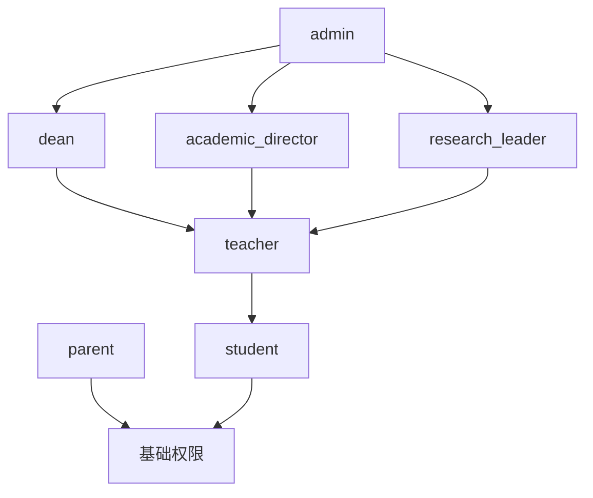
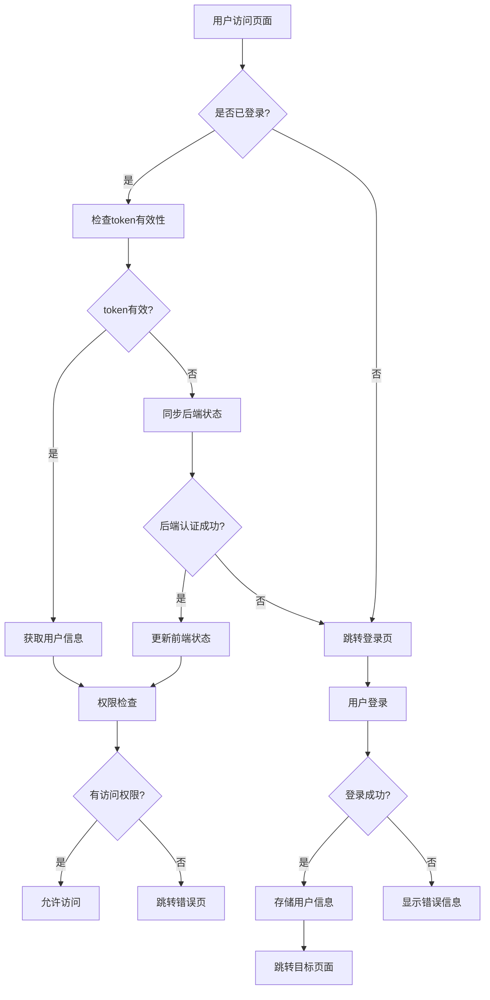
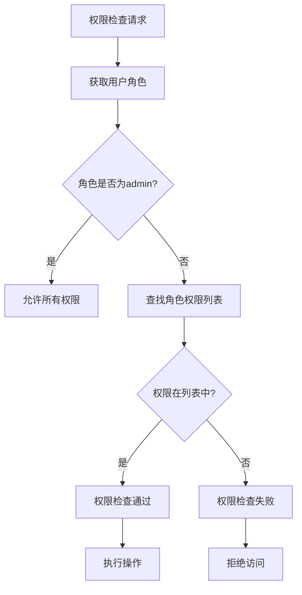
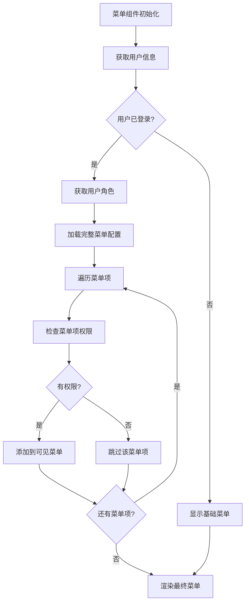

# 用户权限管理系统规范

## 1. 产品概述

本文档为Natural English英语学习平台建立完整的用户权限管理系统规范，基于RBAC（基于角色的访问控制）模型，统一管理用户认证、角色定义、权限控制、页面访问和菜单绑定等核心功能。

通过标准化的权限管理流程，确保系统安全性、用户体验一致性，并为后续功能扩展提供可靠的权限基础架构。

## 2. 核心功能

### 2.1 用户管理规范

#### 2.1.1 用户注册流程

**注册方式：**
- 手机号注册：用户提供手机号（必填）、密码、真实姓名
- 邮箱注册：邮箱为非必填项，可选择性提供
- 角色选择：用户角色为必选项，新注册用户默认为 `student` 角色
- 验证机制：手机号验证（必需）、邮箱验证（可选）

**登录方式：**
- 支持用户名/手机号/邮箱任一方式登录
- 手机号作为用户唯一标识
- 密码统一验证

**数据结构：**
```javascript
const UserProfile = {
  id: 'string',           // 用户唯一标识
  username: 'string',     // 用户名
  phone: 'string',        // 手机号（必填，唯一标识）
  email: 'string',        // 邮箱地址（可选）
  real_name: 'string',    // 真实姓名
  role: 'string',         // 用户角色（必选）
  avatar: 'string',       // 头像URL
  created_at: 'datetime', // 创建时间
  updated_at: 'datetime', // 更新时间
  is_active: 'boolean',   // 账户状态
  last_login: 'datetime', // 最后登录时间
  phone_verified: 'boolean', // 手机号验证状态
  email_verified: 'boolean'  // 邮箱验证状态
}
```

#### 2.1.2 用户认证机制

**认证方式：**
- Token认证：基于JWT或类似token机制
- 会话管理：前端localStorage存储用户信息和token
- 自动同步：前后端认证状态自动同步

**认证状态管理：**
```javascript
// 认证状态检查
export async function isAuthenticated() {
  const token = localStorage.getItem('token')
  const user = getCurrentUser()
  
  // 前端有完整登录信息
  if (token && user) return true
  
  // 同步后端状态
  return await syncAuthState()
}

// 获取当前用户
export function getCurrentUser() {
  const userStr = localStorage.getItem('user')
  if (!userStr) return null
  
  try {
    const user = JSON.parse(userStr)
    return user && user.role ? user : null
  } catch (error) {
    console.error('用户信息解析失败:', error)
    return null
  }
}
```

### 2.2 角色定义规范

#### 2.2.1 角色层次结构

我们的系统定义了7种用户角色，按权限级别从高到低排列：

| 角色代码 | 角色名称 | 权限级别 | 主要职责 |
|----------|----------|----------|----------|
| admin | 管理员 | 最高 | 系统管理、用户管理、全功能访问 |
| dean | 教导主任 | 高 | 教学管理、学术管理、数据分析 |
| academic_director | 教务主任 | 高 | 课程管理、教学管理、学术报告 |
| research_leader | 教研组长 | 中高 | 教研管理、教学方法、研究报告 |
| teacher | 自由老师 | 中 | 教学功能、学生管理、资源管理 |
| parent | 家长 | 低 | 查看子女信息、进度跟踪、沟通 |
| student | 学生 | 基础 | 学习功能、个人资料、基础操作 |

#### 2.2.2 角色显示名称映射

```javascript
export function getRoleDisplayName(role) {
  const roleNames = {
    'admin': '管理员',
    'dean': '教导主任',
    'academic_director': '教务主任',
    'research_leader': '教研组长',
    'teacher': '自由老师',
    'parent': '家长',
    'student': '学生'
  }
  return roleNames[role] || role
}
```

### 2.3 权限管理规范

#### 2.3.1 权限分类体系

**基础权限：**
- `view_dashboard` - 查看仪表板
- `view_own_profile` - 查看个人资料
- `change_own_settings` - 修改个人设置
- `view_help` - 查看帮助文档

**学习功能权限：**
- `view_word_learning` - 单词学习功能
- `practice_spelling` - 拼写练习
- `use_flashcard` - 使用闪卡
- `practice_reading` - 阅读练习
- `practice_listening` - 听力练习
- `participate_challenge` - 参与挑战
- `review_words` - 单词复习

**管理功能权限：**
- `manage_users` - 用户管理
- `manage_academic` - 学术管理
- `manage_teaching` - 教学管理
- `manage_research` - 教研管理
- `view_analytics` - 数据分析
- `access_dev_tools` - 开发工具访问

#### 2.3.2 角色权限映射表

```javascript
const ROLE_PERMISSIONS = {
  'admin': ['*'], // 管理员拥有所有权限
  
  'dean': [
    'view_dashboard', 'view_own_profile', 'change_own_settings', 'view_help',
    'view_word_learning', 'practice_spelling', 'use_flashcard', 'practice_reading',
    'view_word_detail', 'view_word_examples', 'practice_story_reading', 'practice_listening',
    'participate_challenge', 'practice_word_selection', 'review_words',
    'analyze_word_roots', 'use_pattern_memory', 'access_community', 'access_fashion_content',
    'discover_content', 'access_dev_tools', 'view_analytics', 'manage_resource_auth',
    'manage_subscriptions', 'share_resources', 'manage_academic', 'manage_teaching',
    'view_reports', 'manage_users'
  ],
  
  'academic_director': [
    'view_dashboard', 'view_own_profile', 'change_own_settings', 'view_help',
    'view_word_learning', 'practice_spelling', 'use_flashcard', 'practice_reading',
    'view_word_detail', 'view_word_examples', 'practice_story_reading', 'practice_listening',
    'participate_challenge', 'practice_word_selection', 'review_words',
    'analyze_word_roots', 'use_pattern_memory', 'access_community', 'access_fashion_content',
    'discover_content', 'access_dev_tools', 'view_analytics', 'manage_resource_auth',
    'manage_subscriptions', 'share_resources', 'manage_curriculum', 'manage_teaching',
    'view_academic_reports'
  ],
  
  'research_leader': [
    'view_dashboard', 'view_own_profile', 'change_own_settings', 'view_help',
    'view_word_learning', 'practice_spelling', 'use_flashcard', 'practice_reading',
    'view_word_detail', 'view_word_examples', 'practice_story_reading', 'practice_listening',
    'participate_challenge', 'practice_word_selection', 'review_words',
    'analyze_word_roots', 'use_pattern_memory', 'access_community', 'access_fashion_content',
    'discover_content', 'access_dev_tools', 'view_analytics', 'manage_resource_auth',
    'manage_subscriptions', 'share_resources', 'manage_research', 'manage_teaching_methods',
    'view_research_reports'
  ],
  
  'teacher': [
    'view_dashboard', 'view_own_profile', 'change_own_settings', 'view_help',
    'view_word_learning', 'practice_spelling', 'use_flashcard', 'practice_reading',
    'view_word_detail', 'view_word_examples', 'practice_story_reading', 'practice_listening',
    'participate_challenge', 'practice_word_selection', 'review_words',
    'analyze_word_roots', 'use_pattern_memory', 'access_community', 'access_fashion_content',
    'discover_content', 'access_dev_tools', 'view_analytics', 'manage_resource_auth',
    'manage_subscriptions', 'share_resources', 'manage_teaching', 'view_student',
    'change_student'
  ],
  
  'parent': [
    'view_dashboard', 'view_own_profile', 'change_own_settings', 'view_help',
    'view_student', 'view_own_children', 'view_child_progress', 'view_child_reports',
    'communicate_with_teacher'
  ],
  
  'student': [
    'view_dashboard', 'view_own_profile', 'change_own_settings', 'view_help',
    'view_word_learning', 'practice_spelling', 'use_flashcard', 'practice_reading',
    'view_word_detail', 'view_word_examples', 'practice_story_reading', 'practice_listening',
    'participate_challenge', 'practice_word_selection', 'review_words',
    'analyze_word_roots', 'use_pattern_memory', 'access_community', 'access_fashion_content',
    'discover_content', 'change_own_profile'
  ]
}
```

#### 2.3.3 权限检查函数

```javascript
/**
 * 检查用户是否拥有指定权限
 * @param {string} userRole - 用户角色
 * @param {string} permission - 权限名称
 * @returns {boolean} 是否拥有权限
 */
export function hasPermission(userRole, permission) {
  if (!userRole || !permission) return false
  
  const permissions = ROLE_PERMISSIONS[userRole] || []
  return permissions.includes('*') || permissions.includes(permission)
}
```

### 2.4 页面访问控制规范

#### 2.4.1 页面权限映射表

```javascript
const PAGE_PERMISSIONS = {
  '/': 'view_word_learning',
  '/dashboard': 'view_dashboard',
  '/profile': 'view_own_profile',
  '/settings': 'change_own_settings',
  '/help': 'view_help',
  '/word-learning': 'view_word_learning',
  '/word-learning/spelling': 'practice_spelling',
  '/word-learning/flashcard': 'use_flashcard',
  '/word-reading': 'practice_reading',
  '/word-detail': 'view_word_detail',
  '/word-examples': 'view_word_examples',
  '/story-reading': 'practice_story_reading',
  '/listening': 'practice_listening',
  '/word-challenge': 'participate_challenge',
  '/word-selection': 'practice_word_selection',
  '/word-review': 'review_words',
  '/word-root-analysis': 'analyze_word_roots',
  '/pattern-memory': 'use_pattern_memory',
  '/community': 'access_community',
  '/fashion': 'access_fashion_content',
  '/dev': 'access_dev_tools',
  '/dev-index': 'access_dev_tools',
  '/admin/dev-index': 'access_dev_tools',
  '/analytics': 'view_analytics',
  '/resource-auth': 'manage_resource_auth',
  '/subscription-management': 'manage_subscriptions',
  '/resource-sharing': 'share_resources',
  '/learning-modes': 'view_word_learning',
  '/competition': 'participate_challenge',
  '/quick-brush': 'review_words',
  '/discover': 'discover_content'
}
```

#### 2.4.2 页面访问检查函数

```javascript
/**
 * 检查用户是否可以访问指定页面
 * @param {string} userRole - 用户角色
 * @param {string} path - 页面路径
 * @returns {boolean} 是否可以访问
 */
export function canAccessPage(userRole, path) {
  // 处理动态路由参数
  const normalizedPath = path.replace(/\/\d+$/, '').replace(/\/[^/]*$/, '')
  const permission = PAGE_PERMISSIONS[normalizedPath] || PAGE_PERMISSIONS[path]
  
  if (!permission) {
    // 如果页面没有定义权限要求，默认允许访问
    return true
  }
  
  return hasPermission(userRole, permission)
}
```

#### 2.4.3 路由守卫实现

```javascript
/**
 * 路由权限检查函数
 * @param {Object} to - 目标路由
 * @param {Object} from - 来源路由
 * @param {Function} next - 路由继续函数
 */
export async function checkRoutePermission(to, from, next) {
  const authenticated = await isAuthenticated()
  const user = getCurrentUser()
  
  // 如果路由需要认证但用户未登录
  if (to.meta.requiresAuth && !authenticated) {
    next('/login')
    return
  }
  
  // 如果用户已登录但访问登录页，重定向到首页
  if (authenticated && to.path === '/login') {
    next('/')
    return
  }
  
  // 检查页面权限
  if (user && !canAccessPage(user.role, to.path)) {
    console.warn(`用户 ${user.username}(${user.role}) 无权访问页面 ${to.path}`)
    
    // 对于关键页面，重定向到首页而不是错误页
    const criticalPages = ['/learning-modes', '/learning-mode', '/dashboard']
    if (criticalPages.includes(to.path)) {
      next('/')
      return
    }
    
    next({
      path: '/error',
      query: {
        type: 'permission',
        message: `您的角色(${user.role})无权访问此页面`
      }
    })
    return
  }
  
  next()
}
```

### 2.5 角色权限完整映射表

#### 2.5.1 角色-页面-权限映射表

| 角色 | 可访问页面 | 页面路径 | 所需权限 | 权限分类 |
|------|------------|----------|----------|----------|
| **admin** | 所有页面 | /* | * | 全部权限 |
| **dean** | 仪表板 | /dashboard | view_dashboard | 基础权限 |
| | 个人资料 | /profile | view_own_profile | 基础权限 |
| | 设置 | /settings | change_own_settings | 基础权限 |
| | 帮助 | /help | view_help | 基础权限 |
| | 单词学习 | /word-learning | view_word_learning | 学习功能权限 |
| | 拼写练习 | /word-learning/spelling | practice_spelling | 学习功能权限 |
| | 闪卡练习 | /word-learning/flashcard | use_flashcard | 学习功能权限 |
| | 阅读练习 | /word-reading | practice_reading | 学习功能权限 |
| | 单词详情 | /word-detail | view_word_detail | 学习功能权限 |
| | 单词例句 | /word-examples | view_word_examples | 学习功能权限 |
| | 故事阅读 | /story-reading | practice_story_reading | 学习功能权限 |
| | 听力练习 | /listening | practice_listening | 学习功能权限 |
| | 单词挑战 | /word-challenge | participate_challenge | 学习功能权限 |
| | 单词选择 | /word-selection | practice_word_selection | 学习功能权限 |
| | 单词复习 | /word-review | review_words | 学习功能权限 |
| | 词根分析 | /word-root-analysis | analyze_word_roots | 学习功能权限 |
| | 模式记忆 | /pattern-memory | use_pattern_memory | 学习功能权限 |
| | 学习社区 | /community | access_community | 社交功能权限 |
| | 时尚内容 | /fashion | access_fashion_content | 内容权限 |
| | 内容发现 | /discover | discover_content | 内容权限 |
| | 开发工具 | /dev-index | access_dev_tools | 管理功能权限 |
| | 数据分析 | /analytics | view_analytics | 管理功能权限 |
| | 资源管理 | /resource-auth | manage_resource_auth | 管理功能权限 |
| | 订阅管理 | /subscription-management | manage_subscriptions | 管理功能权限 |
| | 资源分享 | /resource-sharing | share_resources | 管理功能权限 |
| | 学术管理 | - | manage_academic | 管理功能权限 |
| | 教学管理 | - | manage_teaching | 管理功能权限 |
| | 报告查看 | - | view_reports | 管理功能权限 |
| | 用户管理 | - | manage_users | 管理功能权限 |
| **academic_director** | 仪表板 | /dashboard | view_dashboard | 基础权限 |
| | 个人资料 | /profile | view_own_profile | 基础权限 |
| | 设置 | /settings | change_own_settings | 基础权限 |
| | 帮助 | /help | view_help | 基础权限 |
| | 单词学习 | /word-learning | view_word_learning | 学习功能权限 |
| | 拼写练习 | /word-learning/spelling | practice_spelling | 学习功能权限 |
| | 闪卡练习 | /word-learning/flashcard | use_flashcard | 学习功能权限 |
| | 阅读练习 | /word-reading | practice_reading | 学习功能权限 |
| | 单词详情 | /word-detail | view_word_detail | 学习功能权限 |
| | 单词例句 | /word-examples | view_word_examples | 学习功能权限 |
| | 故事阅读 | /story-reading | practice_story_reading | 学习功能权限 |
| | 听力练习 | /listening | practice_listening | 学习功能权限 |
| | 单词挑战 | /word-challenge | participate_challenge | 学习功能权限 |
| | 单词选择 | /word-selection | practice_word_selection | 学习功能权限 |
| | 单词复习 | /word-review | review_words | 学习功能权限 |
| | 词根分析 | /word-root-analysis | analyze_word_roots | 学习功能权限 |
| | 模式记忆 | /pattern-memory | use_pattern_memory | 学习功能权限 |
| | 学习社区 | /community | access_community | 社交功能权限 |
| | 时尚内容 | /fashion | access_fashion_content | 内容权限 |
| | 内容发现 | /discover | discover_content | 内容权限 |
| | 开发工具 | /dev-index | access_dev_tools | 管理功能权限 |
| | 数据分析 | /analytics | view_analytics | 管理功能权限 |
| | 资源管理 | /resource-auth | manage_resource_auth | 管理功能权限 |
| | 订阅管理 | /subscription-management | manage_subscriptions | 管理功能权限 |
| | 资源分享 | /resource-sharing | share_resources | 管理功能权限 |
| | 课程管理 | - | manage_curriculum | 管理功能权限 |
| | 教学管理 | - | manage_teaching | 管理功能权限 |
| | 学术报告 | - | view_academic_reports | 管理功能权限 |
| **research_leader** | 仪表板 | /dashboard | view_dashboard | 基础权限 |
| | 个人资料 | /profile | view_own_profile | 基础权限 |
| | 设置 | /settings | change_own_settings | 基础权限 |
| | 帮助 | /help | view_help | 基础权限 |
| | 单词学习 | /word-learning | view_word_learning | 学习功能权限 |
| | 拼写练习 | /word-learning/spelling | practice_spelling | 学习功能权限 |
| | 闪卡练习 | /word-learning/flashcard | use_flashcard | 学习功能权限 |
| | 阅读练习 | /word-reading | practice_reading | 学习功能权限 |
| | 单词详情 | /word-detail | view_word_detail | 学习功能权限 |
| | 单词例句 | /word-examples | view_word_examples | 学习功能权限 |
| | 故事阅读 | /story-reading | practice_story_reading | 学习功能权限 |
| | 听力练习 | /listening | practice_listening | 学习功能权限 |
| | 单词挑战 | /word-challenge | participate_challenge | 学习功能权限 |
| | 单词选择 | /word-selection | practice_word_selection | 学习功能权限 |
| | 单词复习 | /word-review | review_words | 学习功能权限 |
| | 词根分析 | /word-root-analysis | analyze_word_roots | 学习功能权限 |
| | 模式记忆 | /pattern-memory | use_pattern_memory | 学习功能权限 |
| | 学习社区 | /community | access_community | 社交功能权限 |
| | 时尚内容 | /fashion | access_fashion_content | 内容权限 |
| | 内容发现 | /discover | discover_content | 内容权限 |
| | 开发工具 | /dev-index | access_dev_tools | 管理功能权限 |
| | 数据分析 | /analytics | view_analytics | 管理功能权限 |
| | 资源管理 | /resource-auth | manage_resource_auth | 管理功能权限 |
| | 订阅管理 | /subscription-management | manage_subscriptions | 管理功能权限 |
| | 资源分享 | /resource-sharing | share_resources | 管理功能权限 |
| | 教研管理 | - | manage_research | 管理功能权限 |
| | 教学方法 | - | manage_teaching_methods | 管理功能权限 |
| | 研究报告 | - | view_research_reports | 管理功能权限 |
| **teacher** | 仪表板 | /dashboard | view_dashboard | 基础权限 |
| | 个人资料 | /profile | view_own_profile | 基础权限 |
| | 设置 | /settings | change_own_settings | 基础权限 |
| | 帮助 | /help | view_help | 基础权限 |
| | 单词学习 | /word-learning | view_word_learning | 学习功能权限 |
| | 拼写练习 | /word-learning/spelling | practice_spelling | 学习功能权限 |
| | 闪卡练习 | /word-learning/flashcard | use_flashcard | 学习功能权限 |
| | 阅读练习 | /word-reading | practice_reading | 学习功能权限 |
| | 单词详情 | /word-detail | view_word_detail | 学习功能权限 |
| | 单词例句 | /word-examples | view_word_examples | 学习功能权限 |
| | 故事阅读 | /story-reading | practice_story_reading | 学习功能权限 |
| | 听力练习 | /listening | practice_listening | 学习功能权限 |
| | 单词挑战 | /word-challenge | participate_challenge | 学习功能权限 |
| | 单词选择 | /word-selection | practice_word_selection | 学习功能权限 |
| | 单词复习 | /word-review | review_words | 学习功能权限 |
| | 词根分析 | /word-root-analysis | analyze_word_roots | 学习功能权限 |
| | 模式记忆 | /pattern-memory | use_pattern_memory | 学习功能权限 |
| | 学习社区 | /community | access_community | 社交功能权限 |
| | 时尚内容 | /fashion | access_fashion_content | 内容权限 |
| | 内容发现 | /discover | discover_content | 内容权限 |
| | 开发工具 | /dev-index | access_dev_tools | 管理功能权限 |
| | 数据分析 | /analytics | view_analytics | 管理功能权限 |
| | 资源管理 | /resource-auth | manage_resource_auth | 管理功能权限 |
| | 订阅管理 | /subscription-management | manage_subscriptions | 管理功能权限 |
| | 资源分享 | /resource-sharing | share_resources | 管理功能权限 |
| | 教学管理 | - | manage_teaching | 管理功能权限 |
| | 学生查看 | - | view_student | 管理功能权限 |
| | 学生管理 | - | change_student | 管理功能权限 |
| **parent** | 仪表板 | /dashboard | view_dashboard | 基础权限 |
| | 个人资料 | /profile | view_own_profile | 基础权限 |
| | 设置 | /settings | change_own_settings | 基础权限 |
| | 帮助 | /help | view_help | 基础权限 |
| | 学生信息 | - | view_student | 家长专用权限 |
| | 子女信息 | - | view_own_children | 家长专用权限 |
| | 子女进度 | - | view_child_progress | 家长专用权限 |
| | 子女报告 | - | view_child_reports | 家长专用权限 |
| | 教师沟通 | - | communicate_with_teacher | 家长专用权限 |
| **student** | 仪表板 | /dashboard | view_dashboard | 基础权限 |
| | 个人资料 | /profile | view_own_profile | 基础权限 |
| | 设置 | /settings | change_own_settings | 基础权限 |
| | 帮助 | /help | view_help | 基础权限 |
| | 单词学习 | /word-learning | view_word_learning | 学习功能权限 |
| | 拼写练习 | /word-learning/spelling | practice_spelling | 学习功能权限 |
| | 闪卡练习 | /word-learning/flashcard | use_flashcard | 学习功能权限 |
| | 阅读练习 | /word-reading | practice_reading | 学习功能权限 |
| | 单词详情 | /word-detail | view_word_detail | 学习功能权限 |
| | 单词例句 | /word-examples | view_word_examples | 学习功能权限 |
| | 故事阅读 | /story-reading | practice_story_reading | 学习功能权限 |
| | 听力练习 | /listening | practice_listening | 学习功能权限 |
| | 单词挑战 | /word-challenge | participate_challenge | 学习功能权限 |
| | 单词选择 | /word-selection | practice_word_selection | 学习功能权限 |
| | 单词复习 | /word-review | review_words | 学习功能权限 |
| | 词根分析 | /word-root-analysis | analyze_word_roots | 学习功能权限 |
| | 模式记忆 | /pattern-memory | use_pattern_memory | 学习功能权限 |
| | 学习社区 | /community | access_community | 社交功能权限 |
| | 时尚内容 | /fashion | access_fashion_content | 内容权限 |
| | 内容发现 | /discover | discover_content | 内容权限 |
| | 个人资料编辑 | - | change_own_profile | 基础权限 |

#### 2.5.2 权限分类统计表

| 权限分类 | 权限数量 | 主要权限项 |
|----------|----------|------------|
| 基础权限 | 4 | view_dashboard, view_own_profile, change_own_settings, view_help |
| 学习功能权限 | 14 | view_word_learning, practice_spelling, use_flashcard, practice_reading, view_word_detail, view_word_examples, practice_story_reading, practice_listening, participate_challenge, practice_word_selection, review_words, analyze_word_roots, use_pattern_memory, change_own_profile |
| 社交功能权限 | 1 | access_community |
| 内容权限 | 2 | access_fashion_content, discover_content |
| 管理功能权限 | 15 | access_dev_tools, view_analytics, manage_resource_auth, manage_subscriptions, share_resources, manage_academic, manage_teaching, view_reports, manage_users, manage_curriculum, view_academic_reports, manage_research, manage_teaching_methods, view_research_reports, view_student, change_student |
| 家长专用权限 | 5 | view_student, view_own_children, view_child_progress, view_child_reports, communicate_with_teacher |

### 2.6 权限分类优化方案

#### 2.6.1 现有权限分类问题分析

**当前问题：**
1. **权限粒度不一致**：学习功能权限过于细分，而管理功能权限相对粗糙
2. **权限继承缺失**：角色间缺乏明确的权限继承关系，导致重复定义
3. **权限命名不规范**：权限命名缺乏统一标准，难以维护
4. **动态权限支持不足**：无法根据用户状态动态调整权限
5. **权限分组不合理**：部分权限分类边界模糊，存在交叉

#### 2.6.2 优化权限分类体系

**新权限分类架构：**

| 一级分类 | 二级分类 | 权限粒度 | 适用角色 | 继承关系 |
|----------|----------|----------|----------|----------|
| **系统权限** | 基础访问权限 | 粗粒度 | 所有角色 | 基础继承 |
| | 认证权限 | 中粒度 | 认证用户 | 基础继承 |
| **学习权限** | 内容访问权限 | 中粒度 | student+ | 角色继承 |
| | 学习工具权限 | 细粒度 | student+ | 角色继承 |
| | 进度管理权限 | 中粒度 | student+ | 角色继承 |
| **教学权限** | 学生管理权限 | 中粒度 | teacher+ | 角色继承 |
| | 课程管理权限 | 中粒度 | teacher+ | 角色继承 |
| | 教学工具权限 | 细粒度 | teacher+ | 角色继承 |
| **管理权限** | 用户管理权限 | 中粒度 | admin+ | 管理继承 |
| | 系统管理权限 | 粗粒度 | admin+ | 管理继承 |
| | 数据管理权限 | 中粒度 | admin+ | 管理继承 |
| **家长权限** | 子女监护权限 | 中粒度 | parent | 独立权限 |
| | 沟通权限 | 细粒度 | parent | 独立权限 |

#### 2.6.3 权限继承机制设计

**角色继承层次：**


**继承规则：**
1. **向上继承**：高级角色自动继承低级角色的所有权限
2. **权限叠加**：同级角色权限可以叠加，不冲突
3. **特殊权限**：某些角色拥有独特权限（如parent的家长权限）
4. **权限覆盖**：高级角色可以覆盖低级角色的特定权限设置

#### 2.6.4 动态权限管理方案

**动态权限触发条件：**

| 触发条件 | 权限变化 | 实现方式 | 示例 |
|----------|----------|----------|------|
| 用户状态变更 | 权限启用/禁用 | 状态监听 | 账户冻结时禁用所有权限 |
| 订阅状态 | 功能权限调整 | 订阅检查 | 高级功能需要付费订阅 |
| 时间限制 | 临时权限授予 | 定时任务 | 试用期权限自动到期 |
| 地理位置 | 区域权限限制 | IP检查 | 某些功能仅限特定地区 |
| 设备类型 | 平台权限差异 | 设备检测 | 移动端功能受限 |

**动态权限实现架构：**
```javascript
// 动态权限检查器
class DynamicPermissionChecker {
  async checkPermission(user, permission, context) {
    // 1. 基础角色权限检查
    const basePermission = this.checkRolePermission(user.role, permission);
    
    // 2. 动态条件检查
    const dynamicChecks = await Promise.all([
      this.checkSubscriptionStatus(user, permission),
      this.checkTimeRestrictions(user, permission),
      this.checkLocationRestrictions(user, permission, context),
      this.checkDeviceRestrictions(user, permission, context)
    ]);
    
    // 3. 综合判断
    return basePermission && dynamicChecks.every(check => check);
  }
}
```

#### 2.6.5 权限粒度优化建议

**粒度优化原则：**
1. **功能导向**：按功能模块划分权限，而非按页面
2. **最小权限**：默认最小权限，按需授予
3. **组合权限**：支持权限组合，减少单一权限数量
4. **上下文相关**：考虑使用场景的权限差异

**优化后的权限结构：**
```javascript
// 权限组合示例
const PERMISSION_GROUPS = {
  LEARNING_BASIC: [
    'view_word_learning',
    'practice_spelling',
    'use_flashcard',
    'practice_reading'
  ],
  LEARNING_ADVANCED: [
    'analyze_word_roots',
    'use_pattern_memory',
    'participate_challenge'
  ],
  TEACHING_BASIC: [
    'view_student',
    'manage_teaching'
  ],
  TEACHING_ADVANCED: [
    'change_student',
    'view_analytics',
    'manage_curriculum'
  ]
};
```

#### 2.6.6 实施步骤和最佳实践

**第一阶段：权限重构（1-2周）**
1. 重新定义权限分类体系
2. 建立权限继承关系
3. 更新权限命名规范
4. 迁移现有权限数据

**第二阶段：动态权限实现（2-3周）**
1. 实现动态权限检查器
2. 集成订阅状态检查
3. 添加时间和地理位置限制
4. 完善权限缓存机制

**第三阶段：权限优化（1-2周）**
1. 实现权限组合功能
2. 优化权限检查性能
3. 添加权限审计日志
4. 完善权限管理界面

**最佳实践建议：**
1. **权限缓存**：实现多层权限缓存，提高检查效率
2. **权限审计**：记录所有权限变更和检查日志
3. **权限测试**：建立完整的权限测试用例
4. **权限文档**：维护详细的权限说明文档
5. **权限监控**：实时监控权限使用情况和异常

### 2.7 菜单绑定规范

#### 2.7.1 菜单权限过滤

```javascript
/**
 * 获取用户可访问的菜单项
 * @param {string} userRole - 用户角色
 * @returns {Array} 可访问的菜单项
 */
export function getAccessibleMenus(userRole) {
  const allMenus = [
    {
      id: 'dashboard',
      title: '仪表板',
      path: '/dashboard',
      icon: '📊',
      permission: 'view_dashboard'
    },
    {
      id: 'word-learning',
      title: '单词学习',
      path: '/word-learning',
      icon: '📚',
      permission: 'view_word_learning'
    },
    {
      id: 'word-challenge',
      title: '单词挑战',
      path: '/word-challenge',
      icon: '🎯',
      permission: 'participate_challenge'
    },
    {
      id: 'word-review',
      title: '单词复习',
      path: '/word-review',
      icon: '🔄',
      permission: 'review_words'
    },
    {
      id: 'community',
      title: '学习社区',
      path: '/community',
      icon: '👥',
      permission: 'access_community'
    },
    {
      id: 'analytics',
      title: '数据分析',
      path: '/analytics',
      icon: '📈',
      permission: 'view_analytics'
    },
    {
      id: 'resource-auth',
      title: '资源管理',
      path: '/resource-auth',
      icon: '🔐',
      permission: 'manage_resource_auth'
    },
    {
      id: 'dev-index',
      title: '开发工具',
      path: '/dev-index',
      icon: '🛠️',
      permission: 'access_dev_tools'
    },
    {
      id: 'profile',
      title: '个人资料',
      path: '/profile',
      icon: '👤',
      permission: 'view_own_profile'
    },
    {
      id: 'settings',
      title: '设置',
      path: '/settings',
      icon: '⚙️',
      permission: 'change_own_settings'
    }
  ]
  
  return allMenus.filter(menu => hasPermission(userRole, menu.permission))
}
```

#### 2.5.2 动态菜单管理

```javascript
// 在useMenuManager.js中实现
export function useMenuManager() {
  const userInfo = ref(null)
  const userAuthState = ref(false)
  
  // 权限检查
  const checkPermission = async (permission) => {
    try {
      if (!isUserLoggedIn.value) return false
      
      const user = getCurrentUser()
      if (!user || !user.role) return false
      
      return await hasPermission(user.role, permission)
    } catch (error) {
      console.error('权限检查失败:', error)
      return false
    }
  }
  
  // 检查页面是否需要认证
  const requiresAuth = (path) => {
    const authRequiredPaths = [
      '/dashboard', '/profile', '/settings', '/word-learning',
      '/word-detail', '/word-root-analysis', '/story-reading',
      '/pattern-memory', '/resource-auth', '/subscription-management'
    ]
    return authRequiredPaths.includes(path)
  }
  
  return {
    userInfo,
    userAuthState,
    checkPermission,
    requiresAuth
  }
}
```

## 3. 核心流程

### 3.1 用户认证流程



### 3.2 权限检查流程



### 3.3 菜单渲染流程



## 4. 用户界面设计

### 4.1 权限相关UI组件

**权限指令 (v-permission)：**
```javascript
// 权限指令实现
const permissionDirective = {
  mounted(el, binding) {
    const user = getCurrentUser()
    const permission = binding.value
    
    if (!user || !hasPermission(user.role, permission)) {
      el.style.display = 'none'
    }
  },
  
  updated(el, binding) {
    const user = getCurrentUser()
    const permission = binding.value
    
    if (!user || !hasPermission(user.role, permission)) {
      el.style.display = 'none'
    } else {
      el.style.display = ''
    }
  }
}
```

**使用示例：**
```vue
<template>
  <!-- 只有管理员可以看到的按钮 -->
  <button v-permission="'manage_users'">用户管理</button>
  
  <!-- 只有教师以上角色可以看到的菜单 -->
  <div v-permission="'access_dev_tools'">开发工具</div>
</template>
```

### 4.2 错误页面设计

**权限不足页面：**
- 清晰的错误信息提示
- 当前用户角色显示
- 返回首页或登录的操作按钮
- 联系管理员的引导信息

**未登录页面：**
- 友好的登录提示
- 快速登录表单
- 注册账户的引导链接

### 4.3 角色标识设计

**角色徽章：**
```css
.role-badge {
  display: inline-block;
  padding: 2px 8px;
  border-radius: 12px;
  font-size: 12px;
  font-weight: 500;
}

.role-badge--admin { background: #f44336; color: white; }
.role-badge--dean { background: #9c27b0; color: white; }
.role-badge--academic-director { background: #3f51b5; color: white; }
.role-badge--research-leader { background: #2196f3; color: white; }
.role-badge--teacher { background: #4caf50; color: white; }
.role-badge--parent { background: #ff9800; color: white; }
.role-badge--student { background: #607d8b; color: white; }
```

## 5. 技术实现规范

### 5.1 文件结构

```
src/
├── utils/
│   ├── permission.js          # 核心权限管理
│   ├── authSync.js           # 认证状态同步
│   ├── dynamicPermission.js  # 动态权限管理
│   └── permissionUtils.js    # 权限工具函数
├── composables/
│   └── useMenuManager.js     # 菜单管理器
├── mixins/
│   └── permissionMixin.js    # 权限混入
├── directives/
│   └── permission.js         # 权限指令
└── components/
    ├── ErrorHandler.vue      # 错误处理组件
    └── RoleBadge.vue        # 角色徽章组件
```

### 5.2 API接口规范

**认证相关API：**
```javascript
// 用户登录
POST /accounts/api/auth/login/
{
  "username": "string",
  "password": "string"
}

// 用户注册
POST /accounts/api/auth/register/
{
  "username": "string",
  "email": "string",
  "password": "string",
  "real_name": "string"
}

// 获取用户信息
GET /accounts/api/users/profile/
Headers: { "Authorization": "Token <token>" }

// 验证token
POST /accounts/api/auth/verify-token/
Headers: { "Authorization": "Token <token>" }

// 用户登出
POST /accounts/api/users/logout/
Headers: { "Authorization": "Token <token>" }
```

### 5.3 状态管理

**权限状态管理：**
```javascript
// 权限变更监听器
class PermissionWatcher {
  constructor() {
    this.listeners = []
  }
  
  addListener(callback) {
    this.listeners.push(callback)
  }
  
  removeListener(callback) {
    const index = this.listeners.indexOf(callback)
    if (index > -1) {
      this.listeners.splice(index, 1)
    }
  }
  
  notifyChange(user) {
    this.listeners.forEach(callback => {
      try {
        callback(user)
      } catch (error) {
        console.error('权限变更监听器执行失败:', error)
      }
    })
  }
}

export const permissionWatcher = new PermissionWatcher()
```

### 5.4 缓存策略

**认证状态缓存：**
```javascript
// 认证状态缓存
let authCache = {
  lastCheck: 0,
  result: null,
  syncing: false
}

// 缓存有效期（5分钟）
const AUTH_CACHE_DURATION = 5 * 60 * 1000

// 清除认证缓存
export function clearAuthCache() {
  authCache.lastCheck = 0
  authCache.result = null
  authCache.syncing = false
}
```

## 6. 权限检查流程

### 6.1 前端权限验证

**组件级权限检查：**
```javascript
// 在Vue组件中使用
export default {
  mixins: [permissionMixin],
  
  computed: {
    canManageUsers() {
      return this.hasPermission('manage_users')
    },
    
    canAccessDevTools() {
      return this.hasPermission('access_dev_tools')
    }
  },
  
  methods: {
    handleAdminAction() {
      if (!this.isAdmin) {
        this.$message.error('权限不足')
        return
      }
      // 执行管理员操作
    }
  }
}
```

**路由级权限检查：**
```javascript
// 在router/index.js中配置
router.beforeEach(async (to, from, next) => {
  // 设置页面标题
  document.title = to.meta.title || 'Natural English'
  
  // 异步检查认证状态
  const isAuth = await isAuthenticated()
  const user = getCurrentUser()
  
  // 检查页面访问权限
  if (user && !canAccessPage(user.role, to.path)) {
    console.warn(`用户无权访问页面: ${to.path}`)
    next({ path: '/error', query: { type: 'permission' } })
    return
  }
  
  next()
})
```

### 6.2 后端同步机制

**认证状态同步：**
```javascript
// 同步后端认证状态
export async function syncAuthState() {
  try {
    const response = await fetch('/accounts/api/auth/verify-token/', {
      method: 'POST',
      credentials: 'include',
      headers: {
        'Content-Type': 'application/json'
      }
    })
    
    if (response.ok) {
      const data = await response.json()
      if (data.user) {
        localStorage.setItem('user', JSON.stringify(data.user))
        localStorage.setItem('token', data.token || '')
        return { success: true, authenticated: true, user: data.user }
      }
    }
    
    // 认证失败，清除本地状态
    clearAuth()
    return { success: true, authenticated: false }
  } catch (error) {
    console.error('认证状态同步失败:', error)
    return { success: false, authenticated: false }
  }
}
```

## 7. 实施指南和最佳实践

### 7.1 实施步骤

**第一阶段：基础权限系统**
1. 完善 `utils/permission.js` 权限管理核心
2. 实现用户认证状态管理
3. 建立角色权限映射表
4. 实现基础权限检查函数

**第二阶段：页面访问控制**
1. 完善页面权限映射表
2. 实现路由守卫权限检查
3. 优化错误页面处理
4. 测试各角色页面访问权限

**第三阶段：菜单权限绑定**
1. 实现动态菜单过滤
2. 优化 `useMenuManager.js` 权限检查
3. 完善菜单组件权限指令
4. 测试菜单显示逻辑

**第四阶段：UI组件和体验优化**
1. 实现权限指令 `v-permission`
2. 优化错误页面设计
3. 添加角色标识组件
4. 完善用户体验细节

**第五阶段：测试和优化**
1. 全面权限功能测试
2. 性能优化和缓存策略
3. 安全性审查
4. 文档完善和培训

### 7.2 最佳实践

**安全原则：**
1. **最小权限原则** - 用户只获得完成任务所需的最小权限
2. **权限分离** - 敏感操作需要多重权限验证
3. **定期审查** - 定期检查和更新用户权限
4. **日志记录** - 记录所有权限相关操作

**性能优化：**
1. **权限缓存** - 合理使用缓存减少重复检查
2. **懒加载** - 按需加载权限相关数据
3. **批量检查** - 批量处理权限验证请求
4. **前端预检** - 前端预先过滤明显无权限的操作

**用户体验：**
1. **渐进式显示** - 根据权限逐步显示功能
2. **友好提示** - 提供清晰的权限不足提示
3. **快速反馈** - 权限检查结果快速响应
4. **一致性** - 保持权限检查逻辑的一致性

**代码规范：**
1. **统一命名** - 权限名称使用统一的命名规范
2. **模块化** - 权限相关代码模块化管理
3. **文档化** - 详细记录权限配置和使用方法
4. **测试覆盖** - 确保权限功能的测试覆盖率

### 7.3 监控和维护

**权限监控：**
```javascript
// 权限使用统计
const permissionStats = {
  checkCount: 0,
  deniedCount: 0,
  errorCount: 0
}

// 权限检查包装器
function monitoredHasPermission(userRole, permission) {
  permissionStats.checkCount++
  
  try {
    const result = hasPermission(userRole, permission)
    if (!result) {
      permissionStats.deniedCount++
      console.log(`权限拒绝: ${userRole} -> ${permission}`)
    }
    return result
  } catch (error) {
    permissionStats.errorCount++
    console.error(`权限检查错误: ${error.message}`)
    return false
  }
}
```

**定期维护任务：**
1. 检查权限配置的完整性
2. 清理无效的权限缓存
3. 更新角色权限映射表
4. 优化权限检查性能
5. 审查用户权限分配

通过这套完整的用户权限管理系统规范，Natural English平台将拥有安全、高效、用户友好的权限控制体系，为平台的长期发展提供坚实的基础架构支撑。