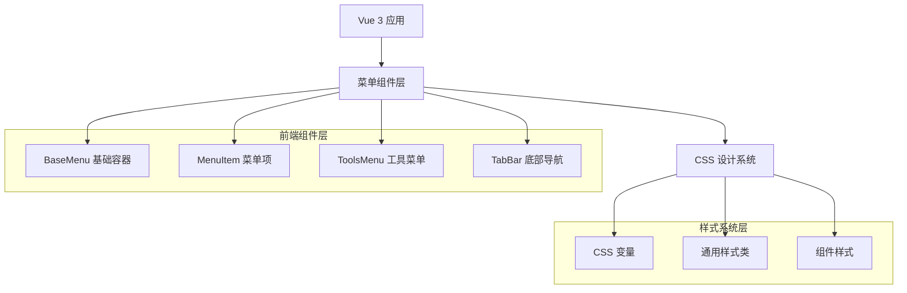
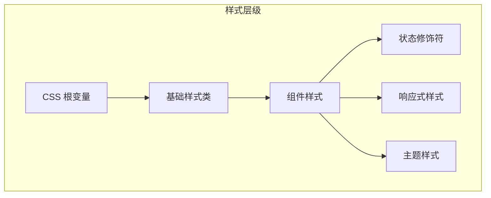

# 菜单系统技术架构文档

## 1. 架构设计



## 2. 技术描述

* 前端：Vue 3 + Composition API + TypeScript

* 样式：CSS3 + CSS Variables + BEM命名规范

* 构建：Vite

* 状态管理：Vue 3 Reactivity API

## 3. 组件路径定义

| 组件名称         | 文件路径                                    | 用途     | 使用场景            |
| ------------ | --------------------------------------- | ------ | --------------- |
| BaseMenu     | components/menu/BaseMenu.vue           | 通用菜单容器 | 下拉菜单、弹出菜单、侧边栏菜单 |
| MenuItem     | components/menu/MenuItem.vue           | 标准菜单项  | 所有菜单中的可点击项目     |
| ToolsMenu    | components/navigation/ToolsMenu.vue    | 工具选择菜单 | 工具栏中的工具选择界面     |
| TabBar | components/navigation/TabBar.vue | 底部导航栏  | 移动端主导航          |
| DevCenterMenu| components/navigation/DevCenterMenu.vue| 开发中心菜单 | 开发工具集合界面        |
| NavItem      | components/navigation/NavItem.vue      | 导航项组件  | 导航栏中的单个导航项      |

## 4. 组件API定义

### 4.1 BaseMenu 组件

**Props接口：**

```typescript
interface BaseMenuProps {
  visible: boolean;           // 菜单可见性
  type: 'popup' | 'dropdown' | 'sidebar'; // 菜单类型
  size: 'small' | 'medium' | 'large';     // 菜单尺寸
  position?: { x: number; y: number };     // 菜单位置
  autoClose?: boolean;        // 点击外部自动关闭
  transition?: string;        // 过渡动画类型
}
```

**Events接口：**

```typescript
interface BaseMenuEvents {
  'update:visible': (visible: boolean) => void;
  'close': () => void;
  'open': () => void;
}
```

### 4.2 MenuItem 组件

**Props接口：**

```typescript
interface MenuItemProps {
  icon?: string;              // 图标名称
  title: string;              // 标题文本
  description?: string;       // 描述文本
  variant?: 'primary' | 'secondary' | 'danger'; // 样式变体
  disabled?: boolean;         // 禁用状态
  expandable?: boolean;       // 是否可展开
  active?: boolean;           // 激活状态
}
```

**Events接口：**

```typescript
interface MenuItemEvents {
  'click': (event: MouseEvent) => void;
  'expand': () => void;
  'collapse': () => void;
}
```

### 4.3 ToolsMenu 组件

**Props接口：**

```typescript
interface ToolsMenuProps {
  tools: Tool[];              // 工具列表
  selectedTool?: string;      // 当前选中工具
  showDevCenter?: boolean;    // 显示开发中心
}

interface Tool {
  id: string;
  name: string;
  description: string;
  enabled: boolean;
  icon?: string;
}
```

**Events接口：**

```typescript
interface ToolsMenuEvents {
  'tool-select': (toolId: string) => void;
  'tool-toggle': (toolId: string, enabled: boolean) => void;
}
```

## 5. CSS架构设计

### 5.1 样式层次结构



### 5.2 CSS变量系统

**根变量定义：**

```css
:root {
  /* 颜色系统 */
  --menu-color-primary: #4A90E2;
  --menu-color-primary-light: #6BB6FF;
  --menu-color-secondary: #f8f9fa;
  --menu-color-text-primary: #333333;
  --menu-color-text-secondary: rgba(51, 51, 51, 0.7);
  --menu-color-border: rgba(0, 0, 0, 0.1);
  --menu-color-shadow: rgba(0, 0, 0, 0.1);
  
  /* 背景系统 */
  --menu-bg-primary: rgba(255, 255, 255, 0.9);
  --menu-bg-secondary: rgba(255, 255, 255, 0.1);
  --menu-bg-hover: rgba(74, 144, 226, 0.1);
  --menu-bg-active: rgba(74, 144, 226, 0.2);
  
  /* 尺寸系统 */
  --menu-radius-xs: 4px;
  --menu-radius-sm: 8px;
  --menu-radius-md: 12px;
  --menu-radius-lg: 16px;
  --menu-spacing-xs: 4px;
  --menu-spacing-sm: 8px;
  --menu-spacing-md: 12px;
  --menu-spacing-lg: 16px;
  --menu-spacing-xl: 20px;
  
  /* 动画系统 */
  --menu-transition-fast: 0.15s ease-out;
  --menu-transition-normal: 0.3s ease-in-out;
  --menu-transition-slow: 0.5s ease-in-out;
  --menu-blur: blur(20px);
  
  /* 阴影系统 */
  --menu-shadow-sm: 0 2px 8px rgba(0, 0, 0, 0.1);
  --menu-shadow-md: 0 4px 20px rgba(0, 0, 0, 0.1);
  --menu-shadow-lg: 0 8px 32px rgba(0, 0, 0, 0.15);
}
```

### 5.3 深色模式变量

```css
@media (prefers-color-scheme: dark) {
  :root {
    --menu-color-text-primary: #ffffff;
    --menu-color-text-secondary: rgba(255, 255, 255, 0.7);
    --menu-color-border: rgba(255, 255, 255, 0.1);
    --menu-bg-primary: rgba(30, 30, 30, 0.9);
    --menu-bg-secondary: rgba(255, 255, 255, 0.05);
    --menu-color-shadow: rgba(0, 0, 0, 0.3);
  }
}
```

## 6. 组件实现规范

### 6.1 基础样式类

```css
/* 菜单容器基础类 */
.menu-container {
  background: var(--menu-bg-primary);
  backdrop-filter: var(--menu-blur);
  border-radius: var(--menu-radius-md);
  box-shadow: var(--menu-shadow-md);
  border: 1px solid var(--menu-color-border);
  overflow: hidden;
  transition: var(--menu-transition-normal);
}

/* 菜单项基础类 */
.menu-item {
  display: flex;
  align-items: center;
  padding: var(--menu-spacing-md) var(--menu-spacing-lg);
  color: var(--menu-color-text-primary);
  text-decoration: none;
  border-radius: var(--menu-radius-sm);
  transition: var(--menu-transition-fast);
  cursor: pointer;
}

/* 状态修饰符 */
.menu-item:hover {
  background: var(--menu-bg-hover);
  transform: translateY(-1px);
}

.menu-item:active {
  background: var(--menu-bg-active);
  transform: translateY(0);
}

.menu-item.is-disabled {
  opacity: 0.5;
  cursor: not-allowed;
  pointer-events: none;
}

.menu-item.is-active {
  background: var(--menu-bg-active);
  color: var(--menu-color-primary);
}
```

### 6.2 响应式设计

```css
/* 移动端适配 */
@media (max-width: 768px) {
  .menu-item {
    padding: var(--menu-spacing-sm) var(--menu-spacing-md);
    font-size: 14px;
  }
  
  .menu-container {
    border-radius: var(--menu-radius-sm);
  }
}

/* 触摸设备优化 */
@media (hover: none) and (pointer: coarse) {
  .menu-item {
    min-height: 44px; /* 触摸友好的最小高度 */
  }
  
  .menu-item:hover {
    transform: none; /* 禁用悬停变换 */
  }
}
```

### 6.3 无障碍支持

```css
/* 焦点状态 */
.menu-item:focus {
  outline: 2px solid var(--menu-color-primary);
  outline-offset: 2px;
}

/* 减少动画模式 */
@media (prefers-reduced-motion: reduce) {
  .menu-item,
  .menu-container {
    transition: none;
  }
}

/* 高对比度模式 */
@media (prefers-contrast: high) {
  .menu-container {
    border: 2px solid var(--menu-color-text-primary);
  }
  
  .menu-item {
    border: 1px solid transparent;
  }
  
  .menu-item:focus {
    border-color: var(--menu-color-primary);
  }
}
```

## 7. 实施指南

### 7.1 组件文件结构

```
components/
├── menu/                    # 菜单核心组件
│   ├── BaseMenu.vue        # 通用菜单容器
│   ├── MenuItem.vue        # 标准菜单项
│   └── MenuErrorBoundary.vue # 菜单错误边界
├── navigation/              # 导航相关组件
│   ├── TabBar.vue    # 底部导航栏
│   ├── ToolsMenu.vue       # 工具选择菜单
│   ├── DevCenterMenu.vue   # 开发中心菜单
│   └── NavItem.vue         # 导航项组件
├── Layout.vue              # 布局容器
├── TopNavBar.vue           # 顶部导航栏
├── DynamicMenu.vue         # 动态菜单
└── OptimizedDynamicMenu.vue # 优化的动态菜单
```

### 7.2 迁移步骤

1. **建

