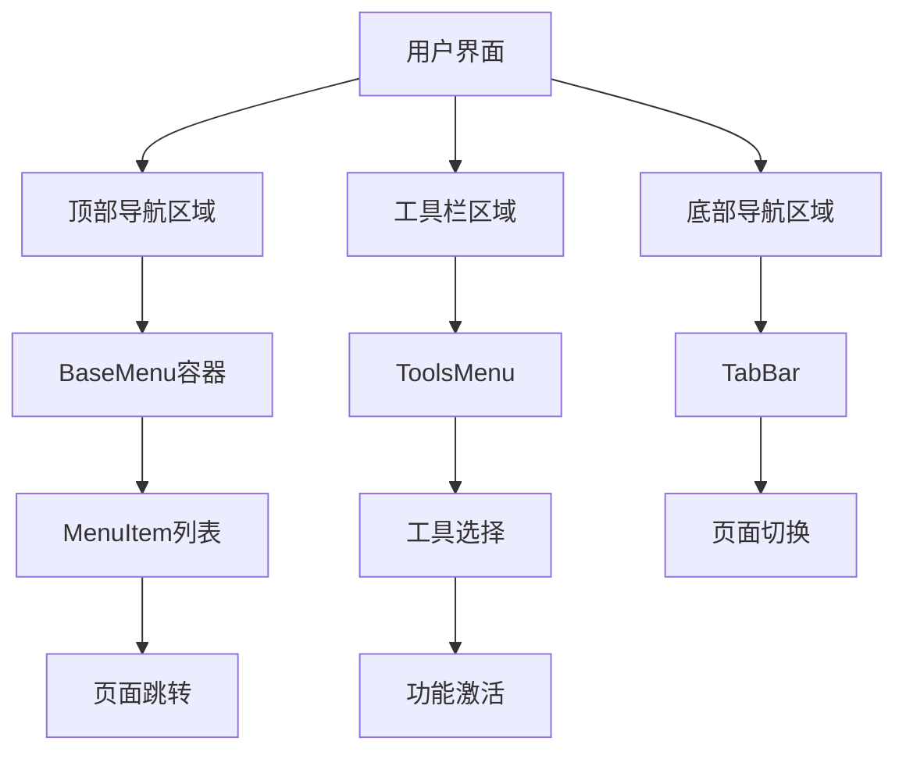

# 菜单设计系统规范

## 1. 产品概述

本文档旨在为Natural English英语学习平台建立统一的菜单设计系统，解决当前BaseMenu、MenuItem、ToolsMenu等组件风格不一致的问题，提升用户体验的一致性和产品的专业度。

通过统一的设计语言和组件规范，确保所有菜单组件在视觉表现、交互行为和用户体验方面保持高度一致。

## 2. 核心功能

### 2.1 设计原则

我们的菜单设计系统遵循以下核心原则：

1. **一致性原则** - 所有菜单组件使用统一的视觉语言
2. **简洁性原则** - 界面简洁明了，避免视觉噪音
3. **可访问性原则** - 支持无障碍访问和多设备适配
4. **渐进式原则** - 支持渐进增强的交互体验

### 2.2 功能模块

我们的菜单设计系统包含以下主要组件：

1. **基础菜单容器(BaseMenu)** - 提供统一的容器样式和定位逻辑
2. **菜单项组件(MenuItem)** - 标准化的菜单项展示和交互
3. **工具菜单(ToolsMenu)** - 专门的工具选择和管理界面
4. **底部导航栏(TabBar)** - 移动端主导航组件

### 2.3 页面详情

| 组件名称 | 模块名称 | 功能描述 |
|----------|----------|----------|
| BaseMenu | 容器系统 | 提供统一的背景、阴影、圆角、模糊效果；支持popup、dropdown、sidebar三种类型；响应式尺寸控制 |
| MenuItem | 交互元素 | 标准化的图标、标题、描述布局；统一的悬停、激活、禁用状态；支持primary、secondary、danger变体 |
| ToolsMenu | 工具管理 | 工具列表展示；单选交互；状态徽章；开发中心特殊样式 |
| TabBar | 移动导航 | 底部固定导航；图标和文字组合；激活状态指示 |

## 3. 核心流程

### 3.1 用户交互流程

用户通过不同入口访问菜单系统：
- 点击顶部导航触发下拉菜单(BaseMenu + MenuItem)
- 点击工具按钮打开工具选择菜单(ToolsMenu)
- 移动端通过底部导航栏进行页面切换(TabBar)

### 3.2 菜单导航流程图



## 4. 用户界面设计

### 4.1 设计风格

**颜色系统：**
- 主色调：蓝色渐变 (#4A90E2 到 #6BB6FF)
- 辅助色：白色半透明 (rgba(255, 255, 255, 0.1))
- 文字色：深灰 (#333) / 白色 (#fff)
- 状态色：成功绿 (#4CAF50)、警告橙 (#FF9800)、危险红 (#F44336)

**视觉效果：**
- 背景模糊：backdrop-filter: blur(20px)
- 圆角规范：8px (小组件) / 12px (中等组件) / 16px (大组件)
- 阴影层次：0 4px 20px rgba(0, 0, 0, 0.1) (轻微) / 0 8px 32px rgba(0, 0, 0, 0.15) (明显)
- 过渡动画：0.3s ease-in-out

**字体规范：**
- 主标题：16px, font-weight: 600
- 副标题：14px, font-weight: 400
- 描述文字：12px, font-weight: 400, opacity: 0.7

### 4.2 组件设计规范

| 组件名称 | 视觉特征 | 交互状态 |
|----------|----------|----------|
| BaseMenu | 白色半透明背景、20px模糊、12px圆角、轻微阴影 | 淡入淡出动画、位置自适应 |
| MenuItem | 透明背景、8px圆角、悬停时背景变化和轻微缩放 | hover: 背景高亮、active: 轻微下沉、disabled: 50%透明度 |
| ToolsMenu | 渐变背景、16px圆角、明显阴影、光带动画效果 | 工具项悬停发光、选中状态高亮、状态徽章颜色区分 |
| TabBar | 固定底部、模糊背景、顶部边框 | 图标激活放大、文字颜色变化 |

### 4.3 响应式设计

**桌面端优先设计：**
- 基础尺寸适配1200px+屏幕
- 菜单项内边距：12px 16px
- 图标尺寸：20px

**移动端适配：**
- 768px以下触发移动端样式
- 菜单项内边距调整为：8px 12px
- 图标尺寸调整为：18px
- 触摸优化：增大点击区域，优化悬停效果

**无障碍支持：**
- 支持键盘导航
- 提供focus状态样式
- 支持屏幕阅读器
- 减少动画模式支持

### 4.4 深色模式适配

**自动检测：** @media (prefers-color-scheme: dark)

**颜色调整：**
- 背景色：rgba(30, 30, 30, 0.9)
- 文字色：#ffffff
- 边框色：rgba(255, 255, 255, 0.1)
- 阴影：更深的黑色阴影

## 5. 技术实现规范

### 5.1 CSS变量系统

```css
:root {
  /* 颜色变量 */
  --menu-bg-primary: rgba(255, 255, 255, 0.9);
  --menu-bg-secondary: rgba(255, 255, 255, 0.1);
  --menu-text-primary: #333333;
  --menu-text-secondary: rgba(51, 51, 51, 0.7);
  
  /* 尺寸变量 */
  --menu-radius-small: 8px;
  --menu-radius-medium: 12px;
  --menu-radius-large: 16px;
  
  /* 动画变量 */
  --menu-transition: 0.3s ease-in-out;
  --menu-blur: blur(20px);
}
```

### 5.2 组件类名规范

**BEM命名约定：**
- Block: `.menu-component`
- Element: `.menu-component__element`
- Modifier: `.menu-component--modifier`

**示例：**
```css
.base-menu { /* 基础样式 */ }
.base-menu--popup { /* 弹出式修饰符 */ }
.base-menu__container { /* 容器元素 */ }
```

### 5.3 状态管理

**统一状态类：**
- `.is-visible` - 可见状态
- `.is-active` - 激活状态
- `.is-disabled` - 禁用状态
- `.is-loading` - 加载状态

## 6. 实施计划

### 6.1 重构优先级

1. **第一阶段** - 建立CSS变量系统和基础样式
2. **第二阶段** - 重构BaseMenu组件，统一容器样式
3. **第三阶段** - 标准化MenuItem组件的变体和状态
4. **第四阶段** - 优化ToolsMenu，对齐整体设计语言
5. **第五阶段** - 完善响应式和无障碍支持

### 6.2 质量保证

**设计审查：**
- 视觉一致性检查
- 交互体验测试
- 无障碍功能验证
- 多设备兼容性测试

**代码规范：**
- CSS代码复用率 > 80%
- 组件模块化程度 > 90%
- 响应式覆盖率 100%
- 无障碍合规性 WCAG 2.1 AA级

通过这套统一的菜单设计系统，我们将显著提升Natural English平台的用户体验一致性和产品专业度。