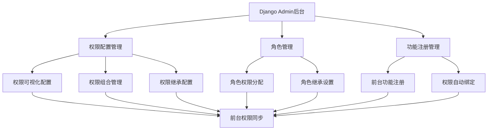

# 用户权限管理系统规范

## 1. 系统概述

本文档定义了英语学习平台的用户权限管理系统规范，包括前台权限控制机制和Django后台可视化配置管理系统。系统支持多角色权限管理、动态权限配置、学习模式权限控制以及可视化的后台管理界面。

## 2. 权限分类体系

### 2.1 权限分类定义

权限按功能模块分为六大类：

| 权限分类 | 权限数量 | 主要权限项 |
|----------|----------|------------|
| 基础权限 | 8 | view_dashboard, view_profile, edit_profile, view_notifications |
| 学习功能权限 | 14 | view_word_learning, practice_spelling, use_flashcard, use_pattern_memory |
| 社交功能权限 | 6 | view_social, send_message, join_group, create_post |
| 内容权限 | 10 | view_content, create_content, edit_content, delete_content |
| 管理功能权限 | 12 | manage_users, manage_roles, view_analytics, system_config |
| 家长专用权限 | 4 | view_child_progress, set_child_limits, receive_reports |

### 2.2 学习模式权限映射

学习模式与权限的对应关系：

| 学习模式 | 页面路径 | 所需权限 | 权限分类 |
|----------|----------|----------|----------|
| 单词学习 | /word-learning | view_word_learning | 学习功能权限 |
| 拼写练习 | /spelling-practice | practice_spelling | 学习功能权限 |
| 闪卡练习 | /flashcard | use_flashcard | 学习功能权限 |
| 模式记忆 | /pattern-memory | use_pattern_memory | 学习功能权限 |
| 听力练习 | /listening-practice | practice_listening | 学习功能权限 |
| 阅读练习 | /reading-practice | practice_reading | 学习功能权限 |
| 单词挑战 | /word-challenge | join_word_challenge | 学习功能权限 |
| 词根分析 | /word-analysis | view_word_analysis | 学习功能权限 |

## 3. 角色权限体系

### 3.1 用户角色定义

| 角色 | 注册方式 | 核心权限 |
|------|----------|----------|
| 学生 (student) | 邮箱注册 | 基础权限 + 学习功能权限 + 社交功能权限 |
| 教师 (teacher) | 邀请码注册 | 学生权限 + 部分内容权限 + 部分管理功能权限 |
| 家长 (parent) | 邮箱注册 | 基础权限 + 家长专用权限 |
| 学术主管 (academic_director) | 管理员分配 | 教师权限 + 完整内容权限 + 部分管理功能权限 |
| 研究负责人 (research_leader) | 管理员分配 | 学术主管权限 + 数据分析权限 |
| 院长 (dean) | 管理员分配 | 研究负责人权限 + 高级管理权限 |
| 管理员 (admin) | 系统分配 | 所有权限 |

### 3.2 权限继承机制

权限继承遵循层级结构：
```
admin (所有权限)
  ↓
dean (管理权限 + 内容权限 + 学习权限 + 基础权限)
  ↓
research_leader (研究权限 + 内容权限 + 学习权限 + 基础权限)
  ↓
academic_director (学术权限 + 内容权限 + 学习权限 + 基础权限)
  ↓
teacher (教学权限 + 学习权限 + 基础权限)
  ↓
student (学习权限 + 基础权限)

parent (家长权限 + 基础权限) - 独立分支
```

## 4. Django后台可视化配置管理系统

### 4.1 系统架构设计

#### 4.1.1 整体架构



#### 4.1.2 数据模型设计

```python
# Django模型定义
class Permission(models.Model):
    """权限模型"""
    code = models.CharField(max_length=100, unique=True, verbose_name="权限代码")
    name = models.CharField(max_length=200, verbose_name="权限名称")
    description = models.TextField(blank=True, verbose_name="权限描述")
    category = models.CharField(max_length=50, choices=PERMISSION_CATEGORIES, verbose_name="权限分类")
    is_active = models.BooleanField(default=True, verbose_name="是否启用")
    created_at = models.DateTimeField(auto_now_add=True)
    updated_at = models.DateTimeField(auto_now=True)

class Role(models.Model):
    """角色模型"""
    code = models.CharField(max_length=50, unique=True, verbose_name="角色代码")
    name = models.CharField(max_length=100, verbose_name="角色名称")
    description = models.TextField(blank=True, verbose_name="角色描述")
    parent_role = models.ForeignKey('self', null=True, blank=True, on_delete=models.CASCADE, verbose_name="父角色")
    permissions = models.ManyToManyField(Permission, through='RolePermission', verbose_name="权限")
    is_active = models.BooleanField(default=True, verbose_name="是否启用")

class FrontendFunction(models.Model):
    """前台功能模型"""
    code = models.CharField(max_length=100, unique=True, verbose_name="功能代码")
    name = models.CharField(max_length=200, verbose_name="功能名称")
    path = models.CharField(max_length=500, verbose_name="页面路径")
    component = models.CharField(max_length=200, verbose_name="组件名称")
    category = models.CharField(max_length=50, verbose_name="功能分类")
    required_permissions = models.ManyToManyField(Permission, verbose_name="所需权限")
    is_menu_item = models.BooleanField(default=False, verbose_name="是否为菜单项")
    menu_order = models.IntegerField(default=0, verbose_name="菜单排序")
    icon = models.CharField(max_length=100, blank=True, verbose_name="图标")
    is_active = models.BooleanField(default=True, verbose_name="是否启用")
```

### 4.2 Django Admin配置界面设计

#### 4.2.1 权限管理界面

```python
@admin.register(Permission)
class PermissionAdmin(admin.ModelAdmin):
    list_display = ['code', 'name', 'category', 'is_active', 'created_at']
    list_filter = ['category', 'is_active', 'created_at']
    search_fields = ['code', 'name', 'description']
    list_editable = ['is_active']
    
    fieldsets = (
        ('基本信息', {
            'fields': ('code', 'name', 'description')
        }),
        ('分类设置', {
            'fields': ('category',)
        }),
        ('状态设置', {
            'fields': ('is_active',)
        })
    )
    
    def get_queryset(self, request):
        return super().get_queryset(request).select_related()
```

#### 4.2.2 角色管理界面

```python
@admin.register(Role)
class RoleAdmin(admin.ModelAdmin):
    list_display = ['code', 'name', 'parent_role', 'permission_count', 'is_active']
    list_filter = ['parent_role', 'is_active']
    search_fields = ['code', 'name']
    filter_horizontal = ['permissions']
    
    fieldsets = (
        ('基本信息', {
            'fields': ('code', 'name', 'description')
        }),
        ('继承设置', {
            'fields': ('parent_role',)
        }),
        ('权限配置', {
            'fields': ('permissions',)
        }),
        ('状态设置', {
            'fields': ('is_active',)
        })
    )
    
    def permission_count(self, obj):
        return obj.permissions.count()
    permission_count.short_description = '权限数量'
```

#### 4.2.3 前台功能管理界面

```python
@admin.register(FrontendFunction)
class FrontendFunctionAdmin(admin.ModelAdmin):
    list_display = ['code', 'name', 'path', 'category', 'is_menu_item', 'menu_order', 'is_active']
    list_filter = ['category', 'is_menu_item', 'is_active']
    search_fields = ['code', 'name', 'path']
    list_editable = ['menu_order', 'is_active']
    filter_horizontal = ['required_permissions']
    
    fieldsets = (
        ('基本信息', {
            'fields': ('code', 'name', 'path', 'component')
        }),
        ('分类设置', {
            'fields': ('category',)
        }),
        ('菜单设置', {
            'fields': ('is_menu_item', 'menu_order', 'icon')
        }),
        ('权限设置', {
            'fields': ('required_permissions',)
        }),
        ('状态设置', {
            'fields': ('is_active',)
        })
    )
```

### 4.3 前台功能动态注册机制

#### 4.3.1 功能注册API设计

```python
# 功能注册装饰器
def register_frontend_function(code, name, path, category, permissions=None, **kwargs):
    """
    前台功能注册装饰器
    
    Args:
        code: 功能代码
        name: 功能名称
        path: 页面路径
        category: 功能分类
        permissions: 所需权限列表
        **kwargs: 其他配置参数
    """
    def decorator(func):
        # 注册功能到数据库
        function, created = FrontendFunction.objects.get_or_create(
            code=code,
            defaults={
                'name': name,
                'path': path,
                'category': category,
                'component': func.__name__,
                **kwargs
            }
        )
        
        # 绑定权限
        if permissions:
            for perm_code in permissions:
                try:
                    permission = Permission.objects.get(code=perm_code)
                    function.required_permissions.add(permission)
                except Permission.DoesNotExist:
                    # 自动创建权限
                    permission = Permission.objects.create(
                        code=perm_code,
                        name=f"权限_{perm_code}",
                        category='学习功能权限'
                    )
                    function.required_permissions.add(permission)
        
        return func
    return decorator

# 使用示例
@register_frontend_function(
    code='word_learning',
    name='单词学习',
    path='/word-learning',
    category='学习模式',
    permissions=['view_word_learning'],
    is_menu_item=True,
    menu_order=1,
    icon='book'
)
def word_learning_view(request):
    pass
```

#### 4.3.2 自动权限绑定机制

```python
class AutoPermissionBinding:
    """
    自动权限绑定管理器
    """
    
    @staticmethod
    def bind_function_permissions(function_code, permission_codes):
        """
        为功能绑定权限
        """
        try:
            function = FrontendFunction.objects.get(code=function_code)
            
            for perm_code in permission_codes:
                permission, created = Permission.objects.get_or_create(
                    code=perm_code,
                    defaults={
                        'name': f"权限_{perm_code}",
                        'category': '学习功能权限'
                    }
                )
                function.required_permissions.add(permission)
                
                if created:
                    # 自动分配给相关角色
                    AutoPermissionBinding.auto_assign_to_roles(permission)
                    
        except FrontendFunction.DoesNotExist:
            raise ValueError(f"功能 {function_code} 不存在")
    
    @staticmethod
    def auto_assign_to_roles(permission):
        """
        自动将权限分配给相关角色
        """
        # 根据权限分类自动分配
        if permission.category == '学习功能权限':
            # 分配给学生及以上角色
            roles = Role.objects.filter(
                code__in=['student', 'teacher', 'academic_director', 'research_leader', 'dean', 'admin']
            )
            for role in roles:
                role.permissions.add(permission)
```

### 4.4 可视化权限配置界面

#### 4.4.1 权限矩阵视图

```python
class PermissionMatrixView(admin.ModelAdmin):
    """
    权限矩阵可视化视图
    """
    change_list_template = 'admin/permission_matrix.html'
    
    def changelist_view(self, request, extra_context=None):
        # 获取所有角色和权限
        roles = Role.objects.filter(is_active=True)
        permissions = Permission.objects.filter(is_active=True).order_by('category', 'code')
        
        # 构建权限矩阵
        matrix = []
        for role in roles:
            role_permissions = set(role.permissions.values_list('code', flat=True))
            row = {
                'role': role,
                'permissions': []
            }
            
            for permission in permissions:
                row['permissions'].append({
                    'permission': permission,
                    'has_permission': permission.code in role_permissions
                })
            
            matrix.append(row)
        
        extra_context = extra_context or {}
        extra_context.update({
            'matrix': matrix,
            'permissions': permissions,
            'permission_categories': Permission.objects.values_list('category', flat=True).distinct()
        })
        
        return super().changelist_view(request, extra_context)
```

#### 4.4.2 角色权限图形化配置

```html
<!-- admin/permission_matrix.html -->
<div class="permission-matrix">
    <table class="matrix-table">
        <thead>
            <tr>
                <th>角色</th>
                
                    <th class="permission-header" title="{{ permission.description }}">
                        {{ permission.name }}
                    </th>
                
            </tr>
        </thead>
        <tbody>
            
                <tr>
                    <td class="role-name">{{ row.role.name }}</td>
                    
                        <td class="permission-cell">
                            <input type="checkbox" 
                                   class="permission-checkbox"
                                   data-role="{{ row.role.code }}"
                                   data-permission="{{ perm_data.permission.code }}"
                                   checked>
                        </td>
                    
                </tr>
            
        </tbody>
    </table>
</div>

<script>
// 权限矩阵交互逻辑
document.addEventListener('DOMContentLoaded', function() {
    const checkboxes = document.querySelectorAll('.permission-checkbox');
    
    checkboxes.forEach(checkbox => {
        checkbox.addEventListener('change', function() {
            const roleCode = this.dataset.role;
            const permissionCode = this.dataset.permission;
            const isChecked = this.checked;
            
            // AJAX请求更新权限
            fetch('/admin/update-role-permission/', {
                method: 'POST',
                headers: {
                    'Content-Type': 'application/json',
                    'X-CSRFToken': getCookie('csrftoken')
                },
                body: JSON.stringify({
                    role_code: roleCode,
                    permission_code: permissionCode,
                    action: isChecked ? 'add' : 'remove'
                })
            })
            .then(response => response.json())
            .then(data => {
                if (data.success) {
                    // 显示成功提示
                    showNotification('权限更新成功', 'success');
                } else {
                    // 回滚复选框状态
                    this.checked = !isChecked;
                    showNotification('权限更新失败: ' + data.error, 'error');
                }
            });
        });
    });
});
</script>
```

### 4.5 学习模式权限可视化管理

#### 4.5.1 学习模式权限配置界面

```python
class LearningModePermissionAdmin(admin.ModelAdmin):
    """
    学习模式权限管理
    """
    change_list_template = 'admin/learning_mode_permissions.html'
    
    def changelist_view(self, request, extra_context=None):
        # 获取所有学习模式功能
        learning_functions = FrontendFunction.objects.filter(
            category='学习模式',
            is_active=True
        ).prefetch_related('required_permissions')
        
        # 获取学习功能权限
        learning_permissions = Permission.objects.filter(
            category='学习功能权限',
            is_active=True
        )
        
        # 构建学习模式权限映射
        mode_permission_map = []
        for function in learning_functions:
            mode_permission_map.append({
                'function': function,
                'permissions': function.required_permissions.all(),
                'available_permissions': learning_permissions
            })
        
        extra_context = extra_context or {}
        extra_context.update({
            'mode_permission_map': mode_permission_map,
            'learning_permissions': learning_permissions
        })
        
        return super().changelist_view(request, extra_context)
```

### 4.6 配置变更实时同步机制

#### 4.6.1 配置变更监听器

```python
from django.db.models.signals import post_save, post_delete, m2m_changed
from django.dispatch import receiver
from django.core.cache import cache
import json

@receiver([post_save, post_delete], sender=Permission)
@receiver([post_save, post_delete], sender=Role)
@receiver([post_save, post_delete], sender=FrontendFunction)
def invalidate_permission_cache(sender, **kwargs):
    """
    权限配置变更时清除缓存
    """
    cache.delete_pattern('permissions:*')
    cache.delete_pattern('roles:*')
    cache.delete_pattern('functions:*')
    
    # 通知前台更新
    notify_frontend_update()

@receiver(m2m_changed, sender=Role.permissions.through)
def role_permissions_changed(sender, instance, action, pk_set, **kwargs):
    """
    角色权限关系变更时的处理
    """
    if action in ['post_add', 'post_remove', 'post_clear']:
        # 清除相关缓存
        cache.delete(f'role_permissions:{instance.code}')
        
        # 通知前台更新用户权限
        notify_user_permission_update(instance.code)

def notify_frontend_update():
    """
    通知前台配置更新
    """
    from channels.layers import get_channel_layer
    from asgiref.sync import async_to_sync
    
    channel_layer = get_channel_layer()
    async_to_sync(channel_layer.group_send)(
        'permission_updates',
        {
            'type': 'permission_update',
            'message': {
                'type': 'config_changed',
                'timestamp': timezone.now().isoformat()
            }
        }
    )
```

#### 4.6.2 前台配置同步API

```python
from rest_framework.views import APIView
from rest_framework.response import Response
from django.core.cache import cache

class PermissionConfigSyncView(APIView):
    """
    权限配置同步API
    """
    
    def get(self, request):
        """
        获取最新的权限配置
        """
        # 尝试从缓存获取
        config = cache.get('permission_config')
        
        if not config:
            config = self.build_permission_config()
            cache.set('permission_config', config, 3600)  # 缓存1小时
        
        return Response(config)
    
    def build_permission_config(self):
        """
        构建权限配置数据
        """
        # 获取所有活跃的权限
        permissions = Permission.objects.filter(is_active=True).values(
            'code', 'name', 'category'
        )
        
        # 获取所有活跃的角色及其权限
        roles = {}
        for role in Role.objects.filter(is_active=True).prefetch_related('permissions'):
            roles[role.code] = {
                'name': role.name,
                'permissions': list(role.permissions.filter(is_active=True).values_list('code', flat=True))
            }
        
        # 获取所有活跃的前台功能
        functions = {}
        for func in FrontendFunction.objects.filter(is_active=True).prefetch_related('required_permissions'):
            functions[func.code] = {
                'name': func.name,
                'path': func.path,
                'category': func.category,
                'required_permissions': list(func.required_permissions.filter(is_active=True).values_list('code', flat=True)),
                'is_menu_item': func.is_menu_item,
                'menu_order': func.menu_order,
                'icon': func.icon
            }
        
        return {
            'permissions': list(permissions),
            'roles': roles,
            'functions': functions,
            'last_updated': timezone.now().isoformat()
        }
```

### 4.7 权限配置导入导出功能

#### 4.7.1 配置导出功能

```python
class PermissionConfigExportView(APIView):
    """
    权限配置导出
    """
    
    def get(self, request):
        """
        导出权限配置为JSON文件
        """
        config = self.export_full_config()
        
        response = HttpResponse(
            json.dumps(config, indent=2, ensure_ascii=False),
            content_type='application/json'
        )
        response['Content-Disposition'] = f'attachment; filename="permission_config_{timezone.now().strftime("%Y%m%d_%H%M%S")}.json"'
        
        return response
    
    def export_full_config(self):
        """
        导出完整配置
        """
        return {
            'version': '1.0',
            'export_time': timezone.now().isoformat(),
            'permissions': list(Permission.objects.values()),
            'roles': list(Role.objects.values()),
            'role_permissions': list(Role.permissions.through.objects.values()),
            'frontend_functions': list(FrontendFunction.objects.values()),
            'function_permissions': list(FrontendFunction.required_permissions.through.objects.values())
        }
```

#### 4.7.2 配置导入功能

```python
class PermissionConfigImportView(APIView):
    """
    权限配置导入
    """
    
    def post(self, request):
        """
        导入权限配置
        """
        try:
            config_file = request.FILES['config_file']
            config_data = json.loads(config_file.read().decode('utf-8'))
            
            # 验证配置格式
            self.validate_config(config_data)
            
            # 导入配置
            result = self.import_config(config_data)
            
            return Response({
                'success': True,
                'message': '配置导入成功',
                'result': result
            })
            
        except Exception as e:
            return Response({
                'success': False,
                'error': str(e)
            }, status=400)
    
    def import_config(self, config_data):
        """
        执行配置导入
        """
        with transaction.atomic():
            # 导入权限
            permissions_created = 0
            for perm_data in config_data['permissions']:
                permission, created = Permission.objects.update_or_create(
                    code=perm_data['code'],
                    defaults=perm_data
                )
                if created:
                    permissions_created += 1
            
            # 导入角色
            roles_created = 0
            for role_data in config_data['roles']:
                role, created = Role.objects.update_or_create(
                    code=role_data['code'],
                    defaults=role_data
                )
                if created:
                    roles_created += 1
            
            # 导入前台功能
            functions_created = 0
            for func_data in config_data['frontend_functions']:
                function, created = FrontendFunction.objects.update_or_create(
                    code=func_data['code'],
                    defaults=func_data
                )
                if created:
                    functions_created += 1
            
            return {
                'permissions_created': permissions_created,
                'roles_created': roles_created,
                'functions_created': functions_created
            }
```

### 4.8 权限配置版本管理和回滚机制

#### 4.8.1 配置版本模型

```python
class PermissionConfigVersion(models.Model):
    """
    权限配置版本模型
    """
    version_number = models.CharField(max_length=50, unique=True, verbose_name="版本号")
    description = models.TextField(verbose_name="版本描述")
    config_data = models.JSONField(verbose_name="配置数据")
    created_by = models.ForeignKey(User, on_delete=models.CASCADE, verbose_name="创建者")
    created_at = models.DateTimeField(auto_now_add=True, verbose_name="创建时间")
    is_active = models.BooleanField(default=False, verbose_name="是否为当前版本")
    
    class Meta:
        ordering = ['-created_at']
        verbose_name = "权限配置版本"
        verbose_name_plural = "权限配置版本"
```

#### 4.8.2 版本管理功能

```python
class PermissionVersionManager:
    """
    权限版本管理器
    """
    
    @staticmethod
    def create_version(description, user):
        """
        创建新版本
        """
        # 生成版本号
        version_number = f"v{timezone.now().strftime('%Y%m%d_%H%M%S')}"
        
        # 获取当前配置
        config_data = PermissionConfigSyncView().build_permission_config()
        
        # 创建版本记录
        version = PermissionConfigVersion.objects.create(
            version_number=version_number,
            description=description,
            config_data=config_data,
            created_by=user
        )
        
        return version
    
    @staticmethod
    def rollback_to_version(version_id, user):
        """
        回滚到指定版本
        """
        try:
            version = PermissionConfigVersion.objects.get(id=version_id)
            
            # 创建当前版本的备份
            backup_version = PermissionVersionManager.create_version(
                f"回滚前备份 - {timezone.now().strftime('%Y-%m-%d %H:%M:%S')}",
                user
            )
            
            # 执行回滚
            with transaction.atomic():
                # 清除当前配置
                Permission.objects.all().delete()
                Role.objects.all().delete()
                FrontendFunction.objects.all().delete()
                
                # 恢复指定版本的配置
                config_data = version.config_data
                
                # 重建权限
                for perm_data in config_data['permissions']:
                    Permission.objects.create(**perm_data)
                
                # 重建角色
                for role_data in config_data['roles']:
                    Role.objects.create(**role_data)
                
                # 重建前台功能
                for func_data in config_data['functions']:
                    FrontendFunction.objects.create(**func_data)
                
                # 设置为当前版本
                PermissionConfigVersion.objects.update(is_active=False)
                version.is_active = True
                version.save()
            
            return True, f"成功回滚到版本 {version.version_number}"
            
        except Exception as e:
            return False, f"回滚失败: {str(e)}"
```

## 5. 前台权限控制机制

### 5.1 路由权限守卫

```javascript
// router/index.js
const router = createRouter({
  history: createWebHistory(),
  routes: [
    {
      path: '/word-learning',
      component: () => import('@/pages/WordLearning.vue'),
      meta: {
        requiresAuth: true,
        permissions: ['view_word_learning']
      }
    }
    // 其他路由...
  ]
})

// 路由守卫
router.beforeEach(async (to, from, next) => {
  const authStore = useAuthStore()
  
  if (to.meta.requiresAuth) {
    if (!await authStore.isAuthenticated()) {
      next('/login')
      return
    }
    
    if (to.meta.permissions) {
      const hasPermission = await authStore.hasPermissions(to.meta.permissions)
      if (!hasPermission) {
        next('/error?type=permission')
        return
      }
    }
  }
  
  next()
})
```

### 5.2 组件权限控制

```javascript
// composables/usePermission.js
export function usePermission() {
  const authStore = useAuthStore()
  
  const hasPermission = (permission) => {
    return authStore.userPermissions.includes(permission)
  }
  
  const hasAnyPermission = (permissions) => {
    return permissions.some(permission => hasPermission(permission))
  }
  
  const hasAllPermissions = (permissions) => {
    return permissions.every(permission => hasPermission(permission))
  }
  
  return {
    hasPermission,
    hasAnyPermission,
    hasAllPermissions
  }
}
```

## 6. 系统集成和部署

### 6.1 Django设置配置

```python
# settings.py
INSTALLED_APPS = [
    'django.contrib.admin',
    'django.contrib.auth',
    'django.contrib.contenttypes',
    'django.contrib.sessions',
    'django.contrib.messages',
    'django.contrib.staticfiles',
    'rest_framework',
    'channels',
    'permission_management',  # 权限管理应用
]

# 权限管理配置
PERMISSION_MANAGEMENT = {
    'CACHE_TIMEOUT': 3600,  # 权限缓存时间（秒）
    'AUTO_CREATE_PERMISSIONS': True,  # 是否自动创建权限
    'ENABLE_PERMISSION_INHERITANCE': True,  # 是否启用权限继承
    'SYNC_TO_FRONTEND': True,  # 是否同步到前台
}

# WebSocket配置（用于实时同步）
CHANNEL_LAYERS = {
    'default': {
        'BACKEND': 'channels_redis.core.RedisChannelLayer',
        'CONFIG': {
            "hosts": [('127.0.0.1', 6379)],
        },
    },
}
```

### 6.2 前台配置同步

```javascript
// stores/permissionStore.js
export const usePermissionStore = defineStore('permission', {
  state: () => ({
    permissions: [],
    roles: {},
    functions: {},
    lastUpdated: null
  }),
  
  actions: {
    async syncFromBackend() {
      try {
        const response = await api.get('/api/permission-config-sync/')
        this.permissions = response.data.permissions
        this.roles = response.data.roles
        this.functions = response.data.functions
        this.lastUpdated = response.data.last_updated
      } catch (error) {
        console.error('权限配置同步失败:', error)
      }
    },
    
    // WebSocket实时更新
    setupRealtimeSync() {
      const ws = new WebSocket('ws://localhost:8000/ws/permission-updates/')
      
      ws.onmessage = (event) => {
        const data = JSON.parse(event.data)
        if (data.type === 'config_changed') {
          this.syncFromBackend()
        }
      }
    }
  }
})
```

## 7. 总结

本规范定义了完整的用户权限管理系统，包括：

1. **前台权限控制**：基于角色的权限体系，支持学习模式权限管理
2. **Django后台管理**：可视化的权限配置界面，支持图形化权限分配
3. **动态功能注册**：前台功能自动注册和权限绑定机制
4. **实时同步**：配置变更的实时同步和通知机制
5. **版本管理**：权限配置的版本控制和回滚功能
6. **导入导出**：配置的备份和迁移功能

该系统具有良好的扩展性、可维护性和用户体验，能够满足英语学习平台的权限管理需求。