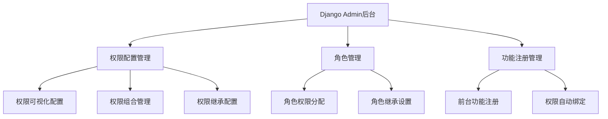
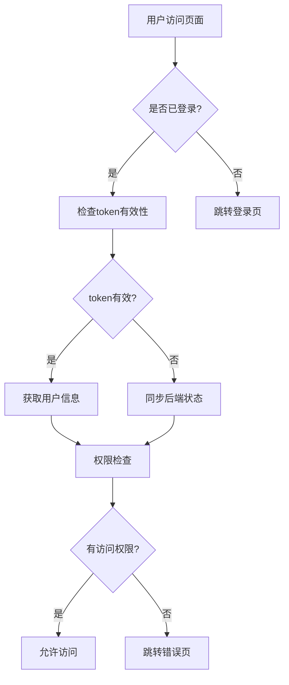

# 权限管理系统规范对比分析

## 1. 文档概述

本文档对比分析了两个用户权限管理系统规范文档的区别和用途：

- **前端文档**：`/Users/xzmx/Downloads/my-project/Memorize_words/Natural_English_front/.trae/documents/用户权限管理系统规范.md`
- **项目文档**：`/Users/xzmx/Downloads/my-project/Memorize_words/.trae/documents/用户权限管理系统规范.md`

## 2. 文档对比分析

### 2.1 文档定位和用途

| 对比维度 | 前端文档 | 项目文档 |
|----------|----------|----------|
| **主要定位** | Django后台可视化配置管理系统 | 前端权限控制机制和实现规范 |
| **技术栈重点** | Django Admin + 后端权限管理 | Vue.js + 前端权限实现 |
| **目标用户** | 后端开发者、系统管理员 | 前端开发者、产品经理 |
| **实现层面** | 后端权限配置、数据库设计 | 前端权限检查、路由守卫 |

### 2.2 内容结构差异

#### 前端文档特色内容：
1. **Django后台可视化配置管理系统**
   - Django Admin配置界面设计
   - 权限矩阵可视化视图
   - 前台功能动态注册机制
   - 配置变更实时同步机制

2. **数据模型设计**
   - Permission模型（权限模型）
   - Role模型（角色模型）
   - FrontendFunction模型（前台功能模型）
   - 数据库关系设计

3. **后端技术实现**
   - Django信号处理
   - WebSocket实时同步
   - 权限配置导入导出
   - 版本管理和回滚机制

#### 项目文档特色内容：
1. **前端权限控制机制**
   - Vue.js路由守卫实现
   - 组件级权限检查
   - 权限指令（v-permission）
   - 菜单权限过滤

2. **用户认证流程**
   - 前端认证状态管理
   - Token认证机制
   - 认证状态同步
   - 缓存策略

3. **UI/UX设计规范**
   - 权限相关UI组件
   - 错误页面设计
   - 角色标识设计
   - 用户体验优化

### 2.3 技术架构差异

#### 前端文档架构：


#### 项目文档架构：


### 2.4 权限分类体系对比

#### 前端文档权限分类：
| 权限分类 | 权限数量 | 主要权限项 |
|----------|----------|------------|
| 基础权限 | 8 | view_dashboard, view_profile, edit_profile, view_notifications |
| 学习功能权限 | 14 | view_word_learning, practice_spelling, use_flashcard, use_pattern_memory |
| 社交功能权限 | 6 | view_social, send_message, join_group, create_post |
| 内容权限 | 10 | view_content, create_content, edit_content, delete_content |
| 管理功能权限 | 12 | manage_users, manage_roles, view_analytics, system_config |
| 家长专用权限 | 4 | view_child_progress, set_child_limits, receive_reports |

#### 项目文档权限分类：
| 权限分类 | 权限数量 | 主要权限项 |
|----------|----------|------------|
| 基础权限 | 4 | view_dashboard, view_own_profile, change_own_settings, view_help |
| 学习功能权限 | 14 | view_word_learning, practice_spelling, use_flashcard, practice_reading |
| 社交功能权限 | 1 | access_community |
| 内容权限 | 2 | access_fashion_content, discover_content |
| 管理功能权限 | 15 | access_dev_tools, view_analytics, manage_resource_auth |
| 家长专用权限 | 5 | view_student, view_own_children, view_child_progress |

## 3. 文档互补性分析

### 3.1 技术栈互补
- **前端文档**：专注Django后端权限管理系统
- **项目文档**：专注Vue.js前端权限实现
- **互补效果**：形成完整的前后端权限管理解决方案

### 3.2 功能层面互补
- **前端文档**：权限配置、管理、同步
- **项目文档**：权限检查、验证、展示
- **互补效果**：覆盖权限管理的完整生命周期

### 3.3 用户群体互补
- **前端文档**：面向后端开发者和系统管理员
- **项目文档**：面向前端开发者和产品设计师
- **互补效果**：满足不同角色的技术需求

## 4. 统一管理建议

### 4.1 文档重命名方案

建议将两个文档重命名并统一放在 `/Users/xzmx/Downloads/my-project/Memorize_words/.trae/documents/` 目录中：

1. **前端文档** → `用户权限管理系统规范-后端实现.md`
   - 专注Django后台权限管理系统
   - 包含数据模型、Admin配置、同步机制

2. **项目文档** → `用户权限管理系统规范-前端实现.md`
   - 专注Vue.js前端权限控制
   - 包含路由守卫、组件权限、UI设计

3. **新增文档** → `用户权限管理系统规范-总览.md`
   - 整体架构设计
   - 前后端协作规范
   - 完整的权限流程

### 4.2 目录结构建议

```
/Users/xzmx/Downloads/my-project/Memorize_words/.trae/documents/
├── 权限管理系统/
│   ├── 用户权限管理系统规范-总览.md
│   ├── 用户权限管理系统规范-前端实现.md
│   ├── 用户权限管理系统规范-后端实现.md
│   ├── 权限管理系统规范对比分析.md
│   └── 权限配置示例/
│       ├── 角色权限映射表.json
│       ├── 页面权限配置.json
│       └── Django权限模型示例.py
└── 其他文档...
```

### 4.3 统一管理优势

1. **集中管理**：所有权限相关文档集中在一个目录
2. **版本控制**：便于统一的版本管理和更新
3. **协作效率**：团队成员可以快速找到相关文档
4. **知识传承**：新团队成员可以系统性学习权限管理
5. **维护便利**：减少文档分散导致的维护困难

## 5. 实施建议

### 5.1 短期目标（1-2周）
1. 将两个文档重命名并移动到统一目录
2. 创建权限管理系统总览文档
3. 建立文档间的交叉引用关系
4. 完善权限配置示例

### 5.2 中期目标（1个月）
1. 根据实际项目需求优化权限分类
2. 完善前后端权限同步机制
3. 建立权限管理的最佳实践指南
4. 创建权限系统的测试用例文档

### 5.3 长期目标（3个月）
1. 建立权限管理系统的自动化测试
2. 完善权限审计和监控机制
3. 建立权限变更的审批流程
4. 创建权限管理的培训材料

## 6. 结论

两个权限管理系统规范文档在技术栈、功能定位和目标用户方面存在明显差异，但具有很强的互补性。建议将它们重命名后统一放在 `/Users/xzmx/Downloads/my-project/Memorize_words/.trae/documents/` 目录中，并建立完整的权限管理文档体系。

这样的统一管理方式将有助于：
- 提高团队协作效率
- 降低文档维护成本
- 确保权限管理的一致性
- 便于新团队成员快速上手
- 支持项目的长期发展需求

通过合理的文档组织和管理，可以为Natural English项目建立一个完善、可维护的权限管理体系。